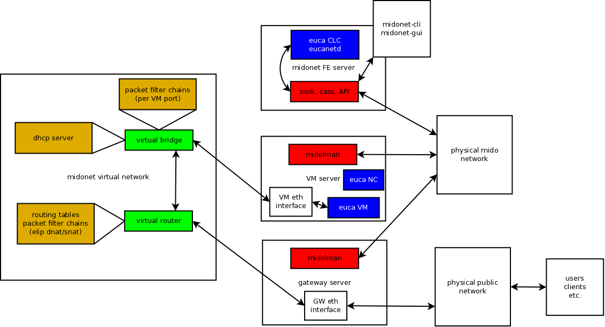

* [Overview](#overview)
* [Design Details](#design-details)
* [Installation](#installation)
    * [Midokura Documentation:](#midokura-documentation:)
    * [Midokura Cookbook:](#midokura-cookbook:)
    * [Midokura frontend machine:](#midokura-frontend-machine:)
    * [Midolman only:](#midolman-only:)
* [Automation](#automation)
* [Debugging](#debugging)
    * [Hopping into a VPC network from the Midonet GW](#hopping-into-a-vpc-network-from-the-midonet-gw)
* [QA Notes](#qa-notes)
* [Unimplemented features](#unimplemented-features)


# Overview
Midokura makes an SDN platform called 'midonet'. Fundamentally, midonet is a collection of software components that allows for the programmatic provisioning of a virtual network infrastructure, with ways to connect the virtual network infrastructure with the physical network infrastructure. Midonet both abstracts usable networks from the underlying physical network, as well as provides a way to control a full networking infrastructure via software (i.e. software defined).

A midonet installation contains the following software components that run on physical servers:


* zookeeper/cassandra - core midonet network database. essentially a 'global view' of all midonet virtual network and configuration components
* midonet-api - a restful API service for interacting with midonet
* midonet-cli, midonet-gui - both CLI and web based GUI interfaces are client tools that interact with midonet-api
* midolman - the agent that needs to run on any host participating in any constructed virtual network. agents pub/sub to zookeeper/cassandra, and implement whatever view is stored.

The virtual network components of midonet (things that one can create/manipulate via the midonet-api) that Eucalyptus is using to implement VPC functionality are:


* midonet routers (these act like real routers)
* midonet bridges (these act like L2 ethernet switches)
* midonet pre/post packet processing chains (this is like iptables/ebtables)
* midonet ports (these can be added to routers and bridges, like real switch/router cable ports)

Using these components, we construct a virtual network environment that maps to what users are provisioning using VPC APIs, using connected routers, bridges (switches) and packet processing chains (for elips, firewall rules, and VPC ACLs).

A midonet installation running alongside eucalyptus is depicted below:





# Design Details
Eucalyptus VPC support (tech. preview in Eucalyptus version 4.1) has a number of interacting components that together deliver AWS VPC functionality within the Eucalyptus platform. In this section, we provide high level information about how Eucalyptus components interact with Midonet and Linux systems to provide VPC functionality. 

Eucalyptus and Midonet InteractionBoth Eucalyptus and the Midonet system operate in a way where there is at any point in time a 'global view' of their respective resources (in this case, we're focusing on network resources). The global view can change based on system configuration (done mostly at installation/deployment time), user input (as new networking artifacts are created, changed, or removed), and when external events happen (VM host failures, VM failures, etc.). Regardless of the reasons why the global view may change over time, both Eucalyptus and Midonet essentially strive to take as input the global view correct state of networking and combine the desired global view state with the actual state within each system by modifying the actual state to reflect the desired global state, and then continue to operate. If nothing changes in the global state, then, there are typically no updates to perform.

In order to facilitate the implementation of Eucalyptus global state within Midonet, there is a Eucalyptus component called 'eucanetd' that, when Eucalyptus is configured to run in VPC mode, runs on a single host in the eucalyptus deployment (the same host that is running the Eucalyptus CLC) and is responsible for performing the following basic flow:


1. read latest global view and determine if it has changed since the last successful global view was read. If there is no change, then eucanetd will wait for a default of 5 seconds before evaluating again, skipping all the next steps. If the global view has changed (or this is the first time the global view is read), then proceed -
1. eucanetd performs a discovery against midonet by reading current midonet resources via the midonet API. Internally, eucanetd is mapping all extant midonet resources into internal eucalyptus data structures that map out all extant eucalyptus resources
1. eucanetd then determines differences between the new desired global state and the actual state discovered from midonet and makes decisions about what to do, if anything (create, update, delete)
1. finally, eucanetd implements any differences from the comparison step above. It will first create/update any existing midonet resources to reflect the global view and then delete anything that is in midonet but is not in the global view. once this is successfully completed, eucanetd waits and then starts its cycle again.

NOTE: this high level flow is identical to how eucanetd functions in the Eucalyptus EDGE mode, accept that in EDGE, discovery and implementation of differences is performed against the underlying Linux networking systems used to implement EDGE (iptables, ebtables, ipsets, etc) instead of midonet.

At any point in time, the latest Eucalyptus global view that is generated and updated by the CLC can be inspected by reading an XML file using the following command: xmllint --format /var/run/eucalyptus/global_network_info.xml

VPC Resources as Midonet ResourcesIn Eucalyptus, AWS VPC resources are created, updated, and deleted as they are in AWS using compatible VPC API calls. The Eucalyptus global view largely represents the state of the system in these terms (VPCs, Subnets, Security Groups and Rules, Elastic IPs, VM Instances, etc.). eucanetd then takes these concepts and descriptions and converts them into Midonet resources (routers, bridges, interfaces, chains, chain rules, ip address groups, routing tables, etc.). Here we give an overview of how AWS VPC concepts are translated to Midonet concepts.

Initially, eucanetd will create a 'core' set of Midonet resources that form the basic connectivity model. We create a core router called 'eucart' connected to a core bridge called 'eucabr'. The core router is configured with an external interface that connects the virtual Midonet eucart router with the physical network, as well as a subnet that is used for internal routing. In essence, we create a new router that is accessible to the physical network that can handle any public/elastic IPs that are given to Eucalyptus for use by VMs. eucanetd will also create a separate subsystem for handling AWS metadata, which is described in more detail in a later section.

Once a user creates a VPC, eucanetd translates a new VPC appearing in the global view into a new midonet router which includes in its name the unique VPC ID of the VPC. The router is assigned an internal address on the aforementioned internal router network, and is connected to the core eucabr so that the eucart router and the new VPC router can communicate. When a user then creates a VPC subnet within the VPC, eucanetd will create a new midonet bridge that includes the subnet ID in its name, connected to the VPC router. The VPC router is at this point configured to handle the new VPC subnet's IP subnet. Additional subnets created within the VPC will also result in their own midonet bridges being created and connected to the VPC router, resulting in a condition where VMs in differnet subnets within the same VPC having traffic virtually routed through their respective VPC routers. 


Basic Connectivity and RoutingPublic / Elastic IPsMetadataSecurity Groups


# Installation

### Midokura Documentation:
[http://docs.midonet.org/index.html](http://docs.midonet.org/index.html)


### Midokura Cookbook:
[https://github.com/eucalyptus/midokura-cookbook](https://github.com/eucalyptus/midokura-cookbook)


### Midokura frontend machine:

```bash
# Install Chef
curl -L https://www.opscode.com/chef/install.sh | bash
# Configure the midokura repo password and set the list of recipes, in this case the default which is all things
echo '{"run_list": ["recipe[midokura]"]}' > midokura.json
# Run the recipes
chef-solo -j midokura.json -r https://github.com/eucalyptus/midokura-cookbook/releases/download/v0.2.0-alpha-3/midokura-cookbooks.tgz
```

### Midolman only:

```bash
# Install Chef
curl -L https://www.opscode.com/chef/install.sh | bash
# Configure the midokura repo password and set the list of recipes, in this case just midolman
echo '{"run_list": ["recipe[midokura::midolman]"]}' > midokura.json
# Run the recipes
chef-solo -j midokura.json -r https://github.com/eucalyptus/midokura-cookbook/releases/download/v0.2.0-alpha-3/midokura-cookbooks.tgz
```

# Automation

1. Current automated template [http://jenkins.qa1.eucalyptus-systems.com/job/mainline-vpc-das/](http://jenkins.qa1.eucalyptus-systems.com/job/mainline-vpc-das/)
1. Script to map IPs to AS numbers: [http://git.qa1.eucalyptus-systems.com/qa-repos/eucalele/blob/master/bgp-helpers/create_bgpd_conf.py](http://git.qa1.eucalyptus-systems.com/qa-repos/eucalele/blob/master/bgp-helpers/create_bgpd_conf.py)
1. Midokura Config
  ```
"midokura": { 
       "repo-username": "eucalyptus",
       "repo-password": "<your repo pw>",
       "yum-options": "--nogpg",
       "zookeepers": ["10.111.1.5:2181"],
       "cassandras": ["10.111.1.5:9160"],
       "initial-tenant": "euca_tenant_1",
       "midonet-api-url": "http://10.111.1.5:8080/midonet-api",
       "midolman-host-mapping": { "b-05.qa1.eucalyptus-systems.com":  "10.111.1.5",
                                                    "b-22.qa1.eucalyptus-systems.com":  "10.111.1.22"},
       "bgp-peers":  [{ "router-name": "eucart",
                                "port-ip": "10.116.129.5",
                                "remote-as": 65000,
                                "local-as": 64772,
                                "peer-address": "10.116.133.173",
                                "route": "10.116.130.0/24" }]
    }
```
1. Eucalyptus Side config
```
"midonet": {
            "gw-host": "b-05.qa1.eucalyptus-systems.com",
           "gw-ip": "10.116.129.5",
           "gw-interface": "em1.116",
           "public-network": "10.116.128.0/17",
           "public-gw-ip": "10.116.133.173",
           "eucanetd-host": "b-05.qa1.eucalyptus-systems.com"
        }
      },
```

# Debugging

### Hopping into a VPC network from the Midonet GW

```bash
[root@b-05 ~]# ip netns list   #### This gives you back VPC IDs
vpc-1fc228b1
[root@b-05 ~]# ip netns exec vpc-1fc228b1 /bin/bash ### Open a shell and hop into the VPCs network context
[root@b-05 ~]# route -n  
Kernel IP routing table
Destination     Gateway         Genmask         Flags Metric Ref    Use Iface
192.168.128.0   0.0.0.0         255.255.128.0   U     0      0        0 vn1_77de1936
169.254.0.0     0.0.0.0         255.255.0.0     U     0      0        0 vn3_1fc228b1
[root@b-05 ~]#
```

# Notes

1. CLC/Eucanetd machine needs to be able reverse lookup the IP of the NCs
1. VPC subnets map 1:1 with bridges in Midonet
1. VPCs map 1:1 with routers in Midonet
1. DHCP Debugging
    1. The bridge in midokura takes care of DHCP
```
    midonet> list bridge

    bridge bridge0 name vb_vpc-d50c66e9_subnet-3294f8d3 state up

    bridge bridge1 name eucabr state up

    bridge bridge2 name vb_vpc-0d2a81d9_subnet-9f3b7ec4 state up

    midonet> bridge bridge1 dhcp

    Missing arguments, incomplete command

    midonet> bridge bridge1 dhcp list

    midonet> bridge bridge0 dhcp list

    gw 172.31.0.1 server 172.31.0.1 dns-servers 8.8.8.8 subnet 172.31.0.0/20 opt121-routes \[]

    midonet>
```   
1. In order to flush and rebuild all Euca state from Midokura run
    1. service eucanetd stop; eucanetd -F; service eucanetd
1. BGP debugging:
    1. vtysh is a good tool to debug bgp on the euca side: [http://lartc.org/howto/lartc.dynamic-routing.bgp.html](http://lartc.org/howto/lartc.dynamic-routing.bgp.html)
    1. check that the config is correct, local and PEER IP and AS, state, sent/recv'd counts, etc..
    1. ping, tracert, etc..    
1. Debugging with midonet-cli
    1. To hop into the cli shell use the following where <midonet-api host> is probably your CLC:
```
midonet-cli --midonet-url=[http://<midonet-api host>:8080/midonet-api](http://10.111.5.100:8080/midonet-api) -A
```
    1. use the command 'describe' to get a list of command prefixes
    1. then use list to see them: tunnel-zone list, routers list, host list, etc.. or use show and the name, for example: 'show tunnel-zone tzone0'    
1. BGP routes are only pushed after an instance has been run   

# Unimplemented features

1. Egress rules (backend)
1. Network ACLs (backend)
1. Internal ELB:[VPC: Internal ELB assigns itself a public IP, DNS resolves to that IP](https://eucalyptus.atlassian.net/browse/EUCA-10296)
1. DHCP options (backend)
1. Multiple ENIs
1. VPN Gateways/Connections
1. Customer Gateways
1. [NAT instances ](https://eucalyptus.atlassian.net/browse/EUCA-10420)
1. [Custom route tables](https://eucalyptus.atlassian.net/browse/EUCA-10421)

*****

[[category.networking]] 
[[category.confluence]] 
