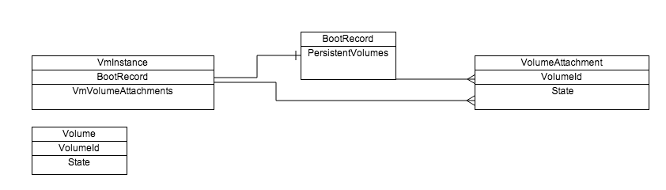
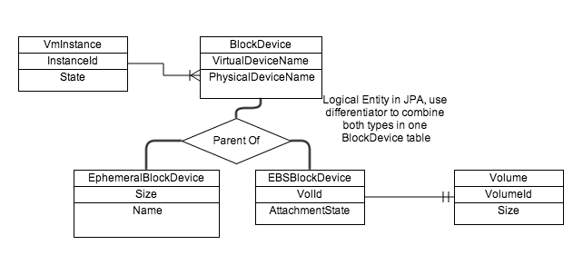

# Problem Statement
The current architecture and domain model for managing EBS and ephemeral devices is not consistent and blocks further support of EBS/EC2 block device mapping semantics and features because it adds constraints the are no longer present in EC2/EBS related to device lifecycle. Extending support of detach/attach capabilities for boot-time devices on the current model will only be workarounds to remove those limits without actually removing those limits fundamentally.


## Current Entity Model
Eucalyptus 4.0.0 Block Device Domain Model



# Proposed Change
The metadata model for instances' devices should be that of a flat block device table (or mapping), that is mutable during run-time but imposes certain restrictions based on the VM lifecycle and some properties of the devices.


## Proposed Entity Model
Proposed Euca 4.1.0 Block Device Mapping



The "BlockDevice" is a logical parent type of EphemeralBlockDevice and EBSBlockDevice. Each child includes extra fields for that type.

BlockDevice properties:


* Device Name (e.g. /dev/sda)
* InstanceId (parent)
* Composite unique key: Device Name + InstanceId
* Children
    * EphemeralBlockDevice properties
    * Size
    * Name (e.g. ephemeral0, ephemeral1)

    
    * EBSBlockDevice properties
    * VolumeId (FK to Volumes entity)
    * AttachmentState (e.g. 'attaching', 'attached', 'detaching')

    

    


## Message Changes
CLC -> CC -> NC path uses <VBR> element for device specs.

TODO: work with backend team to get more specific on what is needed in 4.0+ NC.


```xml
<BlockDeviceMap>
	<Device>
		<DeviceName>/dev/sda</DeviceName>
		<VirtualName>ami</VirtualName>
		<EncryptionKey/><!--for possible device crypto later-->
		<Source>
			<Ephemeral>
				<Image>http://downloadmanifests.objectstorage.mycloud.com:8773/downloadmanifest-i-12355.manifest.xml</Image>
				<Name>localdisk-xxyyyzzz-uuid</Name>
				<Size>10000000</Size>
			</Ephemeral>
		</Source>
	</Device>
	<Device>
		<DeviceName>/dev/sdb</DeviceName>
		<VirtualName>ephemeral0</VirtualName>
		<EncryptionKey/><!--for possible device crypto later-->
		<Source>
			<Ephemeral>
				<Image/>
				<Name>localdisk-xxyyz-uuid2</Name>
				<Size>200000000</Size>
			</Ephemeral>
		</Source>
	</Device>
	<Device>
		<DeviceName>/dev/sdc</DeviceName>
		<VirtualName>sdc</VirtualName>
		<EncryptionKey/><!--for possible device crypto later-->
		<Source>
			<EBSVolume>
				<Name>vol-123456</Name>
				<Token>someencryptedtoken</Token>
				<Size>10000000</Size>
			</EBSVolume>
		</Source>
	</Device>
</BlockDeviceMap>
```

### Components Affected

1. CLC
    1. Run-Instance path heavily modified for new entity model
    1. Attach-Volume/Detach-Volume paths affected

    
1. Database and entity model
    1. Modification of Volumes and Instances relations and tables
    1. Attachment is a single join table between instance and volume records, includes state management

    

    
1. CC– Messaging changes to WSDL, no logic, just pass-thru to NC
1. NC– Messaging changes for WSDL and logic changes
    1. Alter how the NC tracks volume state, no more divide between "vbr" and other volumes

    
1. All of the above have upgrade implications
    1. Migrate DB data to new entity model
    1. Update instance definitions/metadata on NC

    


## Risk Assessment
Overall, this is high risk because it alters the run-instance path and that path has lots of complexity.

There are upgrade implications as well.


*****

[[category.storage]] 
[[category.confluence]]
[[category.ebs]]
