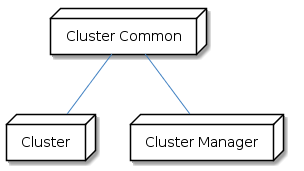
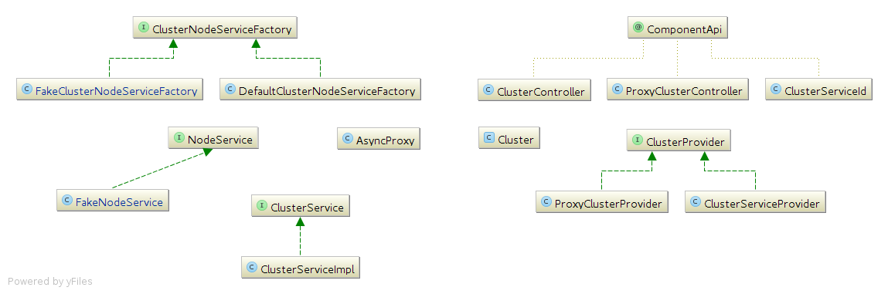

# Overview
This document describes changes around the cluster service in the 5.0 release.


# Implementation

## Component and Topology
Components can now be annotated with  _@ComponentApi_ to indicate that they represent the api for a type of service rather than any particular implementation or to indicate that the component implements an api defined by another component.

 _Topology_  is responsible for resolving an api to an implementation for a given partition.


## Messages
All messages used with the cluster are now extend  _CloudClusterMessage_ and packaged under  _com.eucalyptus.cluster.common.msgs._ Messages are no longer shared between the compute and cluster services, where there are similarly named messages the cluster ones use the name prefix "Cluster", e.g.  _ClusterStartInstanceType._ 

Messages and bindings are added for node communication, these extend  _CloudNodeMessage._ 


## Modules
Code for the cluster implementation was previously contained in the  **_msgs_**  and  **_cluster-manager_** modules. We will move cluster specific code from  **_msgs_**  and introduce new modules:


*  **_cluster-common_** the api for cluster service implementations, this module contains messages, etc
*  **_cluster_** the implementation for cluster apis, other modules must not depend directly on any specific implementation

Dependencies between these modules are as follows:



Not shown are compute common and compute service, which provides the interface and ufs for our ec2 implementation. The cluster module contains the following cluster implementations:


*  **_cluster_** , existing "proxy" cluster implementation
*  **_clusterservice_** , tech preview component, enabled via a  **_com.eucalyptus.cluster.service.enable_**  system property

These implement functionality defined via the cluster common module, used by the cluster manager.


## Class overview
The following class diagram shows classes of interest to the architecture:


### Cluster implementation switching
There are now multiple components that can be used for a cluster:


*  _ClusterController,_ used by all clients of cluster functionality
*  _ProxyClusterController_ , provides  **_cluster_** , existing functionality
*  _ClusterServiceId_ , provides  **_clusterservice_** 

These components are all used with  _CloudClusterMessage_ s, each implementation has its own  _ComponentConfiguration,_ component registration messages (and service builder, etc)

When a particular implementation is used the  _Cluster_  uses underlying functionality from the implementation specific provider:


*  _ClusterProvider_ , the interface for providers of low level cluster functionality
*  _ProxyClusterProvider_ , the provider for the  **_cluster_**  component, provides existing functionality
*  _ClusterServiceProvider_ , the provider for  **_clusterservice_** 

When receiving messages, routing to a particular implementation is performed according to which implementing component is enabled.

When registering a component, we now support simple mapping to allow substitutions, to switch from  **_cluster_** to  **_clusterservice_** you would used a system property:


```bash
com.eucalyptus.empyrean.registration.map.cluster=clusterservice
```

### Cluster service implementation
The  **_clusterservice_** provides support for faking nodes via alternative  _NodeService_  implementations, faking is enabled via a system property **_com.eucalyptus.cluster.service.fake._** 

The  _NodeService_  defines the API for a node:


```java
NcBroadcastNetworkInfoResponseType broadcastNetworkInfo( NcBroadcastNetworkInfoType request )

CheckedListenableFuture<NcBroadcastNetworkInfoResponseType> broadcastNetworkInfoAsync( NcBroadcastNetworkInfoType request )
```
Within the cluster service a  _ClusterNodeServiceFactory_ implementation is used to control which  _NodeService_ implementation is used at runtime. There is a  _FakeNodeService_ implementation that tracks state for a fake node and produces fake metrics (etc) there is also a runtime implemented  _NodeService_ returned from  _DefaultClusterNodeServiceFactory_ which uses  _AsyncProxy_ functionality to send messages to an actual node.


## Cluster API
The  **_cluster-common_**  module defines the api for cluster components. Messages extend  _CloudClusterMessage_  which is owned by the api component _ClusterController._ The common module also defines the binding for cluster messages and contains the related binding unit tests.

The cluster api also includes a few classes related to service state and resource state tracking:


*  _Cluster_ state related to a particular cluster and the related nodes
*  _ClusterProvider_  api used by  _Cluster_ that does implementation specific work
*  _ClusterRegistry_ registry separated out from  _Cluster_ s


*  _ResourceState_ resource tracking for a _Cluster_ 
*  _ResourceToken_ abstract token covering resources know to api

The cluster-manager module uses the api via:


*  _Clusters_ now a facade for access to  _ClusterRegistry_ 
*  _Migrations_ functionality moved from  _Cluster_ as it is not part of the api
*  _VmInstanceToken_ extension of  _ResourceToken_  with instance specifics


## Cluster service implementations

### Proxy cluster
The proxy cluster is used with the C cluster controller. This implementation has its own state machine (in  _ProxyClusterProvider_ ) and defines  _ProxyClusterCertsCallback_ which uses the gather log service to obtain and verify certificates. This implementation also defines a pipeline via  _ProxyClusterClientChannelInitializer._ 


### Cluster service
The cluster service can currently be used for faking clusters for scale or other testing / prototyping.

This implementation is not available unless a system property is set:


```bash
CLOUD_OPTS="-Dcom.eucalyptus.cluster.service.enable=true"
```
 _ClusterNodeServiceFactory_ :


```java
class DefaultClusterNodeServiceFactory implements ClusterNodeServiceFactory {

  @Override
  public NodeService nodeService( ClusterNode node, int port ) {
    Cluster cluster = localCluster( )
    ServiceBuilder serviceBuilder = ServiceBuilders.lookup( ProxyNodeController )
    ServiceConfiguration configuration =
        serviceBuilder.newInstance( cluster.partition, node.name, node.ip, port )
    return AsyncProxy.client( NodeService,  message -> {
      Topology.populateServices( configuration, message, true )
      return message
    }, configuration )
  }
```
Dependency injection with the cluster service allows simple unit testing:


```java
@ComponentNamed( "clusterService" )
class ClusterServiceImpl implements ClusterService {

  @Inject
  ClusterServiceImpl(
      ClusterEucaConfLoader clusterEucaConfLoader,
      ClusterNodes clusterNodes
  ) ...    
  
@Test
void testDescribeResources( ) {
  ClusterEucaConfLoader loader = new ClusterEucaConfLoader( { [
    NODES: '"10.20.40.1 10.20.40.2 10.20.40.3 10.20.40.4 10.20.40.5"'
  ] } )
  
  ClusterNodes nodes = new ClusterNodes(
    loader,
    new FakeClusterNodeServiceFactory( )
  )
  
  ClusterService service = new ClusterServiceImpl( loader, nodes )  
  service.describeResources( new DescribeResourcesType(
  ....
```
The above example shows the service implementation  _ClusterServiceImpl_ which is managed by spring  _@ComponentNamed_ with constructor dependency injection  _@Inject_ being manually configured for unit test purposes.


# Appendix A : Running a fake cluster via QLM
To run a fake cluster in QLM for testing scale you can use the following in the OVERRIDES section:


```bash
default_attributes:
  eucalyptus:
    cloud-opts: "-Dcom.eucalyptus.cluster.service.enable=true -Dcom.eucalyptus.empyrean.registration.map.cluster=clusterservice -Dcom.eucalyptus.cluster.service.fake=true"
```
This sets system properties to:


* enable the tech preview cluster service implementation
* map registrations of the  **_cluster_**  component to the  **_clusterservice_**  component
* enable fake nodes with the  **_clusterservice_** 

You can use custom topologies to fake as many clusters / nodes as desired.

For running many instances you will need to configure additional ip addresses, which can be reserved using the [[public IP address reservation|Public-IP-Address-Reservation]] page. In EDGE mode you can use these addresses for both public and private ranges.

A fake cluster does not run instances, but can be used for testing:


* cloudwatch / billing
* ec2 / autoscaling

You need to manually stop the actual cluster / node services (if desired) as these will be running even though not used.


# References

* [EUCA-13384 JIRA (eucalyptus.atlassian.net)](https://eucalyptus.atlassian.net/browse/EUCA-13384)
* [[Public IP Address Reservation|Public-IP-Address-Reservation]]


*****

[[category.confluence]] 
