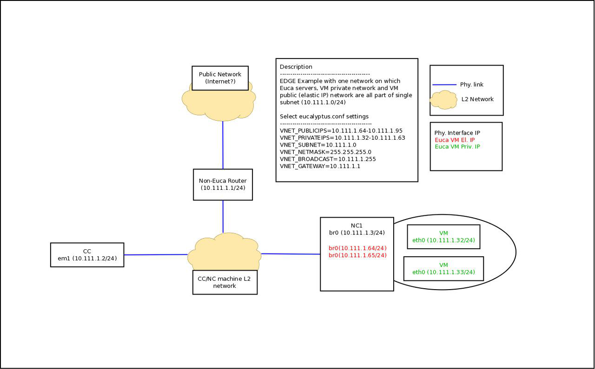
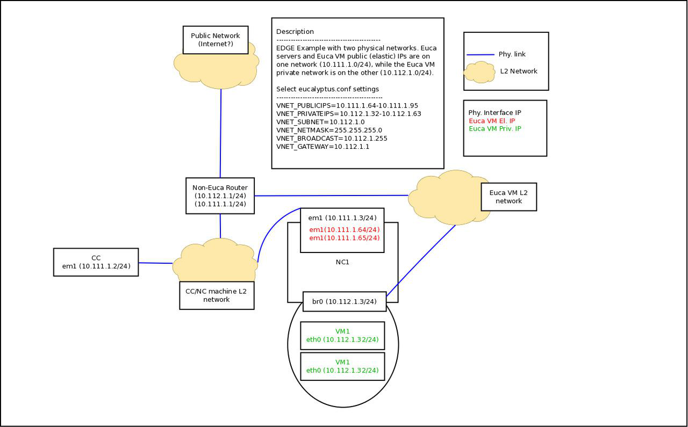

# EDGE Networking Mode
This document outlines some architecture/design/implementation/usage details for the new "EDGE" networking mode. It is assumed that the reader is familiar with existing Eucalyptus terminology and networking modes (reasons, requirements, configuration, deployment), and is looking for information on how the new mode works, along with some details and examples on how to add it to an existing Eucalyptus deployment.


# Motivation
There is a new networking mode for Eucalyptus deployments called"EDGE". There are three primary characteristics of the new mode thatdifferentiate it from other Eucalyptus networking modes, as well asseveral secondary characteristics.


### Primary Characteristics

1. remove the need to place a single Linux server in the data path for all VMs running in a single cluster.
1. remove the need to configure the underlying network to allow passing of VLAN tagged packets for use by Eucalyptus in order to provide VM layer 2 isolation.
1. promote a more clear separation of concerns between the way networking is implemented and the core back-end of Eucalyptus (i.e. largely remove implementation of networking model from cluster controller/node controller).


### Secondary Characteristics

1. configuration parameters required to run in "EDGE" mode should be easier to obtain from infrastructure site administators
1. networking faults are more distributed such that one fundamental networking crash would affect only a node's worth (possibly 2 node's worth) of VMs
1. support for more natural integration with existing site networking infrastructure and practices


# Overview
The name "EDGE" was chosen for this new mode in reference to the mostfundamental architectural choices for the new mode - that thecomponent responsible for implementing Eucalyptus VM networkingartifacts be running at the so-called 'edge' of a Eucalyptusdeployment. For the first implementation that has the previouslymentioned primary and secondary characteristics, the 'edge' of theEucalyptus deployment is at the Node Controllers, which is as close tothe VMs as we can get.

In EDGE, we run a new stand-alone component called 'eucanetd' alongside each node controller, which fetches dynamically changingEucalyptus VM networking view and is responsible for configuring theLinux machine on which the Node Controller/eucanetd is running toreflect the latest view. In this way, we provide the benefits ofprimary characteristic 1, 2, 3 and secondary characteristic 2.

In order to provide the benefits of secondary characteristics 1 and 3,as well as function without a single point where the networking viewcan be implemented, the initial implementation of "EDGE" mode integrateswith a site administrator's existing network infrastructure, allowingthe admin to 'tell' Eucalyptus (through configuration parameters forEDGE mode) about the extant network, which "EDGE" then will consume whenimplementing the Eucalyptus networking view.

The two basic types of pre-existing network setups that "EDGE" willintegrate with are:


* a single flat IP network which is used to service Euca component systems, Eucalyptus VM public IPs (elastic IPs), and Eucalyptus VM private IPs.
* two networks - one for Euca components and Euca VM public IPs, and the other for Euca VM private IPs.

See below for diagrams depicting example topologies for one or two network deployments. In each networking cases, it should be noted that "EDGE" will not'set up' the network from scratch as the MANAGED\* modes do, butinstead should be thought of as 'integrating' with networks thatalready exist. If the networks don't already exist, they will need tobe created outside of Eucalyptus software before configuring "EDGE" withknowledge of the networks. See the next section for more informationon the requirements of EDGE.


# Additional Network Reference Architectures
In addition to the above two architectures and descriptions, we include a number of diagrams that outline the network architectures for more complex scenarios, including:


* Single Network, Multi-Cluster (flat subnet and per-cluster subnet)
* Two Network, Multi-Cluster (flat subnet and per-cluster subnet)

See[[Reference Network Architectures|Reference-Network-Architectures]]to view the diagrams.


# Infrastructure Requirements
Requirements for running Eucalyptus in "EDGE" networking mode aredifferent from the other modes (which each have their ownrequirements). Although "EDGE" provides a full Eucalyptus networkingfeature set (Elastic IPs, Sec. Groups, VM isolation) like the existingMANAGED\* modes, the requirements are more like those of the existingSYSTEM/STATIC modes, in that pre-existing networks must be present todeploy in "EDGE". A summary of the unique infrstructure requirementsof "EDGE" follows:


* depending on the type of pre-existing network that is available/put in place (see Overview for types of pre-existing networks that EDGE can integrate with), those pre-existing networks need to be in place and ready for Eucalyptus to use. Briefly, Eucalyptus in "EDGE" requires that NCs have an interface configured with an IP on the VM public and VM private network (which may be the same network).
* there must be unused IP addresses on the VM public network for EDGE to use as VM elastic IPs
* there must be unused IP addresses on the VM private network for EDGE to use as VM private IPs
* there must be IP connectivy from the NC machines (where eucanetd runs) and their related CC machine (with eucanetd acting as an HTTP client to the CC).
* there must be IP connectivity from the NC machines (where eucanetd runs) and the CLC, for metadata re-directs for 169.254.169.254 to the active CLC to function.


# Using EDGE
In order to use EDGE networking mode, one must have an installed version of Eucalyptus 3.4.X, along with the 'eucalyptus-eucanet' packages on each node controller. This section describes how to configure Eucalyptus in EDGE mode, once the packages have been installed.


# Package Installation
On the node, you'll need to install the package for EDGE support:

 **For 3.4:** 

''yum install eucalyptus-eucanet''

And start it:

''service eucalyptus-eucanetd start''


# EDGE Configuration
Configuring Eucalyptus to use EDGE requires editing eucalyptus.conf on the CC and NC hosts. No configuration is necessary on any other eucalyptus component.

Set the following parameters in your eucalyptus.conf on the CC:


```diff
VNET_MODE
VNET_PRIVINTERFACE (set to any valid interface, ignored in tech preview but needs to be in config)
VNET_PUBINTERFACE (set to any valid interface, ignored in tech preview but needs to be in config)
VNET_SUBNET
VNET_NETMASK
VNET_BROADCAST
VNET_ROUTER
VNET_DNS
VNET_PUBLICIPS
VNET_PRIVATEIPS
```
Here's is an example of values that could be used to configure EDGE:


```diff
VNET_MODE="EDGE"
VNET_PRIVINTERFACE="em1"
VNET_PUBINTERFACE="em1"
VNET_SUBNET="1.100.192.0"
VNET_NETMASK="255.255.192.0"
VNET_BROADCAST="1.100.255.255"
VNET_ROUTER="1.100.192.1"
VNET_DNS="10.1.1.254"
VNET_PUBLICIPS="192.168.10.10-192.168.10.50"
VNET_PRIVATEIPS="1.100.192.10-1.100.192.100"
```
On the NC, the following are required:


```diff
VNET_MODE
VNET_PRIVINTERFACE
VNET_PUBINTERFACE
VNET_BRIDGE
VNET_DHCPDAEMON

```
for example


```diff
VNET_MODE="EDGE"
VNET_PRIVINTERFACE="br0"
VNET_PUBINTERFACE="br0"
VNET_BRIDGE="br0"
VNET_DHCPDAEMON="/usr/sbin/dhcpd41"

```
There is one extra parameter that can be set in eucalyptus.conf on node controllers called 'CC_POLLING_FREQUENCY' which defines the frequency at which the eucanetd process will poll the system for new network updates. The default is set to 5 seconds.


# Basic Design - eucanetd
As indicated by the mode name "EDGE", most of the work that is donewhen Eucalyptus is configured in "EDGE" networking mode is done by

'eucanetd' process, running on the each node controller machine.


Basic eucanetd process flow for the 3.4 Tech Preview:


```diff
- initialize eucanetd stuff (logfile, internal data structures)
- parse command line arguments (if any, currently none)

- loop
  - fetch current networking metadata from CC
  - if CC is not contactable, try again until data can be fetched
    - create all static iptables (filter, nat) and ebtables chains

- enter main loop (never exits)
  - fetch current networking metadata from CC
  - check if latest networking metadata is different from last known networking metadata
  - if update is required
    - install 169.254.169.254 NAT redirect to current CLC IP
    - update handling of private IPs
      - configure and run local dhcpd which serves all VMs running on local host
    - update handling of public IPs
      - configure public interface with current instance public IPs
      - configure iptables DNAT/SNAT rules to handle public<->private NATing
    - update VM isolation rules using ebtables
    - update security group rules
      - generate sets of private IPs within each security group using ipsets
      - install iptables rules implementing sec. group rules with ipsets as src/dst
    - sleep for a configurable number of seconds, go back to beginning of main loop

```


# Basic eucanetd process lifecycle and networking state management
When eucanetd first comes up, it will block until it can sucessfullyfetch metadata from its local CC.

Once it can get info from the CC, it will enter a main loop and neverexit (unless killed).

All networking artifacts that are put in place by eucanetd (iptables,ipsets, ebtables, dhcpd, etc) function independently from eucanetd

actually running (i.e. eucanetd only acts as the process that installsnetworking artifacts). Because of this, if eucanetd is killed whileVMs are running, the networking artifacts will remain in place andfunctional while eucanetd is stopped.

If eucanetd is restarted, it will either block if the CC is down (andartifacts are still in place) or will re-enter the main loop and willstart implementing the new state of the artifacts (or the leave theexisting state, if nothing has changed while eucanetd was down).If a CC fails while eucanetd is running, it will continue to run butwill not do any updates until the CC comes back (at which time it willinstall the latest view or will keep the existing state if nothing haschanges while the CC is down.

If Eucalyptus is in HA mode, the NC will be periodically dropping thelocation of the currently enabled CC, which eucanetd will pick updynamically as it is running.

There is currently no 'timeout' for when eucanetd will decide to clearall networking state if it has not been able to retrieve fresh stateinformation from its local CC. This is a design point that willlikely be made configurable, with 'no timeout' as the default.


# Troubleshooting eucanetd
Similar to other networking modes, troubleshooting typically involves ensuring that the process is healthy, configured properly, and is able to do its job by inspecting the logfile for ERRORs or WARNINGs (/var/log/eucalyptus/eucanetd.log). In terms of artifacts, eucanetd uses similar facilities of existing MANAGED\* networking modes, including 'iptables', 'ebtables', 'ipset', 'dhcpd41' and regular linux ethernet interface (using 'ip'). 

eucanetd additionally offers the ability to run the command manually on the terminal using the parameters '-d' for 'debug' which will force eucanetd to run in the foreground, sending log messages to the terminal. Also, the command line argument '-s <CC IP>' can be used to explicitly tell the eucanetd process to poll using the specified IP of it's cluster controller. This option should only be used for troubleshooting if eucanetd is complaining about not being able to fetch its configuration or network metadata from its CC, as normally it will extract the currently enabled CC from the data dropped by its paired node controller.

Finally, eucanetd stores its 'latest good network information' that it has successfully fetched from eucalyptus in files located in /var/lib/eucalyptus/, each of which starting with the string 'eucanetd_'. For deep troubleshooting, those files can be manually inspected if it is believed that the input data is not being parsed correctly or is incomplete (check eucanetd.log for indications of this potential problem).


*****

[[category.networking]] 
[[category.confluence]] 
