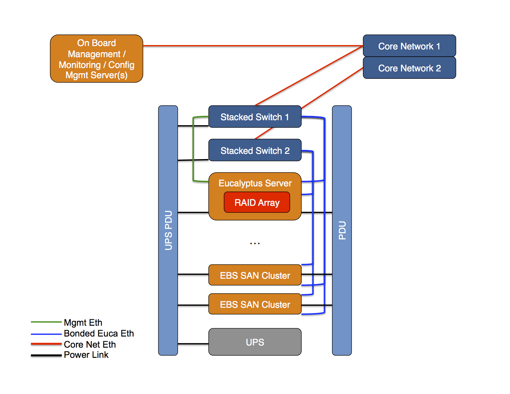
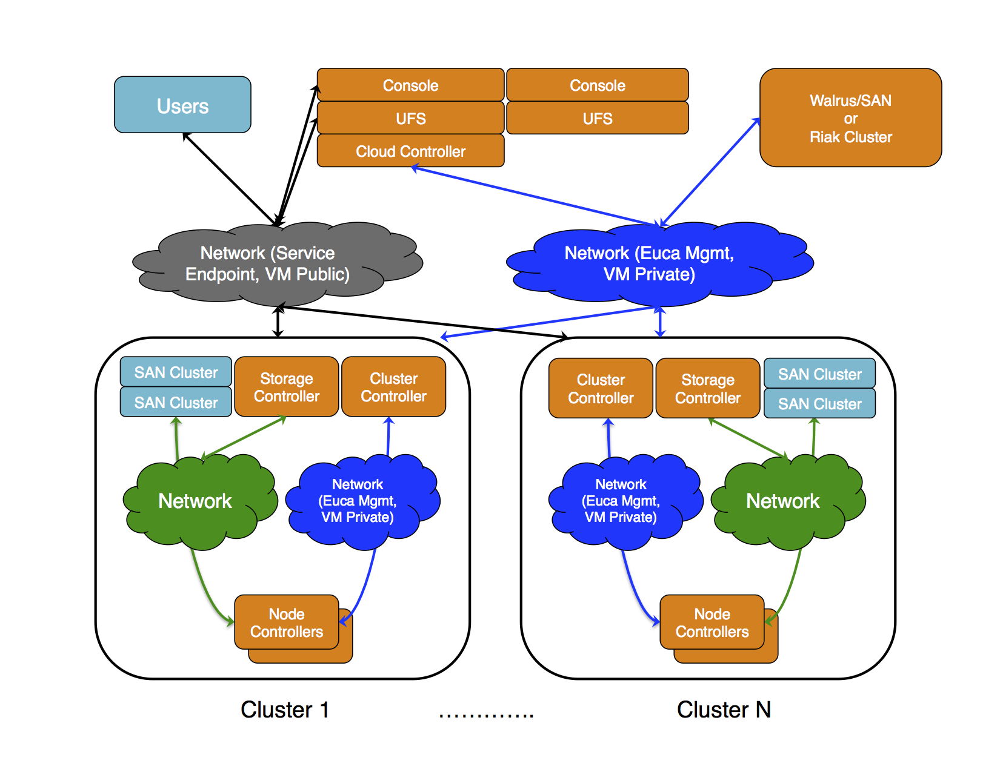
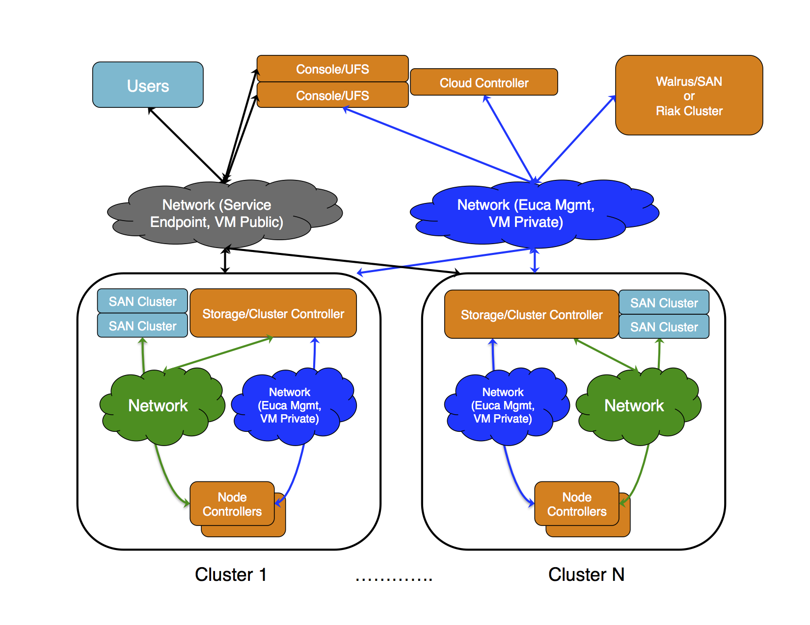

* [Design and Operate a Reliable Eucalyptus Cloud](#design-and-operate-a-reliable-eucalyptus-cloud)
  * [Part 1: Building a reliable deployment](#part-1:-building-a-reliable-deployment)
    * [Reliability in the Eucalyptus Platform](#reliability-in-the-eucalyptus-platform)
    * [Monitoring and Notification System](#monitoring-and-notification-system)
  * [Part 2: Behaviors of Eucalyptus upon failure, and procedures for restoring Eucalyptus health](#part-2:-behaviors-of-eucalyptus-upon-failure,-and-procedures-for-restoring-eucalyptus-health)
    * [Procedure: healthy system backup procedure](#procedure:-healthy-system-backup-procedure)
    * [Eucalyptus component-wise description of failure types, system behavior, and procedures for restoration](#eucalyptus-component-wise-description-of-failure-types,-system-behavior,-and-procedures-for-restoration)
    * [Procedure: Full recovery from backup](#procedure:-full-recovery-from-backup)

# Design and Operate a Reliable Eucalyptus Cloud
The Eucalyptus platform is a cohesive collection of software components that provide an administrator with the ability to offer their end-users an on-premise, AWS compatible cloud computing service for allocating and coordinating compute, storage and network resources. The platform ships with a collection of tools and procedures for installing, configuring, managing and maintaining the platform itself, and additionally includes several built-in mechanisms and techniques for providing reliable services to administrators and end-users. However, as a resource orchestration framework (i.e. a software system that coordinates and implements interactions between collections of physical and virtual resources), any given deployment of Eucalyptus requires that the hardware, OS, resource subsystems, and the Eucalyptus software itself be 'healthy' in order for the given deployment to be successfully providing services to end-users. In reality, when the resources underlying a deployment age over time (resulting in HW/SW components to fail), when unexpected failure events occur (full or partial power outages), or when configuration mishaps occur (mistaken/erroneous HW/SW configuration updates), there are periods of time when some aspect of a deployment goes from healthy to unhealthy, and the magnitude of the service interruptions in the face of failures can vary from minor to complete service outage. For example, in a Eucalyptus deployment, there are components that act as empty 'containers' which, if they fail when empty, only result in reduced maximum capacity in the system and therefore can be remedied by the administrator when they see fit. Failure of other Eucalyptus components in the same deployment, however, will result in what amounts to a complete service disruption. Finally, there are types of failures, such as a complete data center outage with Eucalyptus running on servers without any power backup, would certainly result in total service outage until power and the platform can be powered back on and restored. In this document, we use the term 'reliable' to broadly refer to a system that continues to operate when failures occur, either seamlessly with no service interruption/degradation, or with well defined (partial) service interruption/degradation along with a known procedure/path to full recovery.

This document is intended for Eucalyptus administrators who understand how to deploy Eucalyptus andare planning a new deployment, but who would additionally like to specifically design their deployment to be as reliable as possible in the face of a well defined set of failure scenarios. The document is broken into two sections. In the first section, we will describe the considerations to make when designing a Eucalyptus deployment, starting with robust HW techniques that are specifically relevant to a Eucalyptus deployment, and moving up to the use of various Eucalyptus features and techniques designed to minimize the impact of failures when utilized. This document is not intended as a complete end-to-end deployment guide, but should be considered as a supplement to existing deployment guides, reference architectures and documentation regarding the initial setup and configuration of Eucalyptus, with a focus on building a reliable, robust deployment.

Throughout this document, we'll be referring to a set of Eucalyptus components as the 'Eucalyptus Core'. This phrase is meant to outline the minimal footprint of a Eucalyptus deployment that needs to be operational for the services of Eucalyptus to be available to end-users. The 'Eucalyptus Core' is: the Cloud Controller (CLC), at least one Cluster Contoller (CC), at least one User Facing Service (UFS), an Object Storage Gateway and backing store (Riak or Walrus), at least one Storage Controller and backing store (local disk or SAN device(s)), and at least a small set of Node Controllers (NCs). These components must all be operational for Eucalyptus services to be practically considered available.

After reading this document, the reader should have the context and overview of what reliability aspects of their system (from hardware to the Eucalyptus platform itself) they have at their disposal toward achieving the goal of deploying a reliable Eucalyptus cloud platform.

## Part 1: Building a reliable deployment
Building a reliable deployment of Eucalyptus requires considering available reliability options both in how Eucalyptus itself is deployed (and what features of Eucalyptus are chosen to promote reliability), as well as in the hardware/software resources that the Eucalyptus platform is interacting with and coordinating. In this section, we will provide an overview of reliability options available in hardware and software, how they relate to Eucalyptus operation, as well as what features of Eucalyptus we can exploit to achieve the goal of a reliable deployment.

Reliability in HardwareFrom the perspective of Eucalyptus as a resource coordination system, we overview here various options that can be employed to ensure that the resources that Eucalyptus are coordinating are themselves as reliable as possible. This type of reliability can be vital to achieving a fully reliable deployment, and should be employed whenever possible (as hardware reliability features, budgets, and capability permits). There is never a case where, if any of the below hardware reliability options are avilable, they should not be exploited. The reasoning is that, typically, these mechanisms are meant to prevent catasrophic failure at the lowest possible level, allowing operating system, infrastructure, and application software to utilize the resources as if they are always healthy, thus avoiding OS/infrastructure/application specific reliability mechanisms from ever being triggered.

The section is broken into three categories: servers, storage and network.

Servers
*  **Power:**  modern servers often provide redundant physical hardware supplies, where the server can operate if either one of the power supplies is being fed adequate power. Generally, exploiting this capability by running a rack of servers where each server has one power supply on one circuit and the other power supply on a separate circuit will provide a measure of reliability in the face of power blips or partial circuit power loss. Further, such differentiation allows us the ability to run one of the two power circuits off of a Uninterruptible Power Supply (UPS) unit, giving us additional protection even in the face of complete power outage or power blips, as the UPS will provide battery power for a limited time to servers upon power failure.
*  **RAID:**  most modern server platforms include hardware RAID functionality, where-by connected disks can be configured pre-OS install to participate in a RAID array. There are various RAID levels that use different mechanisms for providing reliability (with trade-offs in how much overall capacity is reduced, and how disk performance is impacted), but utilizing hardware RAID is almost always the right option when building a reliable server. Depending on the server and what data will be residing on the disk array, RAID level 6, 5 or 1 are all good choices, and will provide the ability of the system to experience an entire drive failure and continue operating normally until a new drive can be installed. Ideally, hot-swappable disks configured into a RAID array will provide the best scenario, as replacing a disk upon failure will not require a server shutdown to restore the array.
*  **On-board management:**  most modern servers have the ability to be configured with some form of on-board management capability, which vary in their feature sets. For a Eucalyptus deployment, utilizing on-board management features such as reading remote power/temperature sensors, access to remote system KVM consoles, remote control of server power state, and setting up systems to notify administrators when system failure events occur are all important features, so that the administrators can know in advance when systems are experiencing failures and can take steps to remedy the situation before it is too late.
*  **Eucalyptus Specifics:** Ideally, all servers hosting a Eucalyptus deployment would be configured with redundant power supplies with UPS backup, RAID arrays for OS and data volumes, and with enabled on-board management access and event notifications. However, as a cloud platform, there are certain Eucalyptus components where failures will have a more significant impact on the overall service than others.  If the server reliability features are not available for all servers, the best practice is to minimally configure the Eucalyptus Core servers with the reliability features described above. This will result in the Eucalyptus software services remaining available through power interruption and in the face of individual disk failures. It is important to note that, additionally, the Eucalyptus Core servers also require network resources to remain available through failure events in order to continue to operate. We will address reliable network setup in its own section, below.

StorageIn addition to local storage requirements for OS and certain data volumes (see RAID overview in the server section, above), Eucalyptus can interact with dedicated SAN devices to storage and retrieve data for specific purposes. The two primary ways in which Eucalyptus interacts with a SAN device are when using the device as a backing store for Walrus (object store/S3 data storage) and as a backing store for Elastic Block Storage (EBS) services. In both scenarios, the data that is stored on the SAN device is generally considered crucial, as it represents canonical source of user and system data, and special consideration should be paid to ensuring that these devices are set up in a reliable fashion to prevent data loss (which can lead to degraded/unavailable Eucalyptus service operation).

*  **Storage Area Network (SAN) devices:** Each SAN device that is supported by Eucalyptus has its own methodology for reliability in the face of failures. Detailing the specifics of each device is beyond the scope of this document, but the core principle is common regardless of the device chosen. Eucalyptus will interact with a SAN end-point and/or static mount point to configure, storage and retrieve critical data, and any reliability measure that can be configured in the device itself (ranging from built in UPS/redundant power, built in redundant network links, redundant controller/disk arrays, and RAID techniques within the SAN device/cluster itself) should always be employed. Without these measures, the SAN becomes a single point of failure like any other physical resource that the platform relies upon for healthy operation. 
*  **Eucalyptus Specifics:** If a SAN is being used as the backing store for a Eucalyptus Walrus component, connectivity between the Walrus server and the SAN should be made reliable according to the SAN device best practices. This will result in the SAN mount-point remaining active even when individual components of the SAN might fail. If a SAN is being used as the backing store for Eucalyptus EBS service, then connectivity between the Storage Controller/SAN, and connectivity between the Node Controllers/SAN should be made reliable again according to the SAN device best practices. In both cases, the SAN device complex itself (typically involving a 'cluster' mode or other type of redundant controller/disk shelf arrangement) should be employed.

NetworkIt is recommended that a reliable network infrastructure be in place underneath a Eucalyptus deployment, to provide the platform the ability to resist single points of failure in the network. As a collection of interconnected software components, Eucalyptus itself utilizes the network to provide end-to-end services, and failures in the network can result in the inability of Eucalyptus to function. In addition, Eucalyptus will be coordinating the connection of virtual machines to underlying networks, providing end-users the ability to access and intercommunicate between their VMs. Building a reliable network involves redundancy in server network links, network switches and any upstream network infrastructure to which the Eucalyptus networks are connected. Below, we overview the necessary hardware components required to build a reliable network.

*  **Interfaces:**  Each server connected to a reliable network should do so using more than one network physical interface. Typically, a server with say two network interfaces is configured (in the operating system) to 'bond' these interfaces together in a way where if one of them either fails or loses link (i.e. the switch port to which it is connected fails), the other one will continue to operate properly. The exact instructions on how to set up redundant network interfaces is beyond the scope of this document, but all popular Linux operating systems have well documented instructions on setting up network interfaces in a redundant mode (ethernet bonding, using LACP, for example).
*  **Switches:** In order to provide redundant interface capability, the switches to which servers are connected must support LACP (commonly available in most managed switches), but further should be provisioned in a way where no single switch failure will result in both interface ports going down at the same time. In order to achieve true redundancy, we choose switches that can support 'stacking', where multiple individual switch devices are connected to provide a single management interface, and additionally allow for an LACP bonded server to have its individual links connected to separate physical switches. When all servers are connected to the switch complex in this way, any one failure in a single switch, server interface, or network cable will not result in a network outage to the server(s). Finally, the switch complex should similarly include an LACP uplink to the core network, so that a single switch failure will also not result in the loss of external connectivity beyond the switch network.
*  **Power:** Oddly, a large number of managed switches do no support redundant power supplies. However, when multiple switches are stacked and configured as previously described, placing any one switch in a reliable pair on the 'UPS Circuit' (see the above discussion of redundant power for servers), will result in power failure protection in the network.
*  **Eucalyptus Specifics:** Ideally, all servers connected to a network that is in use by the Eucalyptus platform would be connected to a reliable network as described. However, there are Eucalyptus components and networks where a network interruption will have a more significant impact on the health of the deployment than others. For a reliable Eucalyptus deployment, minimally, the network on which Eucalyptus Core components are registered (during the Eucalyptus component registration step of installation) should be connected to a reliable network, so that the components are able to communicate with one another even when partial network hardware failures occur.

Reliability in Hardware: SummaryIn this section, we've done an overview of techniques and tactics that can be employed at the underlying hardware level to provide a reliable resource pool in which to deploy the Eucalyptus platform. It is important to note that, while these techniques can be employed to provide a reliable system, they are designed only to mitigate the effects of low level/catasrophic types of failures (hardware failures, power outtages, partial network/disk failures, etc.). Target environment/use cases will inform exactly how much of the above methodologies a particular deployment must include, but it is safe to claim that all of the above can only increase the overall reliability of the deployment itself, without impacting the overall performance or ease of use of the given deployment. In sum, we provide here a reference diagram depicting how such a hardware platform is configured, related logically to the Eucalyptus Core components running atop the shown resources.

### Reliability in the Eucalyptus Platform
While areliable HW/OS platform can significantly improve the overall reliability of a Eucalyptus deployment (any software deployment, of course), that set of reliability improving mechanisms are targeted at only a partial list of failures that can cause service interruption/outages. In addition, no matter how reliable an underlying platform is designed to be, there are situations where either the mechanisms fail, or sometimes HW/OS outages trigger due to normal maintenance events and actions. The Eucalyptus platform has been designed at its core to tolerate a variety of partial, temporary and catastrophic failures, which is the topic of this section. Here, we discuss how the decisions on the Eucalyptus deployment topology and choices of which 'drivers' to use within Eucalyptus effect the overall reliability of a given deployment.

Deployment TopologyAs a distributed system of interconnected components, there are many choices that can be made with regard to how the individual software components of Eucalyptus map to physical servers. At deployment design time, the mapping decisions are made using knowledge of the deployment use case, server availability and location on the network, target scale of the system, and overall reliability goals. While any given use case generally will inform a single design, optimizations can be made for reducing server counts and configurations based on cost and other non-technical reasons. Here, we are explicitly discussing the best deployment choices with regard to increasing reliability of the overall platform.

Viewing Eucalyptus as a resource coordination platform, one consequence of the view is that for each Eucalyptus component, there are underlying resources that the component is responsible for coordinating. Ideally, we set a goal of ensuring that the mapping of resource to Eucalyptus component is one-to-one in order to promote reliability, as sharing resources amongst several software components can lead to resource contention which is often the cause of failures that effect the operation of the service. For example, both the Eucalyptus Walrus and Node Controller components at times demand heavy access to underlying disk volumes for handling object gets/puts and VM image manipulation and IO, respectively. In a scenario where an underlying disk volume is both under-provisioned and shared among these two components, there are degenerate cases where the IO load on the underlying system can be non-deterministically high, resulting in IO timeouts and for failure protection mechanisms in Eucalyptus to trigger. In order to remove such degenerate scenarios from occuring in practice, we generally design deplyoments where the software component and resources are mapped one-to-one, or ensure that if resources are shared, that their overall capacity is sufficient to provide stable service to multiple components simultaneously.

Toward this goal, the best design of a reliable Eucalyptus deployment is to place each Eucalyptus component on its own stand-alone server, ensuring that the component has dedicated access to the underlying resources that it needs. This deployment design also isolates failure domains, so that if any one server fails, the magnitude of the outage can be contained and managed as a single failure point (both in terms of hardware and the aspect of the Eucalyptus service that the failed server/component service is providing). The following diagram depicts such a design, where Eucalyptus services are running on their own underlying servers.

Practially, there are a multitude of reasons why running individual Eucalyptus components on their own servers becomes either too expensive or over specialized. In these cases, we identify Eucalyptus components that, when running together on a single underlying server, that the behavior of the overall system when both components fail simultaneously is either common or is mimized, and that the resource utilization of the componets are generally non-overlapping. In the following diagram, we depict a deployment of Eucalyptus which includes the same Eucalyptus components as above, but deployed in a fashion which reduces the overal Eucalyptus Core server count while not introducing the likelyhood of shared resource contention causing failures or of a single server failure causing more or a different type of a service problem than if multiple simultaneous server failures in the above digaram were to happen. Note that in this diagram, we have made co-location choices based on the inclusion of both a SAN device complex for EBS service, and a Riak installation for S3/Walrus service. These decisions will be discussed in more detail below. As soon as a SAN is not part of the deployment, or Walrus is configured to use local storage instead of integrating with a Riak cluster, the resource contention of those servers can quickly become an important reliability factor, and the components should then be hosted on their own isolated servers in order to promote reliability.

Active/Active ComponentsThe User Facing Service and GUI Console components of Eucalyptus provide network end-points to which end-users connect when interacting with all Eucalyptus services. These services can be considered the 'entry point' with which users interact when they are setting up their cloud environments, running and controlling VMs, uploading images and data, etc. They are designed to operate in an 'active/active' manner, which means that multiple instances of each component can be deployed on separated servers in order to increase the reliability of the overall deployment by eliminating the possibility that failure of any one UFS/Console server will render the deployment unusable until the failure can be remedied. In addition, Eucalyptus supports the ability to address UFS services via a fully qualified domain name (FQDN) as opposed to a specific IP address, which is a required feature to enable when running multiple UFS/Console services in order to benefit from their reliability characteristics. When using hostnames instead of IP addresses, end-users will then have only one end-point to consider when interacting with the system, and Eucalyptus will ensure that clients will recieve the appropriate network end-point based on the current operational status of the UFS/Console components. For a reliable deployment of Eucalyptus, we deploy at least two UFS/Console servers to gain this benefit.

Active/Passive Components (Tech. Preview)Eucalyptus includes another reliability feature (previously referred to in Eucalyptus as 'HA Eucalyptus') that is currently unsupported but available for testing in non-production deployments in which certain core components of the platform run in an Active/Passive manner, where the passive component will 'take over' and become active if the active component fails. This feature promotes reliability by guarding against single points of failure on the Cloud Controller, Storage Controller, VMWare Broker and Cluster Controller components of a Eucalyptus deployment. When enabled, any component with a passive counterpart (and related services) will remain available in the face of a catastrophic failure (server dies, component software dies, software component runs out of resources, etc.). When an active component fails, there is a period of time where the services the component was providing will be unavailable as the passive component becomes active, and this timing is highly dependent on the current conditions within the deployment ranging for sub-minute to many tens of minutes. Reducing failover time is one of the focus areas for moving this feature out of tech. preview, along with minimizing fault conditions where manual administrator intervention is required to restore a system to a healthy state.

VM Networking ReliabilityEucalyptus provides a number of networking 'modes' or 'drivers', which are designed to integrate with a variety of different underlying network environments. With reliability of the platform in mind, the mode we choose is called 'EDGE', which promotes increased reliability by distributing the work of AWS compatible networking mechanisms among the Eucalyptus Node Contoller servers, mapping the work needed to be done for VM instances to the server on which the instance is running, thus removing any central location where networking artifacts are in place for multiple remote VMs/networks. With EDGE, the failure impact of any individual Node Controller server is limited to only the VMs running on that server, including their network characteristics. In other words, with EDGE, there is no server where failure of the server will impact network connectivity to any user VM other than the VMs that were running on the failed server.

EBS/Storage Controller Data ReliabilityEucalyptus provides a number of backing store 'drivers' that the system can use for Elastic Block Storage (EBS) volumes. For areliable deployment, we use a reliable SAN device pool (see the above discussion on SAN hardware clustering) as the backing store, as it both reduces the server resource requirements of the Eucalyptus Storage Controller component, and takes advantage of the already present SAN device reliability mechanisms to ensure stable/failure resistant access to user EBS data. 

S3/Walrus Data ReliabilityEucalyptus provides a number of backing store 'drivers' that the system can use for S3/Walrus object storage. When designing areliable deployment, we use a Riak cluster as our backing store, taking advantage of Riak's reliability characteristics which protect object store data from single points of failure and/or data resource contention. If Riak is unavailable and a SAN device cluster is available, we can similarly utilize a SAN pool to provide reliable data storage/access from the Eucalyptus Walrus component to the reliable SAN pool.

 **TODO: need input from storage/QA teams, in particular around connecting Walrus to reliable SAN clusters** 

Reliability in the Eucalytpus Platform: SummaryIn this section, we've discussed how choices of deployment topology as well as underlying drivers impacts the overall reliability of a given Eucalyptus deployment. In sum, for a high reliability deployment, we ensure that Eucalyptus components have isolated access to the resources they are coordinating, and that we choose the most reliable resource dependencies and drivers that are supported by the platform. Namely, we use a SAN device/cluster for EBS, we use EDGE networking mode, and we use Riak as the backing store for S3/Walrus. 

### Monitoring and Notification System
We've discussed up to this point how to design a reliable Eucalyptus deployment, leveraging both HW/OS reliability mechanisms to create 'invisibly' stable underlying resources, as well as which choices to make when designing a deployment topology and selecting Eucalyptus drivers. In combination, using these mechanisms result in a system where system failures will still occur, but when they do we either have a time window in which to fix the failure before it has any effect on the service itself (in the case of the discussed HW/OS reliability mechanisms), or that the liklihood of failure and impact of failure will be isolated and minimized in scope (in the case of the discussed Eucalyptus Platform reliability mechanisms). While these mechanisms increase the overall reliability of a given deployment, it is vital that any actual failures, be they invisible or not, are detected and communicated to the deployment administrator, reliably. For any reliable Eucalyptus deployment, it is therefore necessary to be operating a monitoring system that ties in with the above reliability mechanisms so that failures are detected and notifications are sent when failures occur. This knowledge allows the administrator the ability to then take action to either prevent a partial 'invisible' failure (like a failed disk in a RAID array) or a 'visible' failure (CLC server outage) to work to remedy the problem in order to avoid or minimize service interruption.

For each HW/OS reliability mechanisms, there are typically either built-in or external monitoring interfaces to allow events from these subsystems to be communicated to the deployment administrator. For the Eucalyptus platform, we minimally recommend that the underlying component resources be monitored and that the component service processes themselves be monitored to ensure that they are running. A common, stable and full featured choice for monitoring is the Nagios monitoring tool, which is readily available and supports a wide variety of plugins for receiving events from HW/OS and the Eucalyptus platform.

## Part 2: Behaviors of Eucalyptus upon failure, and procedures for restoring Eucalyptus health
We've thus far described the HW/OS and Eucalyptus software capabilities that in concert result in a reliable deployment of the Eucalyptus platform. Most of these mechanisms are in place to prevent resource failures from impacting running services, but have thus far been the type of capabilities that is put in place either before or at Eucalyptus installation time. Even if all of the discussed reliability guards are in place, there are still situations and failures which will result in service outages. This section discusses, for each Eucalyptus component, the behavior of the overall system when explicit types of failures occur, and provides a procedural overview of how to maintain backups of a running deployment as well as how to recover the system using backup data. Each procedure/behavior described in this section will reference the reliable Eucalyptus deployment depicted in the following diagram:

### Procedure: healthy system backup procedure
All Eucalyptus deployments running production workloads (or those for which a catastrophic failure can be recovered from) must employ a procedure during normal operation results in periodic snapshots of the state of the deployment, so that the system can be partially or fully restored from snapshots. There are three main categories of information that must be captured in a periodic backup procedure in order to fully restore a given Eucalyptus deployment:

*  **Configuration:**  configuration files, run-time properties, any system config modifications atop default package installation
*  **Eucalyptus database:**  run-time and static Eucalyptus state and configuration
*  **User data:**  S3 object and EBS volume data 

 **TODO NOTE: there is currently no eng/QA/otherwise tested backup/restoration procedure for a Eucalyptus deployment. This is what we do on the ECC, but we've never had to restore. Have empirically done this on small/dev deployments, verifying only that it is nominally possible.** 

 **NOTE: we do have a documented procedure, but there have been problems during restore, recently (aug 18, 2014), where restoration fails:https://www.eucalyptus.com/docs/eucalyptus/4.0.1/index.html#admin-guide/backup_postgres.html** 

ConfigurationA given Eucalyptus deployment has three types of configuration that need to be periodically backed up (or, backed up when modified) in order to restore a deployment. Any standard back-up mechanism can be utilized to save configuration information, employing standard data back up procedures. The amount of data in aggregate that comprises the 'configuration' aspect of a Eucalyptus deployment is small usually measuring sub-megabyte per server.

*  **Configuration Files:**  on all servers running a Eucalyptus software component, the contents of /etc/eucalyptus/ and /etc/eucaconsole/ should be incrementally backed up and tagged with the server name so that, if a server is re-installed from scratch, these directories can be restored verbatim.
*  **Run-time Configuration Properties:**  much of the configuration of a Eucalyptus deployment is done at run-time by setting run-time properties on the Cloud Controller. With administrator credentials sourced, the output of 'euca-describe-properties' should be incrementally backed up.
*  **System Configuration Modifications:**  there are various run-time files and helper tools in Eucalyptus that operate well by default, but can be modified by the administrator for certain site-specific reasons. In general, any file that is installed by a Eucalyptus software package and is then modified by the administrator should be included in incremental back up.

Eucalyptus DatabaseOne of the very first operations that an administrator performs when installing Eucalyptus is to "initialize" the Eucalyptus Cloud Controller. This step results in the creation of the Eucalyptus Database, on the Cloud Controller, that resides in /var/lib/eucalyptus/db/. The DB is used to store system properties, as well as a wide variety of other state information that is required for the system to operate ranging from component registration information to user resource allocations and information. The entire contents of /var/lib/eucalyptus/db/ on the Cloud Controller should be incrementally backed up in order for a system to be restored if the server on which the DB information resides fails to the degree where data in /var/lib/eucalyptus/db/ is lost or corrupted. While the same mechanisms can be used to back up this data, it is listed separately here since the size of the DB directory can be very large depending on the features of Eucalyptus that are enabled and the size/activity characteristics of the cloud itself.

 **TODO: verify with services team if this is indeed the best current mechanisms (as opposed to a postgres dump operation which would avoid backing up only partial DB snapshots). Direct DB dumps give a better DB backup, but unclear how restore procedure would work end-to-end with just a DB dump.** 

User DataThe final category of information that must be backed up in order for a deployment to be restored is all data that users have created as part of normal operation. For a given Eucalyptus deployment, user data is stored both in the S3 storage back-end (for S3 buckets/objects including VM images) and the EBS storage back-end (for EBS volumes and snapshots). Given the fact that there are several drivers for integrating Eucalyptus with different storage back-ends for both S3 and EBS, the specific data back-up strategy that should be deployed is dependent on which back-end is in use. In general, however, it should be guaranteed that if data in a storage back-end is lost, there must be a back up / restoration procedure in place to bring the data back exactly how it was placed there by Eucalyptus in order for the system to continue to operate as it did before.

### Eucalyptus component-wise description of failure types, system behavior, and procedures for restoration
In this section, we will be describing a number of failure scenarios along with a description of system behavior when the failure occurs. In addition, we outline the procedure for restoring the system back to a healthy state in the face of the given failure.

 **TODO: these behaviors and restoration procedures have not been, but need to be, determined empirically, and described/documented here. Further action is to add and remove more failure case scenarios as input from the field.** 

Eucalyptus Console
* Failure type: component software goes down (server stays up)
    * System Behavior: if the Eucalyptus graphical console software (either the 'eucaconsole' or 'nginx' processes) fails for any reason, the effect will be that any user who tries to point their browser at the Eucalyptus console URL will receive a common 'this webpage is not available' type message from their browser. For users who are currently logged in to the console when the software component fails, there will eventually (usually upon page refresh or the attempt to perform an action) be presented with a similar 'this webpage is not available' message from their browser. 
    * Restoring Health: The Eucalyptus console is largely stateless, and thus the procedure for restoring the service to healthy operation is simply to restart the console/nginx processes via their respective init scripts, which will then continue to serve new connections, and will present a login screen to users who were previously logged in.

    
* Failure type: component server goes down
    * System Behavior: same as above.
    * Restoring Health: power-cycling the server will bring the Eucalyptus console service back-online, as the packages enable automatic 'start service on server boot' via their init scripts when they are installed.

    
* Failure type: component resources become unavailable
    * System Behavior: TODO: unknown
    * Restoring Health: TODO: unknown, but probably is 'stop the service, make problem resources available again, start the service'

    

Eucalyptus User Facing Service
* Failure type: component software goes down (server stays up)
    * System Behavior: TODO
    * Restoring Health: TODO

    
* Failure type: component server goes down
    * System Behavior: TODO
    * Restoring Health: TODO

    
* Failure type: component resources become unavailable
    * System Behavior: TODO
    * Restoring Health: TODO

    

Eucalyptus Cloud Controller
* Failure type: component software goes down (server stays up)
    * System Behavior: TODO
    * Restoring Health: TODO

    
* Failure type: component server goes down
    * System Behavior: TODO
    * Restoring Health: TODO

    
* Failure type: component resources become unavailable
    * System Behavior: TODO
    * Restoring Health: TODO

    

Eucalyptus Walrus
* Failure type: component software goes down (server stays up)
    * System Behavior: TODO
    * Restoring Health: TODO

    
* Failure type: component server goes down
    * System Behavior: TODO
    * Restoring Health: TODO

    
* Failure type: component resources become unavailable
    * System Behavior: TODO
    * Restoring Health: TODO

    

Eucalyptus Storage Controller
* Failure type: component software goes down (server stays up)
    * System Behavior: TODO
    * Restoring Health: TODO

    
* Failure type: component server goes down
    * System Behavior: TODO
    * Restoring Health: TODO

    
* Failure type: component resources become unavailable
    * System Behavior: TODO
    * Restoring Health: TODO

    

Eucalyptus Cluster Controller
* Failure type: component software goes down (server stays up)
    * System Behavior: TODO
    * Restoring Health: TODO

    
* Failure type: component server goes down
    * System Behavior: TODO
    * Restoring Health: TODO

    
* Failure type: component resources become unavailable
    * System Behavior: TODO
    * Restoring Health: TODO

    

Eucalyptus VMWare Broker
* Failure type: component software goes down (server stays up)
    * System Behavior: TODO
    * Restoring Health: TODO

    
* Failure type: component server goes down
    * System Behavior: TODO
    * Restoring Health: TODO

    
* Failure type: component resources become unavailable
    * System Behavior: TODO
    * Restoring Health: TODO

    

Eucalyptus Imaging Worker VM
* Failure type: component software goes down (server stays up)
    * System Behavior: TODO
    * Restoring Health: TODO

    
* Failure type: component server goes down
    * System Behavior: TODO
    * Restoring Health: TODO

    
* Failure type: component resources become unavailable
    * System Behavior: TODO
    * Restoring Health: TODO

    

Eucalyptus ELB VM
* Failure type: component software goes down (server stays up)
    * System Behavior: TODO
    * Restoring Health: TODO

    
* Failure type: component server goes down
    * System Behavior: TODO
    * Restoring Health: TODO

    
* Failure type: component resources become unavailable
    * System Behavior: TODO
    * Restoring Health: TODO

    

Eucalyptus Node Controller
* Failure type: component software goes down (server stays up)
    * System Behavior: TODO
    * Restoring Health: TODO

    
* Failure type: component server goes down
    * System Behavior: TODO
    * Restoring Health: TODO

    
* Failure type: component resources become unavailable
    * System Behavior: TODO
    * Restoring Health: TODO

    

### Procedure: Full recovery from backup
We've discussed system failure behavior and restoration of service health in the face of partial failures in the previous section. In this section, we describe a restoration procedure, from back up, or an entire Eucalyptus deployment. This type of procedure should only be necessary in extreme cases where an entire deployment is irrevocably lost, or the administrator wishes to verify that a deployment can be restored from back-up as part of regular best practices around backup/recovery procedures (it is insufficient to rely on a back-up system alone, without verifying empirically that restoration from said backups is possible).

Restoring an entire Eucalyptus system is similar to installing the system from scratch, except that there are certain installation operations that will be replaced with putting the backup information in place instead of generating them. The procedure follows:

 **TODO: verify this procedure** 

*  **Install and configure infrastructure:**  all servers, networks, storage devices, operating systems, and management tools/systems should first be installed exactly as they were in the previous deployment. Importantly, server/subsystem IP addresses and hostnames must match their previous foot print in order for Eucalyptus back-up information to apply correctly. If any changes to underlying resources are desired at system restore time, they should be delayed until after the system is brought back exactly as it was before, and then the change should be made against the running system (as opposed to making underlying system changes at the same time as system restoration).
*  **Install Eucalyptus software components:**  this process is identical to installing Eucalyptus from scratch. Each server that was hosting a Eucalyptus component previously should have the corresponding Eucalyptus component re-installed from packages on the new servers.
*  **Restore Eucalyptus configuration files:**  for each host where configuration files and any modified system files have been backed up (see previous section on backing up a Eucalyptus deployment), these files should be restored directly from backup to their corresponding server ( **NOTE:**  verify that both the data and permissions have been restored properly)
*  **Restore Eucalyptus DB:**  the data base backup (see previous section on backing up a Eucalyptus deployment) should be put back in place on the Cloud Controller in /var/lib/eucalyptus/db/ ( **NOTE:**  verify that the both the data and permissions have been restored properly)
*  **Restore user data:**  the user data from your S3 and EBS storage back-end servers must be restored in the corresponding new storage back-ends, according to best practices for the particular storage back-end that the deployment is using
*  **Start Eucalyptus components:**  at this point, the system should come up as it was before.
*  **Verify configuration:**  using the run-time properties from back up (see previous section on backing up a Eucalyptus deployment), verify that the running system properties match the backed up system properties.
*  **Reboot all servers:**  it is always advised that, before a system is considered back online, that a reboot step is performed to verify that the system is operating in steady state and that no steps have been missed.

*****

[[category.networking]] 
[[category.confluence]] 
