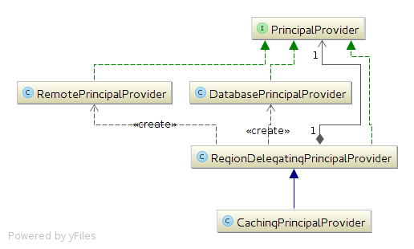
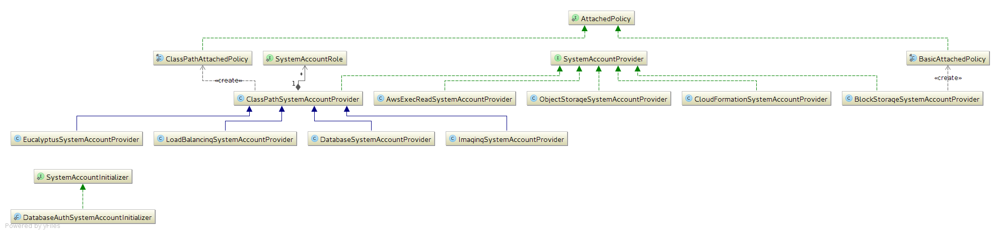

This document details changes for the IAM service implementation and for the authentication and authorization API in Eucalyptus 4.2.

* [Overview](#overview)
* [IAM model](#iam-model)
* [Implementation changes](#implementation-changes)
  * [Authorization API](#authorization-api)
  * [Authorization cache](#authorization-cache)
  * [Authorization entities](#authorization-entities)
  * [Policy persistence](#policy-persistence)
  * [Policy cache](#policy-cache)
  * [System account creation](#system-account-creation)

## Overview
In order to support region federation in 4.2 it was first necessary to modify the IAM service and authentication and authorization API for extensibility and to support potentially remote datasources for identity metadata.

## IAM model
When there are multiple sources of identity information, as there would be with region federation then the source for each identity must be determined. The most efficient approach is to partition the IAM identifier space where possible so that given an identifier it is possible to derive the identity owner. Some identifiers are global and user selected (account alias) and some are global and derived from the values they represent (signing certificate identifiers) in these cases identity owners would need to coordinate to ensure information is not duplicated.

## Implementation changes
This section highlights changes to the implementation in 4.2.

### Authorization API
The authorization API is minimalized, made immutable and moved into the msgs module, the old authentication module is removed. The  _Accounts_  facade is the main entry point, with the new  _PrincipalProvider_  interface used for most functionality:

The  _CachingPrincipalProvider_  is used by the  _Accounts_  facade and is located via  _ServiceLoader_  (configured in the  _META-INF/services/com.eucalyptus.auth.api.PrincipalProvider_  file). The  _CachingPrincipalProvider_  adds a cache on top of the  _RegionDelegatingPrincipalProvider_  which is responsible for dispatching calls the the appropriate _PrincipalProvider_ (s) based on identifier partitioning. In the typical non-region-federated case all calls are handled by the  _DatabasePrincipalProvider_ .

### Authorization cache
There is a new authorization cache that is enabled by default. The cache is implemented by the  _CachingPrincipalProvider_  based on configuration from  _AuthenticationProperties_ . There is a cache for principal information which has an expiry and also an expiry specifically for authorizations. When an authorization expires the principal information is refreshed, if unchanged the existing cached information reused, avoiding the need to transfer/reload policy information. There is also the option to reused cached principal information if an error occurs on refresh, this adds some degree of failure handling for remote principals when enabled (off by default)

For better performance and failure handling with federated regions the cache durations should be increased.

### Authorization entities
Authorization entities and the  _eucalyptus_auth_  persistence context are now considered part of the euare module (a service implementation detail)

### Policy persistence
Tables relating to the decomposed policy are removed, the textual version of the policy is used at runtime. The following tables are removed (by _AuthPreUpgrade420_ ) on upgrade to 4.2:

* auth_auth_action_list
* auth_auth_resource_list
* auth_auth
* auth_condition_value_list
* auth_condition
* auth_principal_value_list
* auth_principal
* auth_statement

### Policy cache
Policies are now interned and cached. The immutable  _PolicyPolicy_  class is now used to represent a policy,  _PolicyUtils_  provides support for interning policies. Interning policies allows a single representation of each canonical partial policy to be shared to save resources. The  _PolicyParser_  transparently handles interning, so no explicit action is required in the  _PolicyEngineImpl_  authorization cache to handle policy/statement duplication. Unique  _PolicyVersion_ s are cached, so cached policies need not be checked for freshness as any change to a policy creates a new  _PolicyVersion_ .

### System account creation
There is a new API for system account creation:

Services requiring a system account implement the  _SystemAccountProvider_  interface and add service loader metadata under  _META-INF/services/com.eucalyptus.auth.util.SystemAccountProvider_  so the provider is used on bootstrap. The  _ClassPathSystemAccountProvider_  implementation supports more complex system accounts with some support for roles. The  _SystemAccountInitializer_  is implemented in the euare module by the  _DatabaseAuthSystemAccountInitializer_  and does the work of applying the information obtained from the  _SystemAccountProvider_ s.

*****

[[category.confluence]] 
