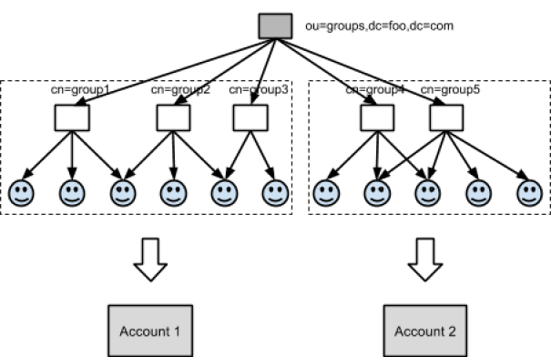

#  Identity and Access Management in Eucalyptus 3


Identity and Access Management in Eucalyptus 3

User Identities

Special Identities

Credentials

Account Creation

Special User Attributes

Identity Migration from Eucalyptus 2

Access Management

Policy

Eucalyptus Policy Extensions

EC2 Resource

Policy Key

Policy Evaluation Algorithm

Overall Access Evaluation Algorithm

Default Permissions

Quota

Quota Evaluation Algorithm

Default Quota

LDAP/AD Integration

Mapping Identities from LDAP/AD to Eucalyptus

LDAP/AD Integration Configuration (LIC)

LDAP/AD Synchronization

Appendix

Accepted AWS APIs as policy action


 Eucalyptus 3 has a big change in the design of user identity and access management. The essential goal of the new design is to provide more layers in the hierarchical organization of user identities, and more refined control over resource access. The core of the new design is highly compatible with Identity and Access Management (IAM) service in Amazon AWS. There are a few Eucalyptus specific extensions to meet the needs of enterprise customers.


## User Identities
Like IAM, the user identities in Eucalyptus 3 are organized into  _Accounts_ .  _Account_  is the unit of resource usage accounting, and also a separate name space for many resources, e.g. security groups, key pairs, users, etc. Accounts are identified by either a unique ID (UUID) or a unique name. The account name is equivalent to IAM's  _account alias_ . In Eucalyptus 3, the account name is used to manipulate accounts in most cases. However, to be compatible with AWS, the EC2 commands often use account ID to display resource ownership. There are command line tools to discover the correspondence of account ID and account name. For example, euare-accountlist lists all the accounts with both their IDs and names. 


 An account can have multiple users, but a user can only be in one account. Within an account, users can be associated with  _Groups_ .  _Group_  is used to attach access permissions to multiple users. A user can be associated with multiple groups. Because an account is a separate name space, user names and group names have to be unique only within an account. Therefore, user  _X_  in account  _A_  and user  _X_  in account  _B_  are two different identities. 

 Both users and groups are identified by their names, which are unique within an account (they also have UUIDs, but rarely used).


### Special Identities
Eucalyptus 3 introduces some special identities for the convenience of administration and use of the system.


* The  **_eucalyptus_**  account. This is like the root group in a Linux system. Every user in the  _eucalyptus_  account has full access to the resources in the system. These users are often referred to as  _sys admin_  or  _cloud admin_ . This account is automatically created when the system starts for the first time. You can not remove  _eucalyptus_  account from the system.
* The  **_admin_**  user of an account. Each account, including the  _eucalyptus_  account, has a user named  _admin_  by default, i.e. created automatically by the system when an account is created. The  _admin_  of an account has full access to the resources owned by the account. You can not remove the  _admin_  user from an account. The  _admin_  can delegate resource access to other users in the account by using  _policies_ .


### Credentials
As IAM, each user has a unique set of credentials, which are used to authenticate the access to resources. There are 3 types of credentials:


*  _X509 certificate_ . This is used to authenticate requests to SOAP API service.
*  _Secret access key_ . This is used to authenticate requests in RESTful API service.
*  _Login password_ . This is used to authenticate the Eucalyptus dashboard access.

Credentials can be managed using IAM-compatible command line tools (the "euare-\*" commands) or the Eucalyptus dashboard. 

 In IAM, each account has its own credentials. In Eucalyptus 3, the equivalent of account credentials are the credentials of  _admin_  user of the account. 

 Like previous versions of Eucalyptus, a convenient way to download the full set of credentials of a user (or an account), including X509 certificate and secret access key, is provided by:


* $EUCALYPTUS/usr/sbin/euca_conf --get-credentials
* $EUCALYPTUS/usr/sbin/euca-get-credentials
* "Download new credentials" from Eucalyptus dashboard

These tools return:


* An arbitrary existing active secret access key
* A newly generated X509 certificate


### Account Creation
Accounts can be created in two ways:


* Direct creation using command line tool or Eucalyptus dashboard by  _sys admin_ . The accounts created in this method will be available for accessing immediately.
* Registration process. One can apply for an account through the dashboard. The process is as follows:
    1. The cloud user registers using the form on the dashboard interface.
    1. An email will then be sent to the  _sys admin_  for review.  _Sys admin_  can approve or reject the application by invoking a URL included in the email. A notification email will be sent to the intended account owner.
    1. If the application is approved, the account owner needs to invoke the URL included in the notification email to confirm the approval.
    1. Once confirmed, the new account becomes available.

    


 The account registration status can be found in dashboard. Note that the account registration status is actually associated with the  _account admin_  user. So using the following command can also obtain the same information:

 euare-usergetattributes --delegate account -u admin --show-extra

 where the --show-extra option displays extra information of a user in the following order:


* If the user is enabled
* Registration status
* Password expires

The account registration status has the following values based on the status of registration process:


* REGISTERED
* APPROVED
* CONFIRMED

An account that is not CONFIRMED can not be used or accessed. The  _sys admin_  can manipulate the account registration status in both dashboard and command line:

 euare-usermod --delegate account -u admin --reg-status=status

 But note that the command line manipulation of the registration status does not send the notification emails. So unless you know what you are doing, use the dashboard.


### Special User Attributes
In Eucalyptus 3, a user has some extra attributes beyond those provided in IAM, that can be manipulated through either dashboard or command line:


* Registration status. As discussed in the above, this is currently only meaningful for  _account admin_  (i.e. account).
* Enabled status. A user can be temporarily disabled using this attribute.
* Password expiration date.
* Custom information. Any name-value pair can be added to a user's custom information attribute. This is useful for attaching pure text information, e.g. address, phone number, department, etc., to a user, esp. when integrated with external LDAP/AD services.

The registration status, enabled status and password expiration date can be inspected and manipulated using "euare-usergetattributes" and "euare-usermod" commands. And the custom information can be inspected and manipulated using "euare-usergetinfo" and "euare-userupdateinfo" commands. Refer to Eucalyptus Command Line Reference for detailed usage of these commands. And these information can also be operated in dashboard.


### Identity Migration from Eucalyptus 2
When Amazon introduced IAM, the concept of "user" has changed. The original "user" has become the "account" and the new "user" is an identity within the "account". With Eucalyptus 3's implementation of an IAM-compatible identity management system, a similar change was made. If an upgrade of Eucalyptus 2 to Eucalyptus 3 is performed, the "users" in Eucalyptus 2 are converted into "accounts" in Eucalyptus 3. Please refer to the Eucalyptus upgrade guide for the detailed implications of this identity conversion process.


## Access Management
In Eucalyptus 2, the access management ability is limited:


*  _admin_  user has full access control of the system resources
* Normal users control resources created by themselves
* Certain resources can be shared among users, via mechanisms like image launch permissions and Walrus bucket ACLs.

Eucalyptus 3 introduces a two-tier hierarchy of user identities based on accounts. The access control, therefore, is provided at both tiers:


* Eucalyptus 2 style resource sharing is still available, but now implemented at account level.
* Within each account, i.e. at user level, fine-grained access control is provided by  _Policy_ , which is fully compatible with IAM policy.

The following table compares different access management mechanisms:


|  **Permissions**  |  **Attach To**  |  **Scope**  |  **Service**  |  **Format**  | 
| IAM | User/Group | Within account | All | JSON | 
| Image Permission | Resource | Across accounts | EC2 | API parameter | 
| Snapshot Permission | Resource | Across accounts | EC2 | API parameter | 
| S3 ACL | Resource | Across accounts | S3/Walrus | XML | 
| S3 Bucket Policy | Resource | Within & Across accounts | S3/Walrus | JSON | 


 Note that  _snapshot permission_  and  _S3 bucket policy_  have not been implemented yet in Eucalyptus 3.Is this still the case as of 3.4.0? 

 IAM policies can be combined with account level permissions. For example, the  _admin_  of account A can give users in account B permission to launch one of account A's images by changing the image attributes. Then the  _admin_  of account B can use IAM policy to designate the users who can actually use the shared images. 

 IAM policies can be attached to both users and groups. When attached to groups, it is equivalent to attach the same policies to the individual users within that group. Therefore, a user may have multiple policies attached from those attached to himself/herself and from those attached to the groups he/she belongs to. 

 IAM policies (except  _quota_  policies, an Eucalyptus 3 extension) SHOULD NOT be attached to  _account admins_ . At this point, doing so won't result in a failure but may have unexpected consequences.


### Policy
Eucalyptus 3 uses the same policy language to specify user level permissions as IAM. The policy is written in JSON. Each policy file may contains multiple statements, each specifying a permission. Each statement has the following components:


*  _Effect_ : "Allow" or "Deny"
*  _Action_  or  _NotAction_ : select or not select service APIs, e.g. "ec2:RunInstances". The action values are  **case insensitive** .Should we add that Action's can be referred to by wildcards "\*" too?
*  _Resource_  or  _NotResource_ : select or not select resources specified in ARN, the globally unique resource name, e.g. "arn:aws:s3:::acme_bucket/blob"
*  _Condition_ : additional constraints of the permission.
    * Condition type. The type of conditions, based on the value type. For example, string comparisons.
    * Condition key. Some system properties for conditions, e.g. current time or source IP address of a request, etc. Key values are  **case insensitive** .

    

Essentially, a permission statement specifies whether to "Allow" or "Deny" ( _effect_ ) a list of  _actions_  to be performed on a list of  _resources_ , under some  _conditions_ . The following example policy contains one policy that gives a user with full permission (same access as the account admin):


```
{
  "Version":"2011-04-01",
  "Statement":[{
    "Sid":"1",
    "Effect":"Allow",
    "Action":"*",
    "Resource":"*"
  }]
}
```


 For detailed description of the policy language, please refer to Amazon AWS IAM User Guide.


### Eucalyptus Policy Extensions
Eucalyptus 3 extends the IAM policy in a few places to meet the needs of enterprise customers.

EC2 ResourceIn IAM, one can not specify EC2 resources in a policy statement except a wildcard "\*". Therefore it is not possible to constrain a permission on specific EC2 entities. For example, you can not restrict a user to run instances on a specific image or VM type. To solve that, Eucalyptus 3 introduces the EC2 resource for the policy language. The ARN of an EC2 resource is like the following:

 arn:aws:ec2::<account id>:<resource type>/<resource id>

 Where  _account id_  is optional. 

 The following  _resource types_  for EC2 are supported:


*  _image_ 
*  _securitygroup_ 
*  _address_ . The  _resource id_  part can be an address or address range, e.g. 192.168.7.1-192.168.7.255.
*  _availabilityzone_ 
*  _instance_ 
*  _keypair_ 
*  _volume_ 
*  _snapshot_ 
*  _vmtype_ 


 An example of a permission using EC2 resources shows in the following:


```
{
  "Version":"2011-04-01",
  "Statement":[{
    "Sid":"2",
    "Effect":"Allow",
    "Action":"ec2:RunInstances",
    "Resource":"arn:aws:ec2:::vmtype/m1.small"
  }]
}
```


 which specifies a permission to launch instances with only "m1.small" VM type.

Policy KeyNot all the IAM policy keys are implemented in Eucalyptus 3. The following AWS policy keys are implemented:


* aws:CurrentTime
* aws:SourceIp

Eucalyptus 3 also extends the policy keys by adding the following:


* ec2:KeepAlive
* ec2:ExpirationTime

to the specification of instance life time. ec2:KeepAlive says how long an instance can run and ec2:ExpirationTime specifies the deadline for an instance. The following example restricts an instance running time to 24 hours.


```
{
  "Version":"2011-04-01",
  "Statement":[{
    "Sid":"3",
    "Effect":"Allow",
    "Action":"ec2:RunInstances",
    "Resource":"*",
    "Condition":{
      "NumericEquals":{
        "ec2:KeepAlive":"1440"
      }
    }
  }]
}
```


 So what if there are multiple ec2:KeepAlive or ec2:ExpirationTime keys that matches a request? For example, one policy statement says the instance can run 24 hours while another says it can run 36 hours. In this situation, Eucalyptus 3 will pick the "better" value, i.e. the longer lifetime for the instance to be launched, in this case, 36 hours.


### Policy Evaluation Algorithm
Multiple policies (and multiple permission statements) can be associated with a user. How they are combined together to control the access to resources in an account is defined by the policy evaluation algorithm. Eucalyptus 3 implements the same policy evaluation algorithm as IAM. Briefly, it can be described in the following:


1. If the request user is  _account admin_ , the access is allowed.
1. Otherwise, collect all the policy statements associated with the request user (attached to the user and all the groups the user belongs to), which match the incoming request (i.e. based on the API being invoked and the resources it is going to access).
    1. If there is no matched policy statement, the access is denied (default implicit deny).
    1. Otherwise, evaluate each policy statement that matches.
    1. If there is a statement that explicitly denies the access, the request is denied.
    1. If there is no explicit deny, which means there is at least one explicit allow, the access is allowed.

    

    


### Overall Access Evaluation Algorithm
Now we give the overall access evaluation combining both account level permissions and IAM permissions, which decides whether a request is accepted by Eucalyptus:


1. If the request user is  _sys admin_ , the access is allowed.
1. Otherwise, check account level permissions, e.g. image launch permission, to see if the request user's account has access to the specific resources.
    1. If not, the access is denied.
    1. Otherwise, invoke the  _policy evaluation algorithm_  to check if the request user has access to the resources based on IAM policies.

    


### Default Permissions
Different identities have different default access permissions, i.e. when no policy associated:


*  _Sys admin_ : access to all resources in the system.
*  _Account admin_ : access to all resources of the account (which also include those shared resources from other accounts, e.g. public images or shared snapshots).
* Regular user: no access to any resource.

For convenience, Eucalyptus 3 gives the following default access to regular users:


* A user can list himself (euare-userlistbypath)
* A user can get attributes of himself (euare-usergetattributes)
* A user can get info of himself (euare-usergetinfo)
* A user can list his own account (euare-accountlist)

And account admin has the following default permissions:


* euare-accountlistpolicies
* euare-accountgetpolicy


## Quota
Eucalyptus 3 adds quota enforcement to resource usage. To avoid introducing another configuration language into Eucalyptus, and simplify the management, we extend the IAM policy language to support quota. The only addition added to the language is the new  _limit_  effect. If a policy statement's  _effect_  is  _limit_ , it is a quota statement. A quota statement also has  _action_  and  _resource_  fields, which can be used to match specific requests, i.e. quota only being checked on matched requests. The actual quota type and value are specified using special quota keys, and listed in the  _condition_  part of the statement. Only condition type NumericLessThanEquals can be used with quota keys. The following is an example:


```
{
  "Version":"2011-04-01",
  "Statement":[{
    "Sid":"4",
    "Effect":"Limit",
    "Action":"ec2:RunInstances",
    "Resource":"*",
    "Condition":{
      "NumericLessThanEquals":{
        "ec2:quota-vminstancenumber":"16"
      }
    }
  }]
}
```


 This quota statement limits the attached user to only launch maximal 16 instances in an account. 

 Quota can be attached to both users and accounts, although some of the quotas only apply to accounts. Quota attached to groups will take no effect. When a quota policy is attached to an account, it actually is attached to the  _account admin_  user. Since only  _sys admin_  can specify account quotas,  _account admin_  can only inspect but not change the quotas attached to himself/herself. The following is all the quota keys implemented in Eucalyptus 3:


* s3:quota-bucketnumber – # of S3 buckets, applies to account and user
* s3:quota-bucketobjectnumber – # of objects in each bucket, applies to account and user
* s3:quota-bucketsize – size of bucket in MB, applies to account and user
* s3:quota-buckettotalsize – total size of all buckets in MB, applies to account and user
* ec2:quota-addressnumber – # of elastic IPs, applies to account and user
* ec2:quota-imagenumber – # of EC2 images, applies to account and user
* ec2:quota-snapshotnumber – # of EC2 snapshots, applies to account and user
* ec2:quota-vminstancenumber – # of EC2 instances, applies to account and user
* ec2:quota-volumenumber – # of EC2 volumes, applies to account and user
* ec2:quota-volumetotalsize – # of total volume size in GB, applies to account and user
* iam:quota-groupnumber – # of IAM groups, applies to account
* iam:quota-usernumber – # of IAM users, applies to account


### Quota Evaluation Algorithm
Like the normal IAM policies, a user may be associated with multiple quota policies (and multiple quota statements). How all the quota policies are combined to take effect is defined by the quota evaluation algorithm:


1. If the request user is  _sys admin_ , there is no limit on resource usage.
1. Otherwise, collect all the quotas associated with the request user, including those attached to the request user's account and those attached to the request user himself/herself (for  _account admin_ , we only need collect account quotas).
1. Evaluate each quota one by one. Reject the request as long as there is one quota being exceeded by the request. Otherwise, accept the request.


 Note that the hard limits on some resources override quota limits. For example, walrus.storagemaxbucketsizeinmb (system property) overrides the s3:quota-bucketsize (quota key).


### Default Quota
Contrary to IAM policies, by default, there is no quota limits (except the hard system limit) on any resource allocations for a user or an account. Also,  _sys admin_  will not be constrained by any quota.  _Account admin_ , however, will only be constrained by account quota.


## LDAP/AD Integration
In Eucalyptus 2, identities can only be managed within Eucalyptus. In Eucalyptus 3, identities can be imported from external sources, via the integration with LDAP or Active Directory services. When LDAP/AD sync is enabled, Eucalyptus:


* Imports specified user and group information from LDAP or AD and maps them into a predefined two-tier account/group/user structure.
* Always authenticates dashboard users through connected LDAP or AD service.

Note that Eucalyptus only imports the identities and some related information. Any Eucalyptus specific attributes are still managed from Eucalyptus (stored in the internal database of Eucalyptus). These include:


* User credentials: secret access keys, X509 certificates. Dashboard login password is an exception. We DO NOT download passwords from LDAP/AD and DO NOT save them either. Eucalyptus authenticate dashboard login directly through LDAP/AD using LDAP/AD authentication (simple or SASL).
* Policies: IAM policies and quotas. Policies are associated with identities within Eucalyptus (stored in internal database)

Also note that special identities, including  _sys admins_  and  _account admins_ , are created in Eucalyptus and not imported from LDAP/AD. Only normal user identities are imported.


### Mapping Identities from LDAP/AD to Eucalyptus
Identities in LDAP/AD are organized differently from the identity structure in Eucalyptus 3. A transformation is required to map LDAP/AD identities into Eucalyptus'. In Eucalyptus 3, a simple mapping is used. In the future versions of Eucalyptus, we may introduce more flexible mapping. 




 The above graph shows a simple scheme of how the mapping works. In this scheme, the user groups in LDAP tree are partitioned into two sets, each mapped into one separate account. Group 1, 2 and 3 are mapped to Account 1 and Group 4 and 5 are mapped to Account 2. As the result, all users in Group 1, 2 and 3 will be in Account 1, and all users in Group 4 and 5 will be in Account 2. 

 To summarize the mapping method:


* Pick user groups from LDAP/AD and combine them into different accounts. There are two ways of doing this:
    * Use something called  _accounting groups_ .  _Account groups_  are essentially groups of groups. Each  _accounting group_  contains multiple user groups in LDAP/AD. Then each  _accounting group_  maps to an account in Eucalyptus.
    * Manually partition groups into accounts. Each group partition maps to an account.

    
* Once the accounts are defined (by  _accounting groups_  or group partitions), all the LDAP/AD user groups will be mapped into Eucalyptus groups within specific accounts; and LDAP/AD users will be mapped into Eucalyptus users. You also have options to filter the groups and users to be imported into Eucalyptus.

Note that each group can be mapped into multiple accounts. But understand that Eucalyptus accounts are separate name spaces. So for groups and users that are mapped into different accounts, their information (name, attributes, etc) will be duplicated in different accounts. And duplicated users will have separate credentials in different accounts. For example, Group 1 may map to both Account 1 and Account 2. Say user A belongs to Group 1. Then Account 1 will have user A and Account 2 will also have user A. User A in Account 1 and user A in Account 2 will have different credentials, policies, etc., but the same user information. 

 Currently, there is not a way to map individual users into an account. The mapping unit is LDAP user group. This may change in the near future.


### LDAP/AD Integration Configuration (LIC)
The LIC is a JSON format file, specifying everything Eucalyptus needs to know about how to synchronize with an LDAP or AD service. An LIC template can be found at ${EUCALYPTUS}/usr/share/eucalyptus/lic_template. This template shows all the fields of the LIC, and provides detailed documentation and example value for each of them. Actually, to start an LIC file, the best way is to use the LIC command line tool. 

 **$**  ${EUCALYPTUS}/usr/sbin/euca-lictool --password secret --out example.lic 

 The above command invokes the LIC tool to create a template LIC and fill in the encrypted password for authenticating to LDAP/AD service (i.e. the password of the administrative user for accessing the LDAP/AD during synchronization). The LIC tool's primary functions are to encrypt the LDAP/AD password and to generate the starting LIC template. The usage of the LIC tool shows different ways to invoke the command. 

 Once you have the LIC template, you can fill in the details by editing the "\*.lic" file using your favorite editor as it is a simple text file. As we said above, the LIC file is in JSON format. Each top level entity specifies one aspect of the LDAP/AD synchronization. The following shows one possible example of LIC:


```
{
  "ldap-service":{
    "server-url":"ldap://localhost:7733",
    "auth-method":"simple",
    "user-auth-method":"simple",
    "auth-principal":"cn=ldapadmin,dc=foo,dc=com",
    "auth-credentials": "{RSA/ECB/PKCS1Padding}EAXRnvwnKtCZOxSrD/F3ng/yHH3J4jMxNUSkJJf6oqNMsUihjUerZ20e5iyXImPgjK1ELAPnppEfJvhCs7woS7jtFsedunsp5DJCNhgmOb2CR/MnH11V3FNY7bBWoew5A8Wwy6x7YrPMS0j7dJkwM7yfp1Z6AbKOo2688I9uIvJUQwEKS4dOp7RVdA0izlJBDPAxiFZ2qa40VjFI/1mggbiWDNlgxiVtZXAEK7x9SRHJytLS8nrNPpIvPuTg3djKiWPVOLZ6vpSgPcVEliP261qdUfnf3GDKi3jqbPpRRQ6n8yI6aHw0gAtq8/qPyqjkkDP8JsGBgmXMxiCNPogbWg==",
    "use-ssl":"false",
    "ignore-ssl-cert-validation":"false",
    "krb5-conf":"/path/to/krb5.conf",
  },
  "sync":{
    "enable":"true",
    "auto":"true",
    "interval":"900000",
    "clean-deletion":"false",
  },
  "accounting-groups":{
    "base-dn":"ou=groups,dc=foo,dc=com",
    "id-attribute":"cn",
    "member-attribute":"member",
    "selection":{
      "filter":"objectClass=accountingGroup",
      "select":["cn=accountingToSelect,ou=Groups,dc=foo,dc=com"],
      "not-select":["cn=accountingToIgnore,ou=Groups,dc=foo,dc=com"],
    }
  },
  "groups-partition":{
    "fooAccount":["fooGroup1", "fooGroup2"],
    "barAccount":["barGroup1", "barGroup2"],
  },
  "groups":{
    "base-dn":"ou=groups,dc=foo,dc=com",
    "id-attribute":"cn",
    "member-attribute":"member",
    "selection":{
      "filter":"objectClass=groupOfNames",
      "select":["cn=groupToSelect,ou=Groups,dc=foo,dc=com"],
      "not-select":["cn=groupToIgnore,ou=Groups,dc=foo,dc=com"],
    }
  },
  "users":{
    "base-dn":"ou=people,dc=foo,dc=com",
    "id-attribute":"uid",
    "sasl-id-attribute":"uid",
    "user-info-attributes":{
      "fullName":"Full Name",
      "email":"Email"
    },
    "selection":{
      "filter":"objectClass=inetOrgPerson",
      "select":["uid=john,ou=People,dc=foo,dc=com", "uid=jack,ou=People,dc=foo,dc=com"],
      "not-select":["uid=tom,ou=People,dc=foo,dc=com"],
    }
  },
}
```


 In the following, we explain each field of LIC in details. 

 " **_ldap-service_** " section specifies everything about the LDAP/AD service:


* " _server-url_ " gives the LDAP/AD service URL, starting with "ldap://" or "ldaps://".
* " _auth-method_ " specifies the LDAP/AD authentication method for the administrative user designated to perform synchronization.
* " _auth-principal_ " gives the ID of the administrative user for synchronization.
* " _auth-credentials_ " provides the secret for authenticating into LDAP/AD service for synchronization, i.e. the password for the administrative user. This is better to be encrypted using Eucalyptus' system certificate by invoking the " _${EUCALYPTUS}/usr/sbin/euca-lictool_ ".
* " _user-auth-method_ " specifies the LDAP/AD authentication method for normal users to perform Dashboard login. We currently support three methods:
    * " _simple_ ": the clear text user/password authentication
    * " _DIGEST-MD5_ ": the SASL authentication using MD5 digest
    * " _GSSAPI_ ": the SASL authentication using Kerberos V5

    
* " _use-ssl_ " specifies whether to use SSL for connecting to LDAP/AD service.
* " _ignore-ssl-cert-validation_ " specifies whether to ignore self-signed SSL certs. This is useful when you only have self-signed SSL certs for your LDAP/AD services.
* " _krb5-conf_ " is used for specifying the "krb5.conf" configuration file path for "GSSAPI" authentication method.


 " **_sync_** " section specifies some knobs for controlling synchronization:


* " _enable_ " turns on/off the synchronization. When this is " _false_ ", all other fields can be ignored. So the simplest form of an LIC file is " _{ 'sync': { 'enable':'false' } }_ ", which happens to be the default value for the LIC file.
* " _auto_ " enables or disables the automatic periodic synchronization.
* " _interval_ " specifies the synchronization interval in milliseconds.
* "clean-deletion" decides whether to remove identity entities from Eucalyptus when they are deleted from LDAP/AD. If this is true, Eucalyptus removes any identities once their counterparts in LDAP/AD are deleted. If false, they are left without being purged. This is useful when we want to temporarily keep a user, group or account in Eucalyptus for some reason when the corresponding identity is deleted in LDAP/AD. The "garbage" can be cleaned by setting this to be true again.


 The other four sections in an LIC specify how to map LDAP/AD users and groups into Eucalyptus accounts, groups and users. Most of these sections use a special construct called " _selection_ " to specify a filter for searching and picking LDAP/AD entities. " _selection_ " has the following fields:


* " _filter_ " is the LDAP/AD searching filter, which is used for the LDAP/AD search to get the relevant LDAP/AD entities, e.g. the users to be synchronized.
* " _select_ " explicitly gives the full DN of entities to be synchronized, in case they can not be specified by the search filter.
* " _not-select_ " explicitly gives the full DN of entities NOT to be synchronzied, in case this can not be specified by the search filter.


 " **_accounting-groups_** " or " **_groups-partition_** " specifies how to map LDAP/AD groups into Eucalyptus accounts. Note that these two sections are mutually exclusive. You need to remove the other one if you choose to use one of them.


* " _accounting-groups_ " uses a special group in LDAP/AD to designate accounts in Eucalyptus, which is called "accounting group". Accounting group takes normal LDAP/AD groups as members, i.e. they are groups of groups. The accounting group's name will become the account name in Eucalyptus. The member groups will become Eucalyptus groups in that account. And the users of all those groups will become Eucalyptus users within that account and corresponding Eucalyptus groups. In this section:
    * " _base-dn_ " specifies the base DN to look for accounting groups in LDAP/AD tree.
    * " _id-attribute_ " specifies the LDAP/AD attribute name for account group ID, e.g. "cn".
    * " _member-attribute_ " specifies the LDAP/AD attribute name for members of the accounting group.
    * " _selection_ " is used to specify which accounting groups are chosen.

    
* " _groups-partition_ " requires customers to specify the accounts manually in the LIC file. The Eucalyptus accounts are created by partitioning LDAP/AD groups. Each partition composes an Euclayptus account. So all the groups within the partition will become Eucalyptus groups within that account. All the users of those groups will become Eucalyptus users within that account and the corresponding Eucalyptus groups. In this section, a list of JSON key-value pairs are used to specify a partition one at a time. For each one, the key is the account name to be mapped and the value is a list of names of LDAP/AD groups to be mapped into the account.


 Note that groups, and therefore users, can be mapped into multiple Eucalyptus accounts. However, EIAM accounts do not allow the sharing of user identities. The solution here is to have the same group or user information duplicated into each account. And each duplicate will have its own Eucalyptus credentials, i.e. they are different identities in Eucalyptus. They just share the same LDAP/AD entity. 

 " **_groups_** " section specifies how to map LDAP/AD groups into Eucalyptus groups. This is mostly straightforward. You pick the LDAP/AD groups and map them into Eucalyptus groups, one by one. Within the section, as in "accounting-groups":


* " _base-dn_ " specifies the base DN for searching groups.
* " _id-attribute_ " specifies the name of the attribute for group ID, e.g. "cn".
* " _member-attribute_ " specifies the name of the attribute for group members. Usually, it is " _member_ " in modern LDAP implementation, which lists full user DN.
* " _selection_ " is used to select any specific LDAP groups.


 " **_users_** " section specifies how to map LDAP/AD users into Eucalyptus users. This is straightforward as well. Within the section:


* " _base-dn_ " specifies the base DN for searching users.
* " _id-attribute_ " specifies the name of the attribute for user ID, e.g. "cn".
* "sasl-id-attribute" specifies the name of the attribute for login ID with SASL authentication (i.e. "DIGEST-MD5" and "GSSAPI")
* " _selection_ " is used to select any specific LDAP/AD users.
* " _user-info-attributes_ " lists all the LDAP/AD attributes of a user that should be mapped to the user info fields. The JSON key specifies the LDAP/AD attribute name and the value specifies the user info field name.


### LDAP/AD Synchronization
The synchronization always starts when the following happens:


* An LIC file is uploaded, whether it is new or the same. Every LIC upload triggers a new synchronization.
* If the automatic synchronization is enabled, a synchronization is started when the timer goes off.


 Note that no concurrent synchronization is allowed. So if you trigger synchronization multiple times with a short time range, only the first one will be performed. 

 To upload an LIC file, use the euca-modify-property command line tool. 

 **$**  ${EUCALYPTUS}/usr/sbin/euca-describe-properties

 PROPERTYauthentication.ldap_integration_configuration{ 'sync': { 'enable':'false' } }

 ... 

 The above command line shows what's our current LIC. 

 authentication.ldap_integration_configuration is the property name for our LIC file. In the above example, the synchronization is disabled. To upload a new one: 

 **$**  ${EUCALYPTUS}/usr/sbin/euca-modify-property -f authentication.ldap_integration_configuration=example.lic 

 This will trigger a new synchronization using the uploaded LIC. You can use 

 **$**  euare-getldapsyncstatus 

 to check if the sync has completed. 

 During a synchronization, everything specified by an LIC in the LDAP/AD tree will be imported into Eucalyptus' internal database. Each synchronization is a merging process of the information already in the database and the information from LDAP/AD. There are three cases for each entity: user, group or account:


* If an entity from LDAP/AD is not in Eucalyptus, a new one is created in the database.
* If an entity from LDAP/AD is already in Eucalyptus, the Eucalyptus version is being updated. For example, if a user's info attributes are changed, those will be downloaded and updated.
* If an entity in Eucalyptus is missing from LDAP/AD (maybe deleted), depending on the clean-deletion option in LIC, it will be removed from database if the option is true. Otherwise, it will be left. Note that, if clean-deletion is true, the removed entities in Eucalyptus will be lost forever, along with all its permissions and credentials. The resources that is associated with the entity will be left untouched. It is system administrator's job to recycle these resources.


## Appendix

### Accepted AWS APIs as policy action
 _Note: These are the APIs accepted by Eucalyptus 3 policy parser, and not necessarily implemented._ 


|  **IAM**   **_(based on API version 2010-05-08)_**  |  **EC2**   \* _(based on API version 2010-08-31)_ \*Sorry to be a pain, do we know if this is accurate yet (i.e. which of these have been implemented) ? Thanks :)I'm forwarding you the api analysis from the engineering team. |  **S3**   **_(based on IAM user guide version 2010-05-08)_**  | 
|  _addusertogroup_   _createaccesskey_   _createaccountalias_   _creategroup_   _createloginprofile_   _createuser_   _deactivatemfadevice_   _deleteaccesskey_   _deleteaccountalias_   _deletegroup_   _deletegrouppolicy_   _deleteloginprofile_   _deleteservercertificate_   _deletesigningcertificate_   _deleteuser_   _deleteuserpolicy_   _enablemfadevice_   _getaccountsummary_   _getgroup_   _getgrouppolicy_   _getloginprofile_   _getservercertificate_   _getuser_   _getuserpolicy_   _listaccesskeys_   _listaccountaliases_   _listgrouppolicies_   _listgroups_   _listgroupsforuser_   _listmfadevices_   _listservercertificates_   _listsigningcertificates_   _listuserpolicies_   _listusers_   _putgrouppolicy_   _putuserpolicy_   _removeuserfromgroup_   _resyncmfadevice_   _updateaccesskey_   _updategroup_   _updateloginprofile_   _updateservercertificate_   _updatesigningcertificate_   _updateuser_   _uploadservercertificate_   _uploadsigningcertificate_  |  _allocateaddress_   _associateaddress_   _attachvolume_   _authorizesecuritygroupingress_   _bundleinstance_   _cancelbundletask_   _cancelspotinstancerequests_   _confirmproductinstance_   _createimage_   _createkeypair_   _createplacementgroup_   _createsecuritygroup_   _createsnapshot_   _createspotdatafeedsubscription_   _createtags_   _createvolume_   _deletekeypair_   _deleteplacementgroup_   _deletesecuritygroup_   _deletesnapshot_   _deletespotdatafeedsubscription_   _deletetags_   _deletevolume_   _deregisterimage_   _describeaddresses_   _describeavailabilityzones_   _describebundletasks_   _describeimageattribute_   _describeimages_   _describeinstanceattribute_   _describeinstances_   _describekeypairs_   _describeplacementgroups_   _describeregions_   _describereservedinstances_   _describereservedinstancesofferings_   _describesecuritygroups_   _describesnapshotattribute_   _describesnapshots_   _describespotdatafeedsubscription_   _describespotinstancerequests_   _describespotpricehistory_   _describetags_   _describevolumes_   _detachvolume_   _disassociateaddress_   _getconsoleoutput_   _getpassworddata_   _importkeypair_   _modifyimageattribute_   _modifyinstanceattribute_   _modifysnapshotattribute_   _monitorinstances_   _purchasereservedinstancesoffering_   _rebootinstances_   _registerimage_   _releaseaddress_   _requestspotinstances_   _resetimageattribute_   _resetinstanceattribute_   _resetsnapshotattribute_   _revokesecuritygroupingress_   _runinstances_   _startinstances_   _stopinstances_   _terminateinstances_   _unmonitorinstances_  |  _getobject_   _getobjectversion_   _putobject_   _getobjectacl_   _getobjectversionacl_   _putobjectacl_   _putobjectaclversion_   _deleteobject_   _deleteobjectversion_   _createbucket_   _deletebucket_   _listbucket_   _listbucketversions_   _listallmybuckets_   _getbucketacl_   _putbucketacl_   _getbucketversioning_   _putbucketversioning_   _getbucketrequestpayment_   _putbucketrequestpayment_   _getbucketlocation_  | 


*****

[[category.confluence]] 
