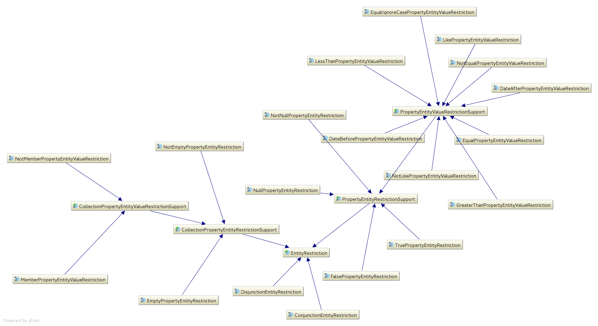
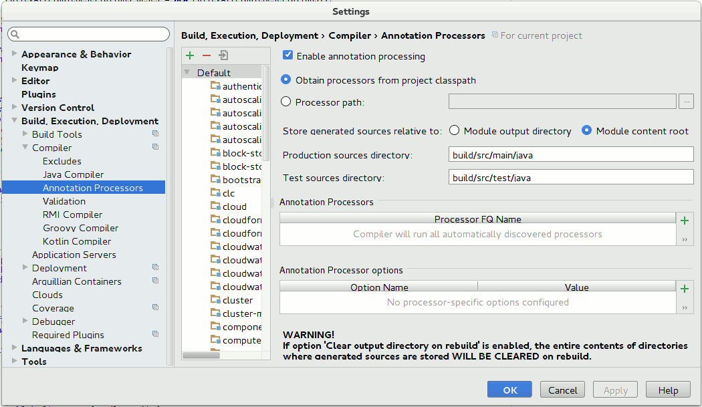

## Overview
There are two main drivers for the changes in 4.3.

The first is that we are using Hibernate specific approaches to persistence rather than the standard JPA APIs. We mainly use either QBE (query by example) or Hibernates criteria API for persistence, QBE is not part of JPA and JPA also now provides a type-safe criteria API based on a generated meta-model.

The second is that in order to move to more recent versions of Hibernate we must update our integration as the deprecated approach we were using has now been removed.


## Hibernate integration

### Bootstrap
The existing discovery mechanism for persistence is preserved with  _PersistenceContexts_  being used to collect information on entities and their persistence units.

A  _PersistenceContextConfiguration_  class is added to encapsulate information related to a persistence unit which includes:


* The entities
* Any auxiliary database objects
* Context specific Hibernate properties

The  _PersistenceContextConfiguration_  is now used when registering a persistence context in place of the removed  _Ejb3Configuration._ 

JPA expects persistence units to be configured in the classpath via  _persistence.xml_  files. To avoid this required we implement the JPA SPI for persistence providers by extending Hibernates  _HibernatePersistenceProvider._  The extended provider overides the default Hibernate behaviour and instead obtains configuration via the new  _PersistenceContexts#getConfiguration_  method.

To preserved support for auxiliary database objects we override  _EucalyptusEntityManagerFactoryBuilderImpl_  to include this information when constructing the Hibernate  _Configuration_  for each persistence unit.

For compatibility with existing schemas we add the property  _hibernate.discriminator.ignore_explicit_for_joined_  which enables legacy Hibernate behaviour for omitting discriminator columns.


### Upgrade
Database upgrades now configures persistence using the new  _PersistenceContextConfiguration_ and also uses new  _PersistenceContexts_  functionality to obtain a Hibernate  _Configuration_  for use with schema upgrades.


### Unit tests
Unit tests that require persistence are updated to use  _PersistenceContextConfiguration_ .


## Type-safe criteria

### Entities API update
The entities API is updated to support type-safe queries, counts, and bulk deletes. The main new items are:


*  _EntityRestriction_ and _EntityRestrictionBuilder_  can be used to replace example entities and for more complex single-entity restrictions 
*  _EntityCriteriaQuery_  and EntityCriteriaQueryJoin to select a unique or list of entities
*  _EntityCriteriaDelete_  and  _EntityCriteriaDeleteJoin_  for bulk delete of an entity or entities

The  _EntityRestriction_ class hierarchy is:



The  _Entities_  and  _Transactions_  classes are updated to support type-safe queries:


*  _Entities#criteriaQuery_ 
*  _Entities#count_ 
*  _Entities#delete_ 
*  _Entities#restriction_ 
*  _Transactions#findAll_ 
*  _Transactions#each_ 
*  _Transactions#one_ 
*  _Transactions#filter_ 
*  _Transactions#transform_ 
*  _Transactions#filteredTransform_ 
*  _Transactions#delete_ 
*  _Transactions#deleteAll_ 

 _Entities_  and  _Transactions_  methods that are not type-safe have been deprecated.

Entity type-safe querySingle entity lookup:


```java
UserEntity user = Entities.criteriaQuery( Entities.restriction( UserEntity.class ).equal( UserEntity_.userId, userId ) ).uniqueResult( )
```
Optional entity lookup:


```java
Optional<UserEntity> userOption = Entities.criteriaQuery( UserEntity.class ).whereEqual( UserEntity_.userId, userId ).uniqueResultOption( )
```


Simple listing:


```java
List<UserEntity> users = Entities.criteriaQuery( UserEntity.class ).list( );
```


Listing with restrictions:


```java
Entities.criteriaQuery( 
    Entities.restriction( AccountEntity.class ).like( AccountEntity_.name, accountNameLike ).build( )
).list( )
```


Listing with simple joins:


```java
List<UserEntity> users = Entities
    .criteriaQuery( UserEntity.class )
    .join( UserEntity_.groups ).whereEqual( GroupEntity_.userGroup, Boolean.TRUE )
    .join( GroupEntity_.account ).whereEqual( AccountEntity_.name, this.delegate.getName( ) )
    .list( );
```


Listing with disjunct criteria:


```java
final List<CertificateEntity> entities = Entities.criteriaQuery( CertificateEntity.class ).where(
    Entities.restriction( CertificateEntity.class ).any(
        Entities.restriction( CertificateEntity.class ).isTrue( CertificateEntity_.revoked ).build( ),
        Entities.restriction( CertificateEntity.class ).isNull( CertificateEntity_.certificateHashId ).build( )
    )
).list( );
```


Entity type-safe countCount with join and criteria:


```java
final long roles = Entities.count( RoleEntity.class )
    .join( RoleEntity_.account )
    .whereEqual( AccountEntity_.name, accountName )
    .uniqueResult( );
```


Entity type-safe bulk deletionEntity deletion with criteria:


```java
Entities.delete(
    Entities.restriction( ReservedNameEntity.class ).before( ReservedNameEntity_.expiry, new Date( ) ).build( )
).delete( )
```
this example shows a bulk deletion with simple criteria.

Entity deletion with join:


```java
Entities.delete( UserEntity.class )
    .join( UserEntity_.groups ).whereEqual( GroupEntity_.userGroup, Boolean.TRUE )
    .join( GroupEntity_.account ).whereEqual( AccountEntity_.name, accountName )
    .delete( );
```
this example uses the convenience  _whereEqual_ restriction.


### Build changes
Classes are now output to the directories:


*  _build/classes_ 
*  _build/test-classes_ 

previously the main output was directly to the  _build_ directory _._ 

We now allow for sources to be generated during the build and placed into build directories:


*  _build/src/main/java_ 
*  _build/src/test/java_ 

This is used for the JPA meta-model classes.

We also now support local properties files allowing customization for the build:


*  _local.properties_ 
*  _local.module.properties_ 

The  _local.properties_ file is for the main build, the module properties is for module specific settings. For example if you did not want to compile C code locally you could add:


```
module.skipNativeMake=true
```
to  _local.module.properties_ .

If you were having build issues due the environment when using more recent versions of ANT you could update  _local.module.properties_  to include:


```
groovyc.fork=true
groovyc.includeantruntime=false
```
The build files were also updated to use properties for various items that can now be overridden locally (e.g.  _javac.source_  and  _javac.target_  for source/target versions)


### IDEA project support
To build an IDEA project with annotation processing enabled, the following gradle project can be used. Gradle is used to build the IDEA project, once built regular IDEA functionality is used for development:


* [build.gradle (gist.githubusercontent.com)](https://gist.githubusercontent.com/sjones4/7941007/raw/1a4030cf9fa90e9aa0e6105d2419d42604614381/build.gradle)
* [settings.gradle (gist.githubusercontent.com)](https://gist.githubusercontent.com/sjones4/7941012/raw/3e8e4532586a8f17ee225ccdc4615ea029fa55b0/settings.gradle)

the above files are copied to the  _clc_  directory, and you can then use gradle to build a project using:


```bash
# gradle idea
```
the  _clc.ipr_  project file is then opened using IDEA.

Further [gradle IDEA tasks (docs.gradle.org)](https://docs.gradle.org/current/userguide/idea_plugin.html) can be found in the documentation.

To manually enable annotation processing edit the project settings as follows:




### Eclipse project support
Hibernate documentation covers [annotation processor configuration (jboss.org)](https://docs.jboss.org/hibernate/orm/4.3/topical/html/metamodelgen/MetamodelGenerator.html#_usage_within_the_ide).


## References

* [[4.3.0 Investigation: Hibernate feature deprecation impact|4.3.0-Investigation--Hibernate-feature-deprecation-impact]]
* JPA 2.1 [tutorial (oracle.com)](http://docs.oracle.com/javaee/7/tutorial/partpersist.htm)
* Hibernate [discriminator column legacy support (atlassian.net)](https://hibernate.atlassian.net/browse/HHH-6911)
* Hibernate [JPA Static Metamodel Generator (jboss.org)](https://docs.jboss.org/hibernate/orm/4.3/topical/html/metamodelgen/MetamodelGenerator.html)


*****

[[category.confluence]] 
