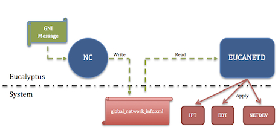
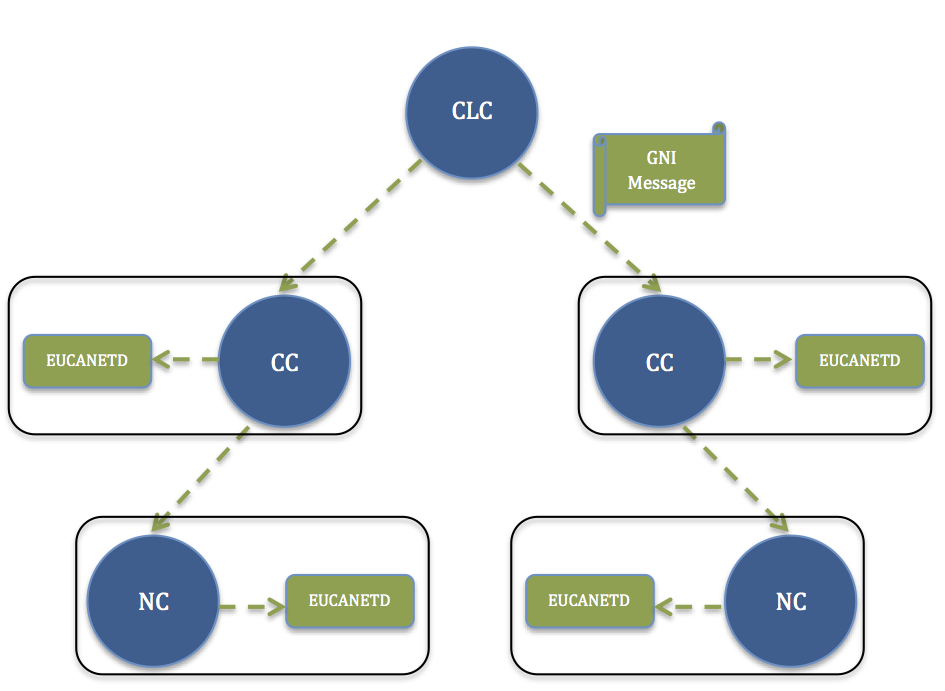
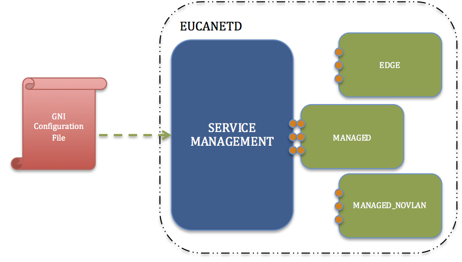

* [Overview](#overview)
* [Background & Strategic Fit](#background-&-strategic-fit)
  * [EUCANETD and EDGE](#eucanetd-and-edge)
  * [The Global Network Configuration](#the-global-network-configuration)
  * [The Global Network Information Message](#the-global-network-information-message)
* [Problem Definition](#problem-definition)
* [Implementation](#implementation)
  * [Plugin Model](#plugin-model)
  * [API Implementation](#api-implementation)
    * [API Design](#api-design)
    * [Service Life Cycle](#service-life-cycle)
    * [Network Modes Pseudo-Code](#network-modes-pseudo-code)
  * [Resource Allocation Feedback Loop](#resource-allocation-feedback-loop)
  * [Build System](#build-system)
  * [Configuration Flow](#configuration-flow)
  * [Porting networking modes](#porting-networking-modes)
    * [Applying the Framework](#applying-the-framework)
    * [Configuration Requirements](#configuration-requirements)
    * [Porting MANAGED networking mode](#porting-managed-networking-mode)
    * [Porting MANAGED-NOVLAN networking mode](#porting-managed-novlan-networking-mode)
  * [CLC Integration](#clc-integration)
    * [Configuration of the 'cloud.network.network_configuration' Property](#configuration-of-the-'cloud.network.network_configuration'-property)
    * [Metadata Changes](#metadata-changes)
    * [Subnet Configuration](#subnet-configuration)
    * [Services Tier Implementation Details](#services-tier-implementation-details)
    * [Instance Timeout/Restauration](#instance-timeout/restauration)
    * [Network and Addressing](#network-and-addressing)
  * [Resource Allocation Feedback Loop](#resource-allocation-feedback-loop)
  * [High Availability (HA) and Components Redundancy](#high-availability-(ha)-and-components-redundancy)
  * [System Upgrade](#system-upgrade)
    * [Generating the MANAGED and MANAGED-NOVLAN JSON Network Configuration String](#generating-the-managed-and-managed-novlan-json-network-configuration-string)
    * [Upgrade Procedure For MANAGED and MANAGED-NOVLAN Networking Modes](#upgrade-procedure-for-managed-and-managed-novlan-networking-modes)
    * [Upgrade Procedure For EDGE Networking Mode](#upgrade-procedure-for-edge-networking-mode)
* [Source Code Documentation](#source-code-documentation)
* [Considerations, Limitations and Issues](#considerations,-limitations-and-issues)
* [Testing Consideration](#testing-consideration)
* [Future Consideration](#future-consideration)

# Overview
Goal for Organization of Document
* Present an overview of current strategy
* Define the problem to solve
* Present some implementation decisions including configuration
* Identify Limitation and Issues of the new design
* Identify Testing Consideration
* Identify future considerations/improvements


# Background & Strategic Fit
Today, the Eucalyptus cloud software provides support for multiple network modes that are implemented within the Cluster and Node controllers. The current implementation makes it very difficult for the maintenance, design and implementation of new networking modes or even extending current ones. With the addition of a new network mode named EDGE in Eucalyptus 4.0 release, a conscious effort was made to start dissociating network elements from the Cluster and Node Controllers business logic implementation. With the addition of this new networking mode, a new software service, named "eucanetd", was created with the sole responsibility to manage and configure the network on behalf of the NC Component. The current project is aimed at pursuing this effort by finalizing a strong uniform framework independent from the various cloud elements (CLC, CC, NC) that will provide easy mechanism for implementing new network modes and/or extending current modes.


## EUCANETD and EDGE
Currently, for the "MANAGED" and "MANAGED_VLAN" networking modes, both the Cluster Controller (CC) and Node Controller (NC) are getting their global network configuration through their respective 'eucalyptus.conf' configuration file. In these modes, whenever a VM is created, the Cloud Controller (CLC) will send multiple messages to the CC and then CC to NC in order to implement the necessary network configuration for each VM adding in complexity and in synchronization between the various cloud components. Furthermore, this decentralized configuration form allows for end-users to make configuration mistakes. Many network configuration parameters needs to be identical between the cloud components and, if one of the components is not configured appropriately, this can also turn into disaster especially when dealing with multiple cloud components (i.e. multiple CCs and NCs).

With the addition of the EDGE networking mode, a new simple network configuration paradigm was implemented. Under this new mode, the core network configuration is provided to the CLC whom in turns broadcast the Global Network Information (GNI), or network view, to all of its subordinate elements (CC/NC) and the later are responsible for implementing any network requirements based on the provided GNI. The remaining network configuration parameters that are component specific (i.e. Bridge device, Public/Private Interface, DHCP user and service, etc.) are still left into the 'eucalyptus.conf' file as these are component unique configuration. The following diagram show how this GNI broadcast messages mechanism flows between the various cloud components:


EDGE is a networking mode that works at the NC level. Once the NC receives a GNI message from its associated CC, it saves the content into a file named 'global_network_info.xml'under the '$EUCALYPTUS/var/lib/eucalyptus' path. At a regular interval, the EUCANETD service determines if the file content, referring to the current distributed system network view, has been modified. If it is the case, EUCANETD will read the content and implements the changes with the system IP Tables (IPT), EB Tables (EBT) and network device as necessary. The following diagram shows this communication between NC and EUCANETD.




## The Global Network Configuration
As mentioned previously, the EDGE networking mode adds a new form of global network configuration that is now centralized at the CLC. This tremendously reduces the configuration complexity by bringing it back to a core location: the CLC. The configuration of this networking mode on the CLC is of the form of a JSON string passed to the 'cloud.network.network_configuration' property. Below is an example of the JSON string for an EDGE mode configuration being passed to the CLC property by the cloud administrator.


```text
{
    "InstanceDnsDomain": "eucalyptus.internal",
    "InstanceDnsServers": ["10.1.1.254"],
    "PublicIps": [
    	"10.111.101.84",
		"10.111.101.91",
		"10.111.101.92",
		"10.111.101.93"
    ],
    "Subnets": [
    ],
    "Clusters": [
        {
            "Name": "PARTI00",
            "MacPrefix": "d0:0d",
            "Subnet": {
                "Name": "10.111.0.0",
                "Subnet": "10.111.0.0",
                "Netmask": "255.255.0.0",
                "Gateway": "10.111.0.1"
            },
            "PrivateIps": [
	    		"10.111.101.94",
			 	"10.111.101.95"
            ]
        },
        {
            "Name": "PARTI01",
            "MacPrefix": "d0:0d",
            "Subnet": {
                "Name": "10.111.0.0",
                "Subnet": "10.111.0.0",
                "Netmask": "255.255.0.0",
                "Gateway": "10.111.0.1"
            },
            "PrivateIps": [
	    		"10.111.101.96",
			 	"10.111.101.97"
            ]
        }
    ]
}
```

## The Global Network Information Message
The GNI is a simple XML message introduced by the addition of the EDGE networking mode that is broadcasted by the CLC to all the cloud components giving the receiving component with a global network view. This is a simple way to advertise the world about network state changes without the necessity of synchronization between components. Today, the message contains information about global network information (public IPs, enabled CLC IP, DNS domain and server), cluster specific configuration, instance information and security groups configuration. The following block is a sample GNI XML message:


```xml
<?xml version="1.0" encoding="UTF-8" standalone="yes"?>
<network-data>
	<configuration>
		<property name="publicIps">
			<value>10.111.101.60</value>
			<value>10.111.101.61</value>
			<value>10.111.101.62</value>
			<value>10.111.101.79</value>
		</property>
		<property name="enabledCLCIp">
			<value>10.111.5.27</value>
		</property>
		<property name="instanceDNSDomain">
			<value>eucalyptus.internal</value>
		</property>
		<property name="instanceDNSServers">
			<value>10.111.5.27</value>
		</property>
		<property name="clusters">
			<cluster name="PARTI00">
				<subnet name="1.119.128.0">
					<property name="subnet">
						<value>1.119.128.0</value>
					</property>
					<property name="netmask">
						<value>255.255.255.0</value>
					</property>
					<property name="gateway">
						<value>1.119.128.1</value>
					</property>
				</subnet>
				<property name="enabledCCIp">
					<value>10.111.5.36</value>
				</property>
				<property name="macPrefix">
					<value>d0:0d</value>
				</property>
				<property name="privateIps">
					<value>1.119.128.3</value>
					<value>1.119.128.4</value>
					<value>1.119.128.5</value>
					<value>1.119.128.6</value>
					<value>1.119.128.7</value>
					<value>1.119.128.8</value>
				</property>
				<property name="nodes">
					<node name="10.111.5.43">
						<instanceIds>
							<value>i-a7f05959</value>
						</instanceIds>
					</node>
				</property>
			</cluster>
		</property>
	</configuration>
	<instances>
		<instance name="i-a7f05959">
			<ownerId>061149015336</ownerId>
			<macAddress>d0:0d:a7:f0:59:59</macAddress>
			<publicIp>10.111.101.100</publicIp>
			<privateIp>1.119.128.35</privateIp>
			<securityGroups>
				<value>sg-e33c6cf3</value>
			</securityGroups>
		</instance>
	</instances>
	<securityGroups>
		<securityGroup name="sg-e33c6cf3">
			<ownerId>061149015336</ownerId>
			<rules>
				<value>-P tcp -p 22-22 -s 0.0.0.0/0</value>
				<value>-P icmp -t -1:-1 -s 0.0.0.0/0</value>
			</rules>
		</securityGroup>
	</securityGroups>
</network-data>
```

# Problem Definition
<span style="line-height: 1.5;">Today, the Eucalyptus cloud platform provides support for 5 distinctive networking infrastructure: STATIC, SYSTEM, MANAGED, MANAGED-NOVLAN and EDGE. As mentioned previously, each bring their own complexity and challenges from an implementation point of view. Each networking mode rely on different configuration strategy which increases the complexity of the current mechanism to synchronize each piece of the puzzle. Adding new networking infrastructure in the future will be a challenge too. With the introduction of EUCANETD with EDGE and the Global Network Configuration, this complexity has been seriously eliminated and shown some serious advantages if applied to the other modes.</span>

<span style="line-height: 1.5;"></span>

The goal of this project is to refactor EUCANETD so we can easily implement and support new networking modes in the future as well as simplifying the current support of the MANAGED and MANAGED-NOVLAN networking infrastructure. As part of this project, both the MANAGED and MANAGED-NOVLAN modes will be ported to this new design. For ease of communication, the following text will refer to "networking modes" as "drivers" or "network drivers". In order to make this happen, a strong extensible framework needs to be implemented within the EUCANETD service. It should be as simple as plugging in a new driver without having to extensively modify any of the core service code. For simplicity, we will split the EUCANETD service into 2 major functions or layers: service management layer and network management layer.

<span style="line-height: 1.5;"></span>

Service Management Layer:


* Responsible for overall process management (setup, life cycle, and cleanup)
* Detection of process configuration changes (modification of 'eucalyptus.conf' configuration file)
* Detection of changes in the global network information and trigger the appropriate event within the network driver
* Load the proper network driver

<span style="line-height: 1.5;"></span>

Network Management Layer:


* Application of network configuration
* Handles GNI updates event appropriately as detected by the service.
* Setups IPT, EBT, Network Devices according to the GNI information
* Each network driver is independent and pluggable


# Implementation
<span style="line-height: 1.5;">Extending EUCANETD</span>EUCANETD is currently only active on the NC component of a cloud and only implements the EDGE networking mode. Because Eucalyptus supports other networking mode tightly coupled with the cloud components, this would be very practical to decouple the network logic from the components and implement them as part of the EUCANETD service. The EUCANETD service function is to implement network needs. This will make is easier to isolate all of our networking functions from the business function and provide an easy mechanism to implement future networking mode. The new networking strategy model would look as follow:




## Plugin Model
The pluggin model is an easy model to implement for applications that shares similar tasks or functionality. The diagram below shows an example of how EUCANETD would be used with network driver pluggins:



In this application, each driver reacts to the various changes given into the GNI content which has a standard structure. For each of the current Network Drivers (EDGE, MANAGED, MANAGED-NOVLAN), every time the GNI changes, they perform the following tasks:


* Detect changes between the global network view (GNI) and the local network view (LNI)
* Handle network infrastructure changes (bridge devices, tunnel devices, other network devices, gateway IPs, metadata IP on network devices, etc.)
* Handle security-group changes and membership
* Handles network addressing (Elastic IPs, DHCP, etc.)

Aside for applying an initial configuration to the system, flushing of the system and cleaning up the system when terminating, a network driver should be capable to handle these specific events and provide the EUCANETD service management layer with APIs that handles these events. Implementing a new network driver should be as simple as implementing the required APIs without having knowledge of the inner-workings of the service management layer.


## API Implementation
There are many ways in which a plugin model can be implemented programatically. For this application, the callback registration model seem to be the most appropriate and flexible. This allows for the design of new drivers to be isolated from the service management layer and keep all the code contained to the network driver. This also reduces the endlessly repeated "if mode x, else mode x, etc." code within the service management layer for each operations. Another option would be to supply the network driver as a dynamically loadable library. This option will not be part of the scope of this implementation. This is because of some current issues with the way our symbol map are loaded and resolving such issue at this moment will take too much time for the actual benefit provided. Nonetheless, using a callback registration model would allow for easily switching to the dynamic library model if we were to use such model in the future.


### API Design
At a very minimum, the API must provide for a mechanism to initialize and cleanup the network driver as well as being able to flush any networking artifacts as necessary. As mentioned previously, in order to implement a networking infrastructure, a network driver must be able to implement the following 3 cores functionality: implementation of the logical network structures (network devices, gateways, etc.), implementation of the security groups and its members, and implementation of the network addressing. It is also understood that not all 3 functions have to be executed every time a network configuration change occurs. For this, a scrubber API informing the service layer of which API to call should be implemented. This results in an API providing the following capabilities to be defined:


* init()
* cleanup()
* system_flush()
* system_scrub()
* implement_network()
* implement_security_group()
* implement_network_addressing()

init( ) APIThis API is called when EUCANETD is starting up. During the startup sequence, detection of the proper driver occurs and once it is successful, the driver's init() function is called. This is a one time call on startup where the driver is expected to do whatever it needs in order to be functional for the remainder of the lifecycle of the application.

cleanup( ) APIThis API is called when EUCANETD is being terminated. There may or may not be some cleanup to do by the network driver for a graceful shutdown.

system_flush( ) APIThis API allows for a complete flush of the networking artifacts on demand. This flush API can be called on startup after the network driver has been initialized (the request is provided on the command line on startup) or at any time during the service's life cycle following the reception of a SIGUSR1 signal. When a flush occurred, the Service Management Layer will force a configuration update (i.e., the set of implement_\* APIs will be called). This will force a system cleanup and re-application of the GNI network view.

system_scrub( ) APIPrior to calling this API, the Service Management Layer will have loaded the GNI configuration as well as conducted a general scrub of the system's network artifacts. Since each driver has direct knowledge as to what pertains to themselves, the Service Management Layer will call this network driver API providing the GNI view and the local network view information for the driver to indicate the Service Management Layer which implement_\* APIs are required to be called. The following bitmask is defined:


* EUCANETD_RUN_NETWORK_API (0x01)

    When set by the system_scrup() API, this indicated the Service Management Layer that the "implement_network()" API needs to be called.

    

    


* EUCANETD_RUN_SECURITY_GROUP_API (0x02)

    When set by the system_scrup() API, this indicated the Service Management Layer that the "implement_security_group()" API needs to be called.

    

    


* EUCANETD_RUN_ADDRESSING_API (0x04)

    When set by the system_scrup() API, this indicated the Service Management Layer that the "implement_network_addressing()" API needs to be called.

    

    


* EUCANETD_RUN_ALL_API (0x07)

    When set, this indicates to the Service Management Layer to run ALL of the "implement_\*" APIs.


implement_network( ) APIThis API is responsible for the implementation of system networking artifacts. This could mean implementing some new network devices, tunnels, bridge as well as installing proper gateway addresses on these network devices.

implement_security_group( ) APIThis API is responsible for the implementation of security groups specific artifacts as well as any artifacts supporting members of these security groups.

implement_network_addressing( ) APIThis API is responsible for the implementation of network addressing. This could mean implementing any necessary elastic IPs, DHCP for private IPs as well as Layer 2 (L2) network address/MAC association.


### Service Life Cycle
The following pseudo-code shows an example of the overall EUCANETD service life cycle which is contained within the service management layer as mentioned previously. This logic can be found in the 'eucanetd.c' file.


```cpp
main
{
	initialize_process();
	load_system_configuration();
	register_network_driver();
	network_driver_initialize_callback();
	until_terminated() {
		config_has_changed = detect_configuration_changed();
		if (config_has_changed) {
			system_scrup(&GNI, &LNI);
			what_changed = network_driver_system_scrub_callback(GNI, LNI);
			if (need_flush) {
				network_driver_system_flush_callback();
				need_flush = FALSE;
				what_changed = EUCANETD_RUN_ALL_API;
			}

			if (what_changed & EUCANETD_RUN_NETWORK_API) {
				network_driver_implement_network_callback();
			}

			if (what_changed & EUCANETD_RUN_SECURITY_GROUP_API) {
				network_driver_implement_security_group_callback();
			}

			if (what_changed & EUCANETD_RUN_ADDRESSING_API) {
				network_driver_implement_network_addressing_callback();
			}
		}
		sleep(sample_interval);
	}
	network_driver_cleanup_callback();
	cleanup_process();
}
```

### Network Modes Pseudo-Code
The following section will show the Pseudo-Code necessary for the implementation of each network mode within the new EUCANETD framework.

EDGE
```cpp
network_driver_initialize()
{
	driver_is_initialized = FALSE;
 
	if (is_nc) {
		if (dhcp_server_is_present AND private_interface_is_present AND private_interface_is_present) {
			driver_is_initialized = TRUE;
		}
	} else if (is_cc) {
		driver_is_initialized = TRUE;
	}
}
 
network_driver_cleanup()
{
	do_nothing();
}
 
network_driver_system_flush()
{
	if (driver_is_initialized) {
		flush_ip_tables_filters();
		flush_ip_tables_nat();
		flush_ip_sets();
		flush_eb_tables();
	}
}
 
network_driver_system_srub()
{
	api_to_call = 0x0;
 
	if (is_nc AND driver_is_initialized) {
		if (network_has_changed)
			api_to_call |= EUCANETD_RUN_NETWORK_API;
 
		if (security_group_have_changed)
			api_to_call |= EUCANETD_RUN_SECURITY_GROUP_API
 
		if (addressing_has_changed)
			api_to_call |= EUCANETD_RUN_ADDRESSING_API
	}
 
	return (api_to_call);
}

network_driver_implement_network()
{
	do_nothing();
}
 
network_driver_implement_security_group()
{
	if (is_nc AND driver_is_initialized) {
		flush_ipsets();
		flush_iptables_filters();
 
		implement_global_ipset();
		implement_global_iptables_filters();
 
		foreach (groups as group) {
			implement_ipsets(group);
			implement_iptables_filters(group)
		}
	}
}
 
network_driver_implement_network_addressing()
{
	if (is_nc && driver_is_initialized) {
		flush_iptables_nat();
		flush_ebtables()
 
		install_metadata_nat_rule();
 
		foreach (instances as instance) {
			implement_dhcp_configuration(instance);
			implement_iptables_nat_rules(instance);
			implement_ebtables_rules(instance);
		}
	}
} 
```
MANAGED-NOVLAN
```cpp
network_driver_initialize()
{
	driver_is_initialized = FALSE;
 
	if (is_cc) {
		if (dhcp_server_is_present AND private_interface_is_present AND private_interface_is_present) {
			driver_is_initialized = TRUE;
		}
	} else if (is_nc) {
		if (public_interface_is_present AND bridge_interface_is_present) {
			driver_is_initialized = TRUE;
		}
	}
}
 
network_driver_cleanup()
{
	do_nothing();
}
 
network_driver_system_flush()
{
	if (is_cc AND driver_is_initialized) {
		flush_network() {
			remove_tunnel_devices();
			remove_private_networks_gateway();
			remove_metadata_ip_from_private_interface();
		}
 
		flush_security_group() {
			flush_iptables_filters();
		}
 
		flush_network{} {
			flush_iptables_nat();
			flush_dhcp_configuration();
			flush_elastic_ips();
		}
	} 
}
 
network_driver_system_srub()
{
	api_to_call = 0x0;
 
	if (is_cc AND driver_is_initialized) {
		if (network_has_changed)
			api_to_call |= EUCANETD_RUN_NETWORK_API;
 
		if (security_group_have_changed)
			api_to_call |= EUCANETD_RUN_SECURITY_GROUP_API
 
		if (addressing_has_changed)
			api_to_call |= EUCANETD_RUN_ADDRESSING_API
	}
 
	return (api_to_call);
}
 
network_driver_implement_network()
{
	if (is_cc AND driver_is_initialized) {
		implement_tunnel_devices();
		implement_private_networks_gateway();
		if (have_enabled_clc_ip) {
			install_metadata_ip_on_private_interface();
		} else {
			remove_metadata_ip_from_private_interface();
		}
	}
}
 
network_driver_implement_security_group()
{
	if (is_cc AND driver_is_initialized) {
		flush_iptables_filters();
		implement_global_iptables_filters();
 
		foreach (groups as group) {
			implement_iptables_filters(group)
		}
	}
}
 
network_driver_implement_network_addressing()
{
	if (is_cc && driver_is_initialized) {
		flush_iptables_nat();
 
		install_metadata_nat_rule();
 
		foreach (instances as instance) {
			implement_dhcp_configuration(instance);
			implement_iptables_nat_rules(instance);
		}
	}
} 
```
MANAGED
```cpp
network_driver_initialize()
{
	driver_is_initialized = FALSE;
 
	if (is_cc) {
		if (dhcp_server_is_present AND private_interface_is_present AND private_interface_is_present) {
			driver_is_initialized = TRUE;
		}
	} else if (is_nc) {
		if (public_interface_is_present AND bridge_interface_is_present) {
			driver_is_initialized = TRUE;
		}
	}
}
 
network_driver_cleanup()
{
	do_nothing();
}
 
network_driver_system_flush()
{
	if (is_cc AND driver_is_initialized) {
		flush_network() {
			remove_tunnel_devices();
			remove_private_networks_gateway();
			remove_bridge_devices();
			remove_metadata_ip_from_private_interface();
		}
 
		flush_security_group() {
			flush_iptables_filters();
		}
 
		flush_network{} {
			flush_iptables_nat();
			flush_dhcp_configuration();
			flush_elastic_ips();
		}
	} else if (is_nc AND driver_is_initialized) {
		remove_bridge_devices();
	}
}
 
network_driver_system_srub()
{
	api_to_call = 0x0;
 
	if (driver_is_initialized) {
		if (network_has_changed)
			api_to_call |= EUCANETD_RUN_NETWORK_API;
 
		if (security_group_have_changed)
			api_to_call |= EUCANETD_RUN_SECURITY_GROUP_API
 
		if (addressing_has_changed)
			api_to_call |= EUCANETD_RUN_ADDRESSING_API
	}
 
	return (api_to_call);
}
 
network_driver_implement_network()
{
	if (is_cc AND driver_is_initialized) {
		implement_tunnel_devices();
		implement_bridge_devices();
		implement_private_networks_gateway();
		if (have_enabled_clc_ip) {
			install_metadata_ip_on_private_interface();
		} else {
			remove_metadata_ip_from_private_interface();
		}
	} else if (is_nc AND driver_is_initialized) {
		implement_bridge_devices();
	}
}
 
network_driver_implement_security_group()
{
	if (is_cc AND driver_is_initialized) {
		flush_iptables_filters();
		implement_global_iptables_filters();
 
		foreach (groups as group) {
			implement_iptables_filters(group)
		}
	}
}
 
network_driver_implement_network_addressing()
{
	if (is_cc && driver_is_initialized) {
		flush_iptables_nat();
 
		install_metadata_nat_rule();
 
		foreach (instances as instance) {
			implement_dhcp_configuration(instance);
			implement_iptables_nat_rules(instance);
		}
	}
} 
```
SYSTEM
```cpp
network_driver_initialize()
{
	do_nothing();
}
 
network_driver_cleanup()
{
	do_nothing();
}
 
network_driver_system_flush()
{
	do_nothing();
}
 
network_driver_system_srub()
{
	do_nothing();
}
 
network_driver_implement_network()
{
	do_nothing();
}
 
network_driver_implement_security_group()
{
	do_nothing();
}
 
network_driver_implement_network_addressing()
{
	do_nothing();
} 
```
STATIC
```cpp
network_driver_initialize()
{
	driver_is_initialized = FALSE;

	if (is_cc) {
		if (dhcp_server_is_present AND private_interface_is_present AND private_interface_is_present) {
			driver_is_initialized = TRUE;
		}
	} else if (is_nc) {
		driver_is_initialized = TRUE;
	}
}
 
network_driver_cleanup()
{
	do_nothing();
}
 
network_driver_system_flush()
{
	do_nothing(); // with force a reconfiguration of DHCP server
}
 
network_driver_system_srub()
{
	api_to_call = 0x0;
 
	if (is_cc AND driver_is_initialized) {
		if (network_has_changed)
			api_to_call |= EUCANETD_RUN_NETWORK_API;
 
		if (security_group_have_changed)
			api_to_call |= EUCANETD_RUN_SECURITY_GROUP_API
 
		if (addressing_has_changed)
			api_to_call |= EUCANETD_RUN_ADDRESSING_API
	}
 
	return (api_to_call);
}

network_driver_implement_network()
{
	do_nothing();
}
 
network_driver_implement_security_group()
{
	do_nothing();
}
 
network_driver_implement_network_addressing()
{
	if (is_cc AND driver_is_initialized) {
		foreach (instances as instance) {
			implement_dhcp_configuration(instance);
		}
	}
} 
```

## Resource Allocation Feedback Loop
With the extraction of the networking function from the CC and NC components, a major hole in resource allocation tracking has been created. This hole has been introduced with the implementation of EDGE networking mode in the 4.0 timeframe and must be resolved as part of this implementation effort. This hole is defined by the lack of knowledge from the CLC, CC and NC components in regards to the state of some networking components allocated namely Public and Private IPs. When a Run-Instance request is sent (or a Public IP assignment has been made), the request is ultimately passed to EUCANETD to implement through the GNI interface. From there, there is no feedback indicating when and if the request has been implemented. If a failure occurred, this can result in the resource being marked as allocated indefinitely. In order to solve this issue, EUCANETD will implement the Network Resource Allocation (NRA) interface which functions like the GNI interface.

The NRA interface is an XML file based interface between EUCANET and its peer component (CC/NC). Every time EUCANETD is made aware of a resource through the GNI, it must provide its state back to the peer component using the NRA interface. The resources being reported back to the CC/NC includes public and private IPs. The following is an example of the NRA message provided back to a CC or NC:


```xml
<?xml version="1.0" encoding="UTF-8" standalone="yes"?>
<network-resources>
	<privateIPs>
		<value>1.111.5.10</value>
		<value>1.111.5.11</value>
	</privateIps>
	<publicIPs>
		<value>10.111.120.10</value>
	</publicIps>
	<instances>
		<instance name="i-abc123bb">
			<privateIp name="1.111.5.10">
				<state>assigned</state>
			</privateIp>
		</instance>
		<instance name="i-bb321cba">
			<privateIp name="1.111.5.11">
				<state>pending</state>
			</privateIp>
			<publicIp name="10.111.120.10">
				<state>pending</state>
			</publicIp>
		</instance>
	</instances>
</network-resources>
```

## Build System
The EUCANETD service is a 'C' application under the eucalyptus/net module that is built using the standard linux makefile system. In order to implement a strong consistent and uniform framework, the build system must reflect a similar design. The following describe the role of each files present in the 'net' module:


*  **eucanetd.c**  - Main process management implementation
*  **eucanetd.h**  - Definition of exported main process global API from eucanetd.c
*  **eucanetd_util.[ch]**  - Definition and implementation of various generic utility specific to EUCANETD not found under the util module.
*  **eucanetd_template.c**  - Template file for creating future network modes. This is not being compiled or used.
*  **eucanetd_edge.c**  - Implementation of the EDGE network driver
*  **eucanetd_managed.c**  - Implementation of the MANAGED network driver
*  **eucanetd_managednv.c**  - Implementation of the MANAGED-NOVLAN network driver
*  **eucanetd_lni.[ch]**  - Definition and Implementation of the Local Network Information (LNI) APIs
*  **globalnetwork.[ch]** - Definition and implementation of various APIs allowing for interaction with the GNI content
*  **ipt_handler.[ch]**  - Definition and implementation of various IP table specific APIs
*  **dev_handler.[ch]**  - Definition and implementation of various network device specific APIs
*  **tun_handler.[ch]**  - Definition and implementation of various tunnel network device specific APIs

There is also 2 files name vnetwork.c and vnetwork.h. These 2 files will remain present for legacy support as needed and should be removed once the legacy modes becomes unsupported. The EUCANETD application must be compiled and linked entirely without the support of these 2 files.


## Configuration Flow
Moving forward, EUCANETD will follow the configuration flow as defined during the design of the EDGE networking mode. This has previously been discussed in the "[Extending EUCANETD](https://eucalyptus.atlassian.net/wiki/display/~chuck/Next+Generation+Network+Driver#NextGenerationNetworkDriver-ExtendingEUCANETD)"section. This means the CLC will broadcast the global network information (GNI) to its subcomponentsin an XML formatted content. This is very flexible as new sections can be added to this model for new network drivers without impacting current network drivers. Removal of section can be done whenever we can confirm that the section is no longer in use by any of the supported network driver.


## Porting networking modes
The port of the two widely used network modes (MANAGED and MANAGED-NOVLAN) to this new architecture is a requirement for this project.


### Applying the Framework
The MANAGED and MANAGED-NOVLAN networking modes are currently part of the CC and NC services and respond to multiple messages events in order to build the network view. In order to uniform-ize our network implementations, these two networking modes will be ported to the new framework as part of the first release. Because the current implementation of these two networking modes does not fit the current framework, an effort must be made to modify the current workflow to match the one defined by the EUCANETD framework. While the flow of how things are applied will change compare to what we have today, to one exception, the end resulting IP tables (Filters, NAT) and network device configuration should remain identical to what is currently implemented today for each mode. The only changes implemented within the IP tables is the name used for the security group chain name. Today, this chain name is a complex hash that is not human-intelligible. This was done so because of the lack of a unique security group identifier. The following is an example of the unintelligible chain name:


```text
Chain INPUT (policy ACCEPT 495 packets, 204K bytes)
 pkts bytes target     prot opt in     out     source               destination        
 
Chain FORWARD (policy DROP 0 packets, 0 bytes)
 pkts bytes target     prot opt in     out     source               destination         
13806   12M EUCA_COUNTERS_OUT  all  --  *      *       0.0.0.0/0            0.0.0.0/0           
13806   12M EUCA_COUNTERS_IN  all  --  *      *       0.0.0.0/0            0.0.0.0/0           
11995   12M ACCEPT     all  --  *      *       0.0.0.0/0            0.0.0.0/0           ctstate ESTABLISHED 
 1811  113K ACCEPT     all  --  *      *       0.0.0.0/0           !1.120.128.0/18      
    0     0 EU_cgcgvIL81ipA6zkFPS+lHA==  all  --  *      *       0.0.0.0/0            0.0.0.0/0           
    0     0 ACCEPT     all  --  *      *       1.120.163.32/28      1.120.163.32/28   
  
Chain OUTPUT (policy ACCEPT 538 packets, 59349 bytes)
 pkts bytes target     prot opt in     out     source               destination   
      
Chain EUCA_COUNTERS_IN (1 references)
 pkts bytes target     prot opt in     out     source               destination         
 8540   11M            all  --  *      *       0.0.0.0/0            1.120.128.0/18      
  659  117K            all  --  *      *       0.0.0.0/0            1.120.163.43    
    
Chain EUCA_COUNTERS_OUT (1 references)
 pkts bytes target     prot opt in     out     source               destination         
 5266  316K            all  --  *      *       1.120.128.0/18       0.0.0.0/0           
  659 44526            all  --  *      *       1.120.163.43         0.0.0.0/0     
      
Chain EU_cgcgvIL81ipA6zkFPS+lHA== (1 references)
 pkts bytes target     prot opt in     out     source               destination         
    0     0 ACCEPT     icmp --  *      *       0.0.0.0/0            1.120.163.32/28     icmp type 255 
    0     0 ACCEPT     tcp  --  *      *       0.0.0.0/0            1.120.163.32/28     tcp dpt:22 
```


In very recent release, there was an addition for a unique security group identifier string of the sg-XXXXXX format for each security group. Using this security group identifier instead of the unintelligible identifier will go long ways in being able to troubleshoot security group issues pertaining to the IP tables. This change will apply to all networking modes supported by EUCANETD. This is easily noticeable in the following example:


```text
Chain INPUT (policy ACCEPT 495 packets, 204K bytes)
 pkts bytes target     prot opt in     out     source               destination 
        
Chain FORWARD (policy DROP 0 packets, 0 bytes)
 pkts bytes target     prot opt in     out     source               destination         
13806   12M EUCA_COUNTERS_OUT  all  --  *      *       0.0.0.0/0            0.0.0.0/0           
13806   12M EUCA_COUNTERS_IN  all  --  *      *       0.0.0.0/0            0.0.0.0/0           
11995   12M ACCEPT     all  --  *      *       0.0.0.0/0            0.0.0.0/0           ctstate ESTABLISHED 
 1811  113K ACCEPT     all  --  *      *       0.0.0.0/0           !1.120.128.0/18      
    0     0 sg-680e3091  all  --  *      *       0.0.0.0/0            0.0.0.0/0           
    0     0 ACCEPT     all  --  *      *       1.120.163.32/28      1.120.163.32/28  
   
Chain OUTPUT (policy ACCEPT 538 packets, 59349 bytes)
 pkts bytes target     prot opt in     out     source               destination    
     
Chain EUCA_COUNTERS_IN (1 references)
 pkts bytes target     prot opt in     out     source               destination         
 8540   11M            all  --  *      *       0.0.0.0/0            1.120.128.0/18      
  659  117K            all  --  *      *       0.0.0.0/0            1.120.163.43  
      
Chain EUCA_COUNTERS_OUT (1 references)
 pkts bytes target     prot opt in     out     source               destination         
 5266  316K            all  --  *      *       1.120.128.0/18       0.0.0.0/0           
  659 44526            all  --  *      *       1.120.163.43         0.0.0.0/0   
        
Chain sg-680e3091 (1 references)
 pkts bytes target     prot opt in     out     source               destination         
    0     0 ACCEPT     icmp --  *      *       0.0.0.0/0            1.120.163.32/28     icmp type 255 
    0     0 ACCEPT     tcp  --  *      *       0.0.0.0/0            1.120.163.32/28     tcp dpt:22
```

### Configuration Requirements
From a configuration perspective, the CLC must allow for configuring these two networking modes in the same fashion it does for EDGE networking. Without following this requirement, EUCANETD will not be provided by the GNI information required to build the network topology by the various components. With the introduction of EDGE, the CLC has the minimum set of configuration necessary to provide the CC and NC with a clear representation of a MANAGED or MANAGED-NOVLAN network topology. The following section will show example of configuration for these two modes.


### Porting MANAGED networking mode
Implementation ConsiderationsConfiguration ExamplesTo configure MANAGED mode, the user will have to modify the "eucalyptus.conf" configuration file on CLC, CC and NC as well as provide the CLC with the JSON network configuration string. On the NC component, the following 'eucalyptus.conf' configuration file fields must be provided:


```bash
VNET_MODE=MANAGED
VNET_PUBINTERFACE=em1
```
On the CC component, most of the global network configuration should be pushed to the CLC and the following component specific configuration should be provided in 'eucalyptus.conf' configuration file:


```text
VNET_MODE=MANAGED
VNET_PUBINTERFACE=em1
VNET_PRIVINTERFACE=em1
VNET_DHCPDAEMON=/usr/sbin/dhcpd
VNET_DHCPUSER=dhcpd
DISABLE_TUNNELING="Y"
```
On the CLC component, the following 'eucalyptus.conf' configuration file fields must be provided as well as the JSON string for the 'cloud.network.network_configuration' property:


```text
euca-modify-property -p cloud.network.network_configuration={
    "Mode": "MANAGED",
    "InstanceDnsDomain": "eucalyptus.internal",
    "InstanceDnsServers": ["10.1.1.254"],
    "PublicIps": [
    	"10.111.101.84",
		"10.111.101.91",
		"10.111.101.92",
		"10.111.101.93"
    ],
    "ManagedSubnet": {
        "Subnet": "10.111.0.0",
        "Netmask": "255.255.0.0",
        "MinVlan": "512",
		"MaxVlan": "639",
        "SegmentSize": "16" <= Old Address Per Net defining the size of each networks
    },
    "Clusters": [
        {
            "Name": "PARTI00",
            "MacPrefix": "d0:0d"
        },
        {
            "Name": "PARTI01",
            "MacPrefix": "d0:0d"
        }
    ]
}
```

### Porting MANAGED-NOVLAN networking mode
Implementation ConsiderationsConfiguration ExamplesTo configure MANAGED-NOVLAN mode, the user will have to modify the "eucalyptus.conf" configuration file on CLC, CC and NC as well as provide the CLC with the JSON network configuration string. On the NC component, the following 'eucalyptus.conf' configuration file fields must be provided:


```bash
VNET_MODE=MANAGED-NOVLAN
VNET_BRIDGE=br0
```
On the CC component, most of the global network configuration should be pushed to the CLC and the following component specific configuration should be provided in 'eucalyptus.conf' configuration file:


```text
VNET_MODE=MANAGED-NOVLAN
VNET_PUBINTERFACE=em1
VNET_PRIVINTERFACE=em1
VNET_DHCPDAEMON=/usr/sbin/dhcpd
VNET_DHCPUSER=dhcpd
```
On the CLC component, the following 'eucalyptus.conf' configuration file fields must be provided as well as the JSON string for the 'cloud.network.network_configuration' property:


```text
euca-modify-property -p cloud.network.network_configuration={
	"Mode": "MANAGED-NOVLAN",
    "InstanceDnsDomain": "eucalyptus.internal",
    "InstanceDnsServers": ["10.1.1.254"],
    "PublicIps": [
    	"10.111.101.84",
		"10.111.101.91",
		"10.111.101.92",
		"10.111.101.93"
    ],
    "ManagedSubnet": {
        "Subnet": "10.111.0.0",
        "Netmask": "255.255.0.0",
		"MinVlan": "512",
		"MaxVlan": "639",
        "SegmentSize": "16" <= Old Address Per Net defining the size of each networks
    },
    "Clusters": [
        {
            "Name": "PARTI00",
            "MacPrefix": "d0:0d"
        },
        {
            "Name": "PARTI01",
            "MacPrefix": "d0:0d"
        }
    ]
}
```

## CLC Integration
In order to successfully migrate the MANAGED and MANAGED-NOVLAN networking mode to EUCANETD, some changes on the CLC component will be necessary in order to generate the proper GNI information.


### Configuration of the 'cloud.network.network_configuration' Property
From a network configuration point of view, anything that is global to the distributed system will be configured at the central point which is the CLC. This should ensure configuration integrity across the distributed system. The networking configuration is provided today for "EDGE" mode through a JSON string assigned to the 'cloud.network.network_configuration' property. This JSON string has various sections as seen previously. The area of concern here are the "Subnet" and "PrivateIps" sections of this string.

The "Subnet" section can be provided as part of the global "Subnets" section or for each Clusters. When a cluster re-uses a global subnet, it refers to the global subnet by name. When a given clusters defines a subnet, it overrides any global configuration for that subnet. Since it is required that every Clusters uses the same subnet, the best method of configuration is to declare the subnet globally and referFor EDGE mode, a subnet is define as a Name, Subnet ID, Netmask and Gateway association. For MANAGED and MANAGED-NOVLAN, the Gateway is not used. Instead, a segment size is needed to split the subnet in smaller network segments. The following is an example of the MANAGED modes configuration focussed on Subnet only and shows the preferred way to configure your network using a global subnet statement and refer to it for each clusters.


```text
{
    "ManagedSubnet": {
        "Subnet": "10.111.0.0",
        "Netmask": "255.255.0.0",
		"MinVlan": "512",
		"MaxVlan": "639",
        "SegmentSize": "16"
    },
    "Clusters": [
        {
            "Name": "PARTI00",
            "MacPrefix": "d0:0d"
        },
        {
            "Name": "PARTI01",
            "MacPrefix": "d0:0d"
        }
    ]
}
```
The previous example will result in generating a GNI message of the following format:


```xml
<?xml version="1.0" encoding="UTF-8" standalone="yes"?>
<network-data>
	<configuration>
		<property name="publicIps">
			<value>10.111.101.44</value>
			<value>10.111.101.45</value>
			<value>10.111.101.49</value>
			<value>10.111.101.50</value>
			<value>10.111.101.98</value>
			<value>10.111.101.99</value>
			<value>10.111.101.100</value>
			<value>10.111.101.103</value>
		</property>
		<property name="mode">
			<value>MANAGED</value>
		</property>
		<property name="enabledCLCIp">
			<value>10.111.1.50</value>
		</property>
		<property name="instanceDNSDomain">
			<value>eucalyptus.internal</value>
		</property>
		<property name="instanceDNSServers">
			<value>10.1.1.254</value>
		</property>
		<property name="managedSubnet">
			<managedSubnet name="1.111.0.0">
				<property name="subnet">
					<value>1.111.0.0</value>
				</property>
				<property name="netmask">
					<value>255.255.192.0</value>
				</property>
				<property name="minVlan">
					<value>512</value>
				</property>
				<property name="maxVlan">
					<value>639</value>
				</property>
				<property name="segmentSize">
					<value>16</value>
				</property>
			</managedSubnet>
		</property>
		<property name="clusters">
			<cluster name="PARTI00">
				<property name="enabledCCIp">
					<value>10.111.1.54</value>
				</property>
				<property name="macPrefix">
					<value>d0:0d</value>
				</property>
				<property name="privateIps" />
				<property name="nodes">
					<node name="10.111.1.173">
						<instanceIds />
					</node>
				</property>
			</cluster>
		</property>
	</configuration>
	<vpcs />
	<instances />
	<dhcpOptionSets />
	<internetGateways />
	<securityGroups />
</network-data>
```


### Metadata Changes
User triggered metadata changes will result in a push of network data to the cluster controller(s). This will be done in any supported networking mode (no longer just edge) and through the BroadcastNetworkInformation operation. This will no longer require separate actions (e.g. for IP address assign / unassign).

Today, for MANAGED and MANAGED-NOVLAN, the CLC assign a network index rather than a private IP address at RunInstance time. Based on the network group and network index, the CC figures out the resulting private IP to assign and return the private IP assignment in the subsequent DescribeInstances operation from the CLC. Rather than using a network index, the CLC must be able to do the private IP assignment at the RunInstance time. This will be done in the implementation of the ManagedPrivateAddressAllocator class described below.


### Subnet Configuration
In order to device the network subnets to use for private IP assignment, the CLC must be informed of the network segment size. Today, this is configured on the CC using the VNET_ADDRSPERNET property in the "eucalyptus.conf" configuration file and propagated from the CC to the CLC through the DescribeNetwork operation. As described previously, the "Subnet" section of the CLC JSON configuration will add a new optional field named "<span style="font-size: 14.0px;line-height: 1.4285715;">NetSize" that will replace the now optional "Gateway" field. In EDGE networking mode, the user must provide a Gateway IP address for the subnet which is not necessary for MANAGED and MANAGED-NOVLAN. For MANAGED and MANAGED-NOVLAN, the CLC needs to know how big the network segments will be so it can subdivide the given "Subnet" in smaller equals "Network Segments". Each "Network Segment" is a sub-network of the configured private subnet. For instance, given the "192.168.0.0/23" subnet ranging from 192.168.0.0 to 192.168.1.255 and a network size of 32 addresses per network segment, the following 16 smaller network segments are created:</span>


```text
Index 	| Segment ID	| CC Gateway Start	| CC Gateway End	| VM Segment Start	| VM Segment End| Segment Broadcast	|
--------------------------------------------------------------------- ---------------------------------------------------
0		| 192.168.0.0	| 192.168.0.1		| 192.168.0.8		| 192.168.0.9		| 192.168.0.30	| 192.168.0.31		|
1		| 192.168.0.32	| 192.168.0.33		| 192.168.0.40		| 192.168.0.41		| 192.168.0.62	| 192.168.0.63		|
2		| 192.168.0.64	| 192.168.0.65		| 192.168.0.72		| 192.168.0.73		| 192.168.0.94	| 192.168.0.95		|
3		| 192.168.0.96	| 192.168.0.97		| 192.168.0.104		| 192.168.0.105		| 192.168.0.126	| 192.168.0.127		|
4		| 192.168.0.128	| 192.168.0.129		| 192.168.0.136		| 192.168.0.137		| 192.168.0.158	| 192.168.0.159		|
5		| 192.168.0.160	| 192.168.0.161		| 192.168.0.168		| 192.168.0.169		| 192.168.0.190	| 192.168.0.191		|
6		| 192.168.0.192	| 192.168.0.193		| 192.168.0.200		| 192.168.0.201		| 192.168.0.222	| 192.168.0.223		|
7		| 192.168.0.224	| 192.168.0.225		| 192.168.0.232		| 192.168.0.233		| 192.168.0.254	| 192.168.0.255		|
8		| 192.168.1.0	| 192.168.1.1		| 192.168.0.8		| 192.168.1.9		| 192.168.1.30	| 192.168.1.31		|
9		| 192.168.1.32	| 192.168.1.33		| 192.168.0.40		| 192.168.1.41		| 192.168.1.62	| 192.168.1.63		|
10		| 192.168.1.64	| 192.168.1.65		| 192.168.0.72		| 192.168.1.73		| 192.168.1.94	| 192.168.1.95		|
11		| 192.168.1.96	| 192.168.1.97		| 192.168.0.104		| 192.168.1.105		| 192.168.1.126	| 192.168.1.127		|
12		| 192.168.1.128	| 192.168.1.129		| 192.168.0.136		| 192.168.1.137		| 192.168.1.158	| 192.168.1.159		|
13		| 192.168.1.160	| 192.168.1.161		| 192.168.0.168		| 192.168.1.169		| 192.168.1.190	| 192.168.1.191		|
14		| 192.168.1.192	| 192.168.1.193		| 192.168.0.200		| 192.168.1.201		| 192.168.1.222	| 192.168.1.223		|
15		| 192.168.1.224	| 192.168.1.225		| 192.168.0.232		| 192.168.1.233		| 192.168.1.254	| 192.168.1.255		|
```


<span style="font-size: 14.0px;line-height: 1.4285715;">Each network segment has 10 reserved IP addresses for the subnet ID, up to 8 CC Gateways and the subnet broadcast address. So each network segment has ("NetSize" - 10) addresses available for the VMs. In our previous example, we would have a maximum of 22 addresses available for the VMs per network segments. Each time a network security-group is active (i.e. at least one instances is using it), it should be associated with the first unused network segment (i.e. none of the IP in this segment has been assigned). From there, each instance using that security-group will be assigned a private IP within that network segment. When an active security-group has its last instance terminated, its assigned network segment becomes available for use by another security-group. In the previous example, only 16 security-group at one time can be active of each 22 VMs for a total of 352 VMs.</span><span style="font-size: 14.0px;line-height: 1.4285715;"></span><span style="font-size: 14.0px;line-height: 1.4285715;"><span style="font-size: 14.0px;line-height: 1.4285715;">Each network segment index also translate to a VLAN identifier to be used by the CC and NC in MANAGED (not MANAGED-NOVLAN) mode. The CLC provides two properties named '</span></span><span style="font-size: 14.0px;line-height: 1.4285715;"><span style="font-size: 14.0px;line-height: 1.4285715;">cloud.network.global_min_network_tag' and '</span></span><span style="font-size: 14.0px;line-height: 1.4285715;">cloud.network.global_max_network_tag' that limits the range of network segments that can be used. If they are set respectively to 3 and 10, this means only network segments between 3 and 10 inclusively can be used for security-groups. In this last example, only 8 security-groups can be use at one time.</span><span style="font-size: 14.0px;line-height: 1.4285715;"></span><span style="font-size: 14.0px;line-height: 1.4285715;">The diagram below shows the relationship between a single instance, the Network Segments, the Security-Groups and the private IP address that will be assigned to the instance. It is noted that AWS provides support for assigning multiple Security-Group to a given instance or group of instances but as of today, Eucalyptus MANAGED and MANAGED-NOVLAN networking mode did not and will provide such support.</span><span style="font-size: 14.0px;line-height: 1.4285715;">NetworkIpAssignment</span>Based on the previous figure, in MANAGED modes, the subnet should contain a list of network segments. Each network segment, when in used, should be associated with a given active security group. The following shows the subnet, network segment, security-group and instance association:

IpAddressAssignmentClassesRep

The following is an example of pseudo-code needed for IP assignment:


```java
List<NetworkSegment> networkSegments;
 
class SecurityGroup {
	NetworkSegment networkSegment;
 
	assignNetworkSegment ( ) throws ResourceException {
		foreach ( networkSegments as networkSegment ) {
			if ( networkSegment.available ) {
				networkSegment.available = false;
				networkSegment.securityGroup = this;
				this.networkSegment = networkSegment;
				return;
			}
		}
		throw new ResourceException( "Not enough resource available" );
	}
 
	getNextPrivateIp( ) throws ResourceException {
		if ( !networkSegment ) {
			assignNetworkSegment ( );
		}
 
		return networkSegment.getNextAvailableIp( );
	}
}
 
class ManagedNetworkingService throws ResourceException {
	preparePrivateIp( reservation ) {
		instances = reservation.getInstances( );
		securityGroup = reservation.getSecurityGroup( );
		foreach( instances as instance ) {
			instance.privateIp = securityGroup.getNextPrivateIp( );
			if ( !instance.privateIp ) {
				throw new Exception( "Not enough resource available" );
			}	
		}
	}
}
```

### Services Tier Implementation Details
This section covers high level design details for the "services tier" (front end) needed to achieve the overall network design.Since both MANAGED and MANAGED-NOVLAN are considered logically a "managed" networking mode style with differences that does not impact the CLC logistic, for simplicity purpose, we will refer to them as "MANAGED" networking modes referring to both modes.

Networking ServicesWith the addition of the "EDGE" networking mode,a networking service abstraction was introduced to encapsulate the varying behavior of both "EDGE" and the "OTHER" networking modes. In order to support the "MANAGED" modes under EUCANETD and for the CLC to generate the proper GNI information, a new service named "ManagedNetworkingService" extending the "NetworkingServiceSupport" will be implemented. This will ensure that proper private IP address are being selected for each instances request. Since we are also dropping the "OTHER" modes (namely STATIC and SYSTEM) the use of the "GenericNetworkingService" will be obsolete and could be removed from the design.

NetworkingServiceAbstract2

Instance Lifecycle HelpersInstance lifecycle helpers were designed to intercept points in the lifecycle of an instance in support of some aspect.Private IP addresses used to be assigned to an instance following a few network operations between CLC and CC where the CLC would figure out some networking indexes that will be assigned to an instances at "run" time from which the CC will figure the private IP. The CLC will later learn the private IP assigned by the CC to each instances. Since the CLC will now be assigning the private IP at "run" time, the need for the "PrivateNetworkIndexVmInstanceLifecycleHelper" has now become obsolete.

VmInstanceLifecycleHelpers

|

Addressing DispatcherWith "EDGE" mode, the addressing dispatcher wasintroduced to allow addressing state change messages to the CC to be skipped. Today, the same will apply to the MANAGED modes. A simple solution would be to create a more global class that would handle any networking more needing this support. In a sense, "EdgeAddressingInterceptor" will be replaced with the "BroadcastAddressingInterceptor" class. Since we will only support both MANAGED modes and the EDGE mode and that these modes no longer need to use the address state change messages, another solution would be to make obsolete any references to the address state change messages.

AddressingInterceptor

Private Address ManagementAs mentioned previously, private addresses in MANAGED modes are not being assigned in the same fashion done by the EDGE mode. In EDGE mode, as have a large subnet from which a given list of private IPs is assigned to each CCs. In MANAGED mode, a large pool of addresses (Private IP Subnet) is assigned for every CCs. This large IP pool is further carved into smaller pools called network segments or sub-subnets of the main pool. The private address allocation will still follow the First Free or Random allocation but this will be done within a given network segment based on the assigned security-group.

PrivateAddress


### Instance Timeout/Restauration
One of the challenge of these networking mode is conflict resolution of when an instance disappear from the Network, has its resources reallocated by the CLC to another instance and then come back into the system creating a networking resources conflicts. Today, the CC handle some of the conflict resolution and tells the CLC what to do. This conflict resulting from the disappearance of an instance comes from the instance timeout configured on the CLC. If, for any reasons, the CLC does not hear about an instance for a given amount of time (configured under the 'cloud.vmstate.instance_timeout' property with a default of 720 minutes), the CLC will assume the instance has been terminated and releases all associated network resources. This can be due to any reasons (e.g. the network for an NC is down, the NC service is not responding, the CC service is not responding, etc.). At this moment, any of these resources can be re-allocated to another instance and security-group). If the reason for this failure clears and the CC and CLC hears about the instance again, a conflict may need to be resolved.

Getting rid of this timeout would resolve this issue as instances should only be considered terminated for 2 reasons: Terminate Request from the User or TearDown state from the NC. This would also require the implementation of a euca-describe-instance-status tool that indicates the latest reachability state of an instance. This is also for AWS compatibility and presented in EUCA-8722. The following is a list of items that needs to be implemented/unimplemented at the CLC level:


1. Remove the support of instance timeout
1. An instance can only be released if a user issued a terminate instance followed by the tear down from the NC or an explicit tear down state received by the NC at any time.
1. Implementation of the 'euca-describe-instance-status' tool
1. Not releasing private and public IPs based on CC reports (its assigned until told otherwise)
1. If we keep instance timeout support, the CLC must implement the instance restoration. This means the following:

    
    1. Let EUCANETD know that the instance resources has been release so it can remove it from the network
    1. When the instance comes back:
    1. Re-assign the resources if available and let EUCANETD know what to implement
    1. Re-assign a new resource if the previous resource wasn't availableand let EUCANETD know what to implement

    

    


### Network and Addressing
With the new configuration presented in this documentation, is is expected that the CLC will be configured with both Public and Private IP addresses rendering the DescribeNetwork and DescribeAddresses call ineffective. The DescribeNetwork API call is used by the CLC to the CC to learn about the network configuration from the CC. This configuration, as mentioned previously, is now provided to the CLC by the JSON configuration string. The DescribeAddresses call is also used by the CLC to inquire about the configured addresses, their associations and state. This is now all handled by the CLC. The CLC should no longer need these 2 API calls to figure things out. The DescribeInstances provides the addressing state information.


## Resource Allocation Feedback Loop
With the EUCANETD design introduced in 4.0 some of the feedback regarding some of the networking resources state (i.e. addresses) has been lost. Today, when an address is assigned to an instance, there is no closure on when the assignment to the instance was actually completed. The actual completion is achieved when CC/NC provides the information to EUCANETD. From there, the assignment may have been completed, failed or delayed but there is no way this information is provided back from EUCANETD to CC/NC and ultimately to CLC. Part of this design effort will be to implement a feedback mechanism for EUCANETD to inform the components of actual task completion. This mechanism will follow a similar implementation as the GNI communication. When EUCANETD performs a task, it will build an XML Network Resource Allocation (NRA) view that will be provided back to the CC and NC through the file system (just like GNI). The NRA document will have the following format:


```xml
<?xml version="1.0" encoding="UTF-8" standalone="yes"?>
<network-resource-allocation>
	<instances>
		<instance name="i-abcdef12">
			<publicIp>66.123.44.10</publicIp>
			<privateIp>192.168.1.10</privateIp>
		</instance>
		<instance name="i-21fedcba">
			<publicIp>66.123.44.11</publicIp>
			<privateIp>192.168.1.11</privateIp>
		</instance>
	</instances>
	<privateIps>
		<property name="192.168.1.10">Pending</property>
		<property name="192.168.1.11">Assigned</property>
	</privateIps>
	<publicIps>
		<property name="66.123.44.10">Pending</property>
		<property name="66.123.44.11">Assigned</property>
	</publicIps>
</network-resource-allocation>
```
With the information retrieved from this NRA view, the CC and NC will both be able to update their instance networking state structure and properly report the state of the public and private IP assignment back to the CLC.


## High Availability (HA) and Components Redundancy
With the addition of MANAGED and MANAGED-NOVLAN to EUCANETD, some considerations in regards to component redundancy need to be taken. Since EDGE is essentially working at the NC layer and since the NC is not a redundant component, the need for such consideration in the past was not warranted. Since the MANAGED modes are being active at the CC level (a redundant component) this definitely has to be taken into consideration. Today, the CC implements an Active/Passive type redundancy where the Active CC will implement the network artifacts and the Passive CC will have all network artifacts removed. EUCANETD is unaware of which CC is the active CC. This can be done in two ways: 1) the CC informs EUCANETD of its state (Active or Passive) through some new communication mechanism (Socket, Lockfile detection, etc.) or the CLC provides each CC state information in the GNI. Regardless of the mechanism employed, the result will be for the network to be teared down by EUCANETD for each CC that has been deactivated by the CLC. This means that, in non-redundant mode, the restart of a CC component (which trigger a disable from the CLC) will result in EUCANETD to tear down and rebuild the network. Another solution would be to dissociate EUCANETD from the CC state when in non-redundant mode.


## System Upgrade
As part of this work effort, we need to keep in consideration the upgrade procedure. At the end of the project, users must be able to upgrade a system with active instances and not loose instance. When the system comes back up, all instances should be reachable. The following is a list of things that needs to be considered when upgrading:


*  **VM Network Device Name Change** 

    As part of this implementation, the VM network device name will changes from "vnetX" (where X is an arbitrary VM ID) to "vn_i-XXXXXXXX" (where i-XXXXXXXX is the instance ID). The upgrade procedure must ensure that the VM device name gets converted to the new scheme. EUCANETD will take care of this renaming by implementing an "upgrade" API which detects the OLD device name on startup and rename them as appropriate.
*  **Managed Bridge Device Name Change** 

    As part of this implementation, the network bridge devices created by the NC (prior to the upgrade) of the "eucabrXXX" (where XXX is the VLAN ID for the security-group) format must be renamed to the proper "sg-XXXXXXXX" ID (where sg-XXXXXXXX is the security-group ID for this bridge).EUCANETD will take care of this renaming by implementing an "upgrade" API which detects the OLD bridge device name on startup and rename them as appropriate.
*  **CLC Configuration Update** At some point during the upgrade procedure, the user must configure the CLC with the proper JSON network configuration string.
*  **IP Tables Preload** 

    With this new implementation, the IP Tables chain for each security-groups will make use of the security-group ID as name. If the IP Tables Preload file contains any rules for existing security-groups, the user must ensure, prior starting EUCANETD, these rules are being called using the security-group ID.


### Generating the MANAGED and MANAGED-NOVLAN JSON Network Configuration String
In order to upgrade to this new implementation, the user or a script must generate the JSON network property/configuration string. This section describes how a human user would generate such string. First, this is a requirement of both networking modes that all CCs be identically configured. The information below needs to be retrieved from any of the CCs:


```bash
VNET_PUBLICIPS="10.111.101.31 10.111.101.40 10.111.101.42 10.111.101.43 10.111.101.132 10.111.101.133 10.111.101.134 10.111.101.135"
VNET_SUBNET="1.121.64.0"
VNET_NETMASK="255.255.192.0"
VNET_ADDRSPERNET="16"
VNET_DNS="10.1.1.254"
VNET_DOMAINNAME="eucalyptus.internal"
```
Some information needs to be retrieved from the CLC properties. The following shows which properties must be retrieved:


```text
PROPERTY PARTI00.cluster.maxnetworktag 639
PROPERTY PARTI00.cluster.minnetworktag 512
```
With this information in mind, one can generate the following JSON configuration. All of the sections are required. Each cluster configuration will pretty much be identical except for each one of their names and if they were configured with unique MAC prefixes (theVNET_MACPREFIX parameter in the CC's 'eucalyptus.conf' configuration file).


```cpp
{
 "Mode": "MANAGED",
 "InstanceDnsDomain": "eucalyptus.internal",
 "InstanceDnsServers": ["10.1.1.254"],
 "PublicIps": [
 "10.111.101.31",
 "10.111.101.40",
 "10.111.101.42",
 "10.111.101.43",
 "10.111.101.132",
 "10.111.101.133",
 "10.111.101.134",
 "10.111.101.135"
 ],
 "ManagedSubnet": {
 "Name": "chuck",
 "Subnet": "1.121.64.0",
 "Netmask": "255.255.192.0",
 "MinVlan": "512",
 "MaxVlan": "639",
 "SegmentSize": "16"
 },
 "Clusters": [
 {
 "Name": "PARTI00",
 "MacPrefix": "d0:0d"
 },
 {
 "Name": "PARTI01",
 "MacPrefix": "d0:0d"
 }]
 }
```

### Upgrade Procedure For MANAGED and MANAGED-NOVLAN Networking Modes
The following list the series of ordered actions that one must take to upgrade the system using this implementation of EUCANETD:


1. Stop all components in the cloud using the "service\[component_name]stop" command. The components are: eucalyptus-cloud, eucalyptus-cc, eucalyptus-nc, eucanetd.
1. Upgrade the CLC, WS and OSG
1. Start the CLC, WS and OSG using the "service\[component_name]start" command
1. When the CLC becomes enabled. Configure the 'cloud.network.network_configuration' property using the "euca-modify-properties" command
1. Upgrade the CCs and SCs (make sure the ipset packages are installed)
1. Start the SC services using the "service eucalyptus-cloud start" command
1. Start the CC services using the "service eucalyptus-cc start" command
1. Start EUCANETD using the "service eucanetd start" command
1. Check for the IP table preloads and bridge device names to be correctly renamed
1. Upgrade the NCs
1. Start the NC services using the "service eucalyptus-nc start" command
1. Start EUCANETD using the "service eucanetd start" command
1. Check for the IP table preloads, VM device names and bridge device names to be correctly renamed


### Upgrade Procedure For EDGE Networking Mode
The following list the series of ordered actions that one must take to upgrade the system using this implementation of EUCANETD:


1. Stop all components in the cloud using the "service\[component_name]stop" command. The components are: eucalyptus-cloud, eucalyptus-cc, eucalyptus-nc, eucanetd.
1. Upgrade the CLC, WS and OSG
1. Start the CLC, WS and OSG using the "service\[component_name]start" command
1. Upgrade the CCs and SCs (make sure the ipset packages are installed)
1. Start the SC services using the "service eucalyptus-cloud start" command
1. Start the CC services using the "service eucalyptus-cc start" command
1. Start EUCANETD using the "service eucanetd start" command
1. Upgrade the NCs
1. Start the NC services using the "service eucalyptus-nc start" command
1. Start EUCANETD using the "service eucanetd start" command


# Source Code Documentation
Source code documentation is done using DOXYGEN. The documentation is temporarily available at the following URL:[http://10.111.1.15](http://10.111.1.15)


# Considerations, Limitations and Issues
In order to successfully port the MANAGED and MANAGED-NOVLAN, the following limitations and issues need to be resolved.<span style="font-size: 14.0px;line-height: 1.4285715;"></span>


*  **IP Address Assignment From CLC** Today, in MANAGED/MANAGED-NOVLAN modes, the CC is responsible to compute everything. From a provided global subnet and a network size (VNET_ADDRSPERNET), the CC subdivide the global subnet in smaller networks of each "VNET_ADDRSPERNET" IP addresses. Each network is assigned an index (from the network with the lowest IP range to the highest), which also serves as a VLAN identifier for MANAGED networking mode. Once computed, the CC returns the list of available network indices to the CLC as part of the Describe-Resources response. When an Run-Instance request is sent from the CLC, the CLC will send the instance information alongside the network index and IP index that must be used for this instance. For EDGE mode, the CLC figures out the IP address assignments. To be more consistent with the new approach, we will need to move the IP address resource allocation to the CLC for MANAGED and MANAGED-NOVLAN networking modes. This will prevent negotiating IP addresses between CLC and CC.

    
*  **Resource Allocation Feedback Loop** With the addition of EUCANETD and since EUCANETD does not communicate back to the CLC, CC and NC, we can potentially loose track of some resources. For instance, when an IP address is associated with an instance, the information is provided to EUCANETD to implement. From there, we have no idea if EUCANETD is actually implementing the request; has completed the request; or did the request failed. This issue is covered under the[Resource Allocation Feedback Loop](https://eucalyptus.atlassian.net/wiki/display/~chuck/Next+Generation+Network+Driver#NextGenerationNetworkDriver-ResourceAllocationFeedbackLoop) section.

    
*  **Instance can have their security-group changed during their life-cycle** With the addition of VPC, it is possible for an end-user to change the security-group of an instance while this instance is running. This will cause many problems at the instance and NC levels where it could be expected from an instance to be able to get a new IP address assigned as well as the NC being able to move the instance's VNET interface from one bridge to another in MANAGED mode.

    
*  **High-Availability** 
*  **Usage of Security-Group IDs** As mentioned under the[Applying the Framework](https://eucalyptus.atlassian.net/wiki/display/~chuck/Next+Generation+Network+Driver#NextGenerationNetworkDriver-ApplyingtheFramework) section, for ease of troubleshooting, the use of Security-Group identifier (sg-xxxxxxxx) for bridge device name and IP table chain name will be considered for MANAGED and MANAGED-NOVLAN only as an improvement. If this causes issues with upgrades or any other issues, the old style bridge name and IP table chain name will be used.

    
*  **Configuration of VNET_ADDRSPERNET** 

    Today, this parameter is configured on the CC and communicated to the CLC. This value is used by the CC and CLC to build the per security group private subnets. Since, in MANAGED mode, both the CC and NC needs to be on the same page as to which subnet is used for a given security group (this will infer the VLAN to use), the NC needs to also be made aware of this value to compute the subnets. This could either be manually configured on the "eucalyptus.conf" configuration file on the NC or provided through the GNI message in the global (not per cluster) subnet declaration. This is a multi-component configuration parameter and it should be centralized as much as possible. For upgrade consideration, the CLC can learn the configured value from the CC and propagate it in the GNI but moving forward, it should allow for re-configuration of this parameter through the CLC.

    
*  **Requirement for ipset packages to be installed** 

    In order for EUCANETD to run successfully, the "ipset" packages must also be installed. This is required today for any CC/NC systems running in EDGE mode. This requirement will be extended to any mode supported by EUCANETD.

    
*  **System Upgrade Consideration** For successful upgrade, the following requirements must be met. If anything changes, this section should be updated accordingly.
    * The previous limitations needs to have a resolution
    * EUCANETD must be started on both registered NC and CC components

    


# Testing Consideration
Because porting MANAGED and MANAGED-NOVLAN to this new framework introduce some extensive changes to the logic, the testing of these two modes must be the thoroughest of all networking mode testing. For EDGE networking, the changes should be minimal in nature and should not affect any of its logic. Although changes to EDGE are minimal in nature, some thorough testing should be performed. The following lists specific area of concerns for these 3 networking modes:


* Basic functionality on a POC and Production setup
* Single/Multi Cluster setups
* Connectivity within and outside security-groups using various rules
* High Availability
* Tunnels Setup for both MANAGED and MANAGED-NOVLAN modes
* Instance Migration
* IP Table Preloads for both MANAGED and MANAGED-NOVLAN modes


# Future Consideration

* Porting of STATIC and SYSTEM mode to EUCANETD. This should be considered for the current release to level everything and reduce different code path for different modes. These 2 modes are very simple to implement and should only incur testing time.
* Implementation of new network drivers


*****

[[category.confluence]] 
[[category.design]] 
[[category.developer]] 

