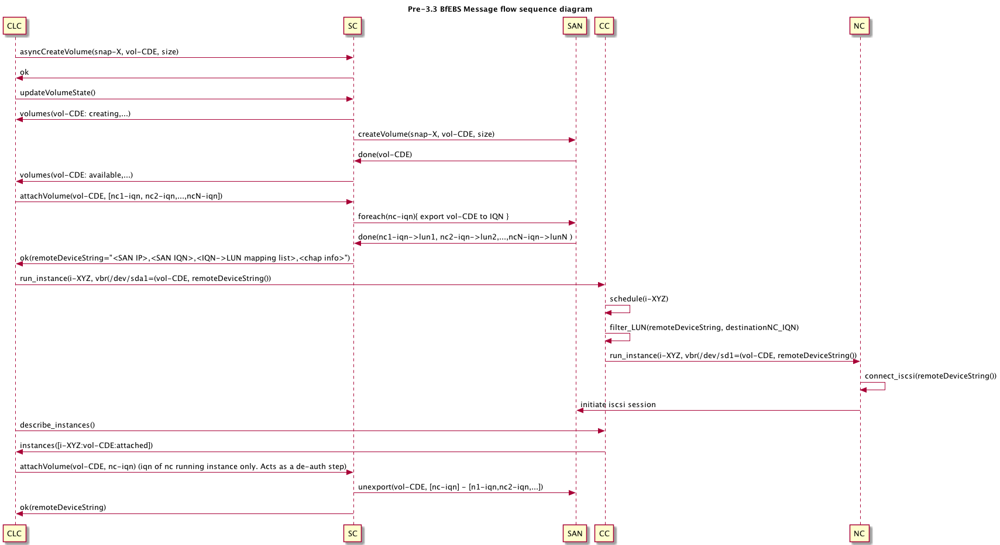

# Overview of Volume Attach/Detach in Eucalyptus 3.3.0

The message flow and logic for attaching and detaching volumes to instances has changed significantly in Eucalyptus 3.3.0. Specifically, a new communication path is now used and the Storage Controller keeps more metadata about the status of a volume with regard to attachment.

Specifically, the Node Controller now directly requests that a volume be exported to it by sending an ExportVolume request to the SC directly. Previously, the CLC would determine which NC was running an instance and then the CLC would send an AttachVolume request to the SC, which would then make the volume available for connections. The CLC would then send the AttachVolume request to the CC and on the NC, which would actually initiate the iSCSI connection to the SC/SAN, depending on configuration.

## Example: Running an EBS-instance (Attachment)

### Running an EBS-instance in Eucalyptus 3.2.2:
1. (create rootfs volume)
2. CLC -> createVolume(snap_source) -> SC
3. SC -> ok() -> CLC
4. (exportAll rootfs volume)
5. CLC -> attachVolume(all_ncs) -> SC
6. SC -> ok(remote_device_string) -> CLC
7. (run instance)
8. CLC -> run_instance(remote_device_string) -> CC
9. CC -> ok() -> CLC (async call)
10. CC -> run_instance(remote_device_string) -> NC
11. NC -> connect_iscsi(remote_device_string) -> ISCSI target (SC or SAN)
12. (state discovery)
13. CLC -> describeInstances() -> CC
14. CC -> describeInstances() ->* NC (each NC)
15. NC -> instances(i-X, vol-y:Attached).. -> CC
16. CC -> instances() -> CLC
17. CLC -> set_volume_attached(NC) -> DB

###Running an EBS-instance in Eucalyptus 3.3.0:
1. (create rootfs volume) Unchanged
2. CLC -> createVolume(snap_source) -> SC
3. SC -> ok() -> CLC
4. (get reference for rootfs volume)
5. CLC -> getVolumeToken() -> SC
6. SC -> ok(ref_token) -> CLC
7. (run instance)
8. CLC -> run_instance(ref_token) -> CC
9. CC -> ok() -> CLC (async call)
10. CC -> run_instance(ref_token) -> NC
11. NC -> exportVolume(ref_token) -> SC
12. SC -> exportVolume(NCx) -> SAN/TGT
13. SC -> ok(connect_string) -> NC
14. NC -> connect(connect_string) -> ISCSI target (SC or SAN)
15. (state discovery)
16. CLC -> describeInstances() -> CC
17. CC -> describeInstances() ->* NC (each NC)
18. NC -> instances(i-X, vol-y:Attached).. -> CC
19. CC -> instances() -> CLC
20. CLC -> set_volume_attached(NC) -> DB

## Detachment
The detach flow is similar, but now requires a lock on volume operations on the NC as well as a two phased detach.

On the NC, assuming vol-X attached as /dev/vdf:
1. Remove /dev/vdf from guest VM.
2. Delete lun from iscsi session (using 'echo 1' to a specific file in /sys/)
3. Call UnexportVolume(vol-X, ip, iqn) on Storage Controller
4. Rescan iscsi session to ensure volume is no longer available
5. Return success.

## How Does the NC Know Where the SC is and Which to Use?

The NC now receives topology maps from the CC on DescribeResources and DescribeInstances requests, which run periodically. This is how the NC keeps a record of SCs and the status of each in the Partition/Cluster. The NC only receives topology info about services in its Cluster and the global services (i.e. Walrus).

At TRACE level logging on the NC you can see the values it is receiving:
    2013-06-13 09:29:45 TRACE 000011882 updateServiceStateInfo   | Updating NC's topology/service state info: pMeta: userId=eucalyptus correlationId=(null)
    2013-06-13 09:29:45 TRACE 000011882 updateServiceStateInfo   | Updating VBR localhost config sc url to: http://10.111.1.11:8773/services/Storage
    2013-06-13 09:29:45 TRACE 000011882 vbr_update_hostconfig_sc | Updated sc url in VBR hostconfig to http://10.111.1.11:8773/services/Storage
    2013-06-13 09:29:45 TRACE 000011882 printNCServiceStateInfo  | Printing 5 services
    2013-06-13 09:29:45 TRACE 000011882 printNCServiceStateInfo  | Epoch 34
    2013-06-13 09:29:45 TRACE 000011882 printNCServiceStateInfo  | Service - CC_11 PARTI00 cluster http://10.111.1.11:8774/axis2/services/EucalyptusCC
    2013-06-13 09:29:45 TRACE 000011882 printNCServiceStateInfo  | Service - 10.111.1.11 eucalyptus dns http://10.111.1.11:8773/services/Dns
    2013-06-13 09:29:45 TRACE 000011882 printNCServiceStateInfo  | Service - 10.111.1.11 eucalyptus eucalyptus http://10.111.1.11:8773/services/Eucalyptus
    2013-06-13 09:29:45 TRACE 000011882 printNCServiceStateInfo  | Service - SC_11 PARTI00 storage http://10.111.1.11:8773/services/Storage
    2013-06-13 09:29:45 TRACE 000011882 printNCServiceStateInfo  | Service - WS_11 walrus walrus http://10.111.1.11:8773/services/Walrus
    2013-06-13 09:29:45 TRACE 000011882 printNCServiceStateInfo  | Notready Service -
    2013-06-13 09:29:45 TRACE 000011882 printNCServiceStateInfo  | Notready Service -
    2013-06-13 09:29:45 TRACE 000011882 printNCServiceStateInfo  | Notready Service -
    2013-06-13 09:29:45 TRACE 000011882 printNCServiceStateInfo  | Notready Service -
    2013-06-13 09:29:45 TRACE 000011882 printNCServiceStateInfo  | Notready Service -
    2013-06-13 09:29:45 TRACE 000011882 printMsgServiceStateInfo | Printing 5 services
    2013-06-13 09:29:45 TRACE 000011882 printMsgServiceStateInfo | Msg-Meta epoch 34
    2013-06-13 09:29:45 TRACE 000011882 printMsgServiceStateInfo | Msg-Meta: Service - CC_11 PARTI00 cluster http://10.111.1.11:8
774/axis2/services/EucalyptusCC
    2013-06-13 09:29:45 TRACE 000011882 printMsgServiceStateInfo | Msg-Meta: Service - 10.111.1.11 eucalyptus dns http://10.111.1
.11:8773/services/Dns
    2013-06-13 09:29:45 TRACE 000011882 printMsgServiceStateInfo | Msg-Meta: Service - 10.111.1.11 eucalyptus eucalyptus http://1
0.111.1.11:8773/services/Eucalyptus
    2013-06-13 09:29:45 TRACE 000011882 printMsgServiceStateInfo | Msg-Meta: Service - SC_11 PARTI00 storage http://10.111.1.11:8773/services/Storage
    2013-06-13 09:29:45 TRACE 000011882 printMsgServiceStateInfo | Msg-Meta: Service - WS_11 walrus walrus http://10.111.1.11:8773/services/Walrus
    2013-06-13 09:29:45 TRACE 000011882 printMsgServiceStateInfo | Msg-Meta: Notready Service -
    2013-06-13 09:29:45 TRACE 000011882 printMsgServiceStateInfo | Msg-Meta: Notready Service -
    2013-06-13 09:29:45 TRACE 000011882 printMsgServiceStateInfo | Msg-Meta: Notready Service -
    2013-06-13 09:29:45 TRACE 000011882 printMsgServiceStateInfo | Msg-Meta: Notready Service -
    2013-06-13 09:29:45 TRACE 000011882 printMsgServiceStateInfo | Msg-Meta: Notready Service -

All of the printNCServiceStateInfo messages are logging the state of the system as the NC's internal state sees it. The printMsgServiceStateInfo is the new topology map that has come in over the wire and the NC is updating to. You'll also see the Epoch number, this is the same epoch displayed in 'euca-describe-services'

The VBR localhost config messages are output of the state update as applied in the Virtual Boot Record handling bits of the NC. Due to the design and implementation of the NC, the VBR bits are independent (they may be used in the VMWareBroker for template creation), so they have their own state cache that is updated along with that of the rest of the NC. If EBS-instances are failing to run, a good check is to ensure that the SC URL in the VBR localhost config is correct and being updated properly.

## Debugging and Common Issues
### Expected Log Entries During Normal Operation

The SC now logs 'Processing <operation> request for <volume|snap>' for all Volume and Snapshot operations at INFO level logging. This is the first thing the SC does once it receives the full request. So, you should be able to see all such log messages for each volume in cloud-output.log on the SC host.

For attachment you should see in cloud-output.log on the SC:

    Processing GetVolumeToken request for volume vol-X
    ...
    ...
    Processing ExportVolume request for volume vol-X

On Detach:

    ...
    Processing UnexportVolume request for volume vol-X
    ...

Note: on detach you will see in the nc.log a message by 'get_iscsi_target' indicating that it was not able to find the target. If this comes after the scClientCall then this is an expected outcome. This particular invocation of that script is just a final check to ensure that the volume has indeed been removed from the NC host.
Example detach from a TGT-backed SC:

    013-06-13 10:27:56 DEBUG 000011882 scClientCall             |  done scOps=UnexportVolume clientrc=0 opFail=0
    2013-06-13 10:27:56 DEBUG 000011882 get_iscsi_target         | invoking `/opt/eucalyptus/usr/lib/eucalyptus/euca_rootwrap /opt/eucalyptus/usr/share/eucalyptus/get_iscsitarget.pl /opt/eucalyptus,,,,GrFh2mGLCXc2eI8k+jXGWTHNyv0MzE9GrYe1KesHUBZIyysichtp6CF/UleA5mAWjVYHrTnVdWk5qTGFILZw1sXIcUD1/FDwVICDbyDVTeIQJ9+fVy0b0V+6bSJJP+hW/vjq3VbGUxiO/Cb1PTt+0E7q09Jcu++7fTvTi1blDjyOdddO7fWA1ZFEBqtKu/T3NFl29B8lnp7mLlVCbxJxCqif6uGu/Jdrqz6UkE81A9X9W1QTWH4NGmlndmMPVQSWvpe5U6zzT1vDBU4n742/Vx4pGax4s7j10+BOP7DujaSXo7nzv2+0LTT+pqpcpRM/3yLZxrweBBrM8ynDNTu7AA==,,10.111.1.11,iqn.2009-06.com.eucalyptus.PARTI00:store16`
    2013-06-13 10:27:56 DEBUG 000011882 get_iscsi_target         | get storage script returned: 1, stdout: '',   stderr: 'which: no multipath in (/bin:/usr/bin:/sbin:/usr/sbin/)
    Failed to run '/sbin/iscsiadm -m session -R': iscsiadm: No session found.'

In this example we see that after the scClientCall to UnexportVolume, the get_iscsi_target properly returns 1 since it cannot find a device for the lun. This is the correct output. If you are using a SAN-backed SC, then you may or may not see the final 'Failed to run...' part because that is specific to the lun->target mapping of TGT. Equallogic will exhibit this behavior as well, but EMC and Netapp typically will not.

On Delete:

    ...
    Processing DeleteStorageVolume request for volume vol-X
    ...

On EBS-instance run, for the root:

    Processing CreateVolume request for volume vol-X
    Processing GetVolumeToken request for volume vol-X
    Processing ExportVolume request for volume vol-X

On EBS-instance stop:

    Processing UnexportVolume request for volume vol-X

Termination may add to the 'stop' set:

    Processing DeleteStorageVolume request for volume vol-X

If any of those are missing then you can see how far the process got and what are the likely sources of failure.
* **Missing GetVolumeToken?** Check the CLC and CLC->SC communications.
* **Missing ExportVolume?** Check that the NC got the doAttachVolume request and that the NC can communicate with the SC on port 8773.
* **Missing UnexportVolume?** Check the NC. It should have a 'doDetachVolume' record in the logs as well as a logged entry of the URL used to contact the SC. If that URL is not http://<registered SC host or IP>:8773/services/Storage then the NC will not have been able to successfully send the message to the SC.

### Common Problems and Likely Causes and Solutions

**1.) Problem: Volume stuck in 'deleting' after delete issued.**

* Possible cause: If a failure occurred on the NC or SC during the last UnexportVolume operation for the affected volume, then the volume may still be exported. In this case, the SC is very conservative and will not delete a volume that is believes is exported based on the DB state it has. You will see in the SC logs that the volume is marked for deletion but is found to be exported so deletion is skipped. This will be repeated in the logs on the SC because the SC is periodically trying to delete the volume but keeps finding it exported. Once the export status is removed the volume will delete normally. This should never happen in normal usage, but may result from network errors or other failures during the UnexportVolume operation on an NC.
* Solution: Verify on the NC and SC that the volume is indeed not connected (iscsiadm on the NC is the easiest way) and then to invalidate the export and token in the eucalyptus_storage database. There is a tool provided in [deveutils git repository](https://github.com/eucalyptus/deveutils) for forcibly unexporting a volume. This should only be used as a last resort, but is preferrable to manual database manipulation. See its documentation for further information on how it works. After running it, the volume should be automatically deleted possibly after a delay (the normal SC delete checks that run every 10 seconds or so).

**2.) Problem: Volume fails to attach to instance, immediate failure, no 'attaching' state**

* Possible cause: CLC is failing to get a token from the SC for the attachment. This is likely the case if the attach-volume request is failing immediately and returning an error to the API caller. The volume will not go to the 'attaching' state if the CLC does not get a token. This can be caused by other failures as well, so some log parsing is necessary. On the SC you should see 'Processing GetVolumeToken request for vol-XYZ' in cloud-output.log. If you do not see this message immediately following the request being issued then there is a problem.
* Solution: Check connectivity to the SC. The CLC should return an error to the user if it cannot find an ENABLED SC to deliver the request to. Also, check DB connectivity on the SC. If the SC cannot read/write to the DB (eucalyptus_storage) then it cannot issue tokens. You should see clear indications of failure in the SC's cloud-error.log file if this is the case.

**3.) Problem: Volume fails to attach to instance, goes to 'attaching' but then back to 'available'**

* Possible cause: NC failing to get successful return on ExportVolume request to SC during attachment. If the volume goes to 'attaching' and then back to 'available' then the NC may be the cause. Check the NC logs and look for ExportVolume failed or any scClientCall lines that indicate opFail=1. The two causes for a failure here are that the SC cannot communicate with the SC (possible it doesn't know which SC to use), or that the SC itself failed during ExportVolume and returned an error the NC to indicate that. In either case, the NC should have log messages indicating that it could not attach and you should see no indication of it ever receiving a local block device for the volume.
* Solution: Check communications between the NC and SC. The NC must be able to connect to port 8773 on the SC and send SOAP requests via TCP. Check in the NC log that it is using the proper SC URL. This URL should be the IP of the SC as registered, and a path of /services/Storage. Firewall and routing rules may be the cause.

***

[[category.storage]]